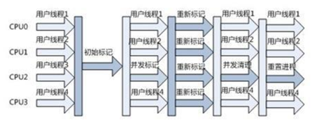

1. 类加载过程：加载-连接（验证，准备，解析）-初始化

2. 加载：3步（1.获取二进制字节流 2.将字节流中静态存储结构转化为方法区的的运行时数据结构 3.生成一个class对象，作为方法去访问这些数据的入口），重点：1.字节码来源：编译生成的.class文件，或者jar包中的.class文件 2.类加载器：启动类加载器，扩展类加载器，应用类加载器，自定义类加载器，为什么要自定义加载器呢:1，可以对编译后的代码进行加密，然后通过自定义的类加载器进行解密 2.可以从非标准来源加载代码，如网络，就需要自己指定加载来源 （Class.forName()执行类加载整个过程，Classloader.loadClass()只执行加载这一步）

3. 验证：主要是为了保证加载进来的字节流符合虚拟机规范，不会造成安全错误：文件格式校验，元数据校验，字节码校验，符号引用校验

4. 准备：主要是为类变量（注意，不是实例变量是static）分配内存，并且赋予初值（不是我们赋予的值，而是0或null，常量就是我们赋予的）

5. 解析：将常量池内的符号引用（如代码中的方法hello()这个字符串）替换为直接引用(hello方法存储的位置或者偏移量)的过程

6. 初始化：对static变量或语句进行初始化（即给static变量赋值，运行static初始化块）真正执行代码的过程，如果父类未初始化，则先初始化父类  顺序：按代码顺序执行：父类变量或初始化块->子类变量或初始化块，时机：new，调用静态变量或方法，反射，程序入口类（包含main）

7. 什么是STOP THE WORLD（STW）？等待所有用户线程进入安全点（safe point）后并阻塞，做一些全局性操作的行为。引发原因：GC，RevokeBias（撤销偏向锁）等。GC：即在执行垃圾收集算法时,Java应用程序的其他所有除了垃圾收集收集器线程之外的线程都被挂起，这些工作都是由虚拟机在后台自动发起和自动完成的，是在用户不可见的情况下把用户正常工作的线程全部停下来，这对于实时性要求很高的程序来说是难以接受的，例如采用复制算法时，为了保证在复制存活的对象的时候，对象的一致性

8. Java对象组成：对象头（缓存对象自身的运行时数据即**mark word：**hash码，年龄分代，锁状态等  类型指针：判断是那个类的实例  数组长度：只有数组对象才有），实例数据，对齐填充（HotSpot虚拟机的对齐方式为8字节对齐，即一个对象必须为8字节的整数倍，如果不是，则通过这个对齐填充来占位填充）  参考多线程第四条的连接，对象头详解参考多线程第九条连接

9. 类加载器：1.BootstrapClassLoader(启动类加载器) ：最顶层的加载类，由C++实现，负责加载jdk的lib目录下的类  2. ExtensionClassLoader(扩展类加载器) ：主要负责加载jre的lib目录下的ext目录下的类  3. AppClassLoader(应用程序类加载器) :面向我们用户的加载器，负责加载当前应用classpath下的所有jar包和类。

10. 双亲委派模型：即在类加载的时候，系统会首先判断当前类是**否被加载过**。已经被加载的类会直接返回，否则才会尝试加载。加载的时候，首先会把该请求委派该父类加载器的 loadClass() 处理（父类也会委派给他的父类），当父类加载器为**null时**，会使用启动类加载器 BootstrapClassLoader 作为父类加载器，因此所有的请求最终都应该传送到顶层的启动类加载器 BootstrapClassLoader 中。当父类加载器无法处理时（它的搜索范围中没找到所需的类），才由自己来处理。

11. 双亲委派模型的好处：假如黑客定义了一个java.lang.String类，该String类具有系统的String类一样的功能，只是在某个函数稍作修改。比如equals函数，这个函数经常使用，如果在这这个函数中，黑客加入一些“病毒代码”。并且通过自定义类加载器加入到JVM中。此时，如果没有双亲委派模型，那么JVM就可能误以为黑客自定义的java.lang.String类是系统的String类，导致“病毒代码”被执行。而有了双亲委派模型，黑客自定义的java.lang.String类永远都不会被加载进内存。因为首先是最顶端的类加载器加载系统的java.lang.String类，最终自定义的类加载器无法加载java.lang.String类。**某个类是由此类和他的加载器一起决定的**，就算用了自定义加载器加载String类，但因为加载器不是启动类加载器，所以和java.lang.String也是不同的。

12. 不用双亲委派模型：自定义一个类加载器，然后重写loadClass()方法

13. 垃圾收集器：1.serial收集器：单线程收集垃圾，其他所有线程停止（STOP THE WORLD），直到收集完毕（新生代采用复制算法，老年代标记整理）（简单高效，适用于client端） 2.parnew：多线程收集垃圾，所有用户线程停止（复制，标记整理）（适用于server端）  3. Parallel Scavenge：多线程收集垃圾，所有用户线程停止（复制，标记整理）（与parnew区别：关注吞吐量，提供了很多参数供用户找到最合适的停顿时间或最大吞吐量） 3.CMS：GC线程与用户线程同时执行（标记清除算法，以最短停顿时间为目标，有两次stw）

14. CMS收集器：1.初始标记：**暂停**所有的其他线程，并记录下**直接与 GC root 相连**的对象，速度很快  2. 并发标记：同时开启 GC 和用户线程，用一个闭包结构去**记录可达对象**（根据第一步得到的对象向下追溯标记）。但在这个阶段结束，这个闭包结构并不能保证包含当前所有的可达对象。因为用户线程可能会**不断的更新引用域**，所以 GC 线程无法保证可达性分析的实时性。所以这个算法里会**跟踪**记录这些发生**引用更新**的地方。 3.重新标记：**暂停用户线程**，重新标记阶段就是为了**修正**并发标记期间因为用户程序继续运行而导致标记产生变动的那一部分对象的标记记录，这个阶段的停顿时间一般会比初始标记阶段的时间稍长，远远比并发标记阶段时间短 4.并发清除：开启用户线程，同时 GC 线程开始对**未标记的区域做清扫**。  优点：并发收集，停顿时间短  缺点：对cpu资源敏感，无法处理浮动垃圾，使用标记清除算法，会产生大量空间碎片

​                               

15. G1（复制算法）：面向大内存，多核系统的收集器，具有**高吞吐量和可预测的停顿时间**。G1收集器将内存划分为一系列大小相等的**region区域**（大小为1-30M，启动时确定），每个region区域逻辑上属于一个分代区域，并且在物理上不连续，当一个属于老年代的区域收集完成后，**变成新可用Region**并可能成为下一个新生代。当申请的对象大于region的一半时，会被放入一个巨型区域中。1.初始标记  2.并发标记 3.最终标记  4.筛选回收  G1 收集器在后台维护了一个优先列表，每次根据允许的收集时间，优先选择回收价值最大的 Region
16. 垃圾收集算法：1.标记清除：**标记存活的对象**，标记完成后全部回收没有被标记对象。问题：效率问题，产生不连续空间碎片 2.复制算法：把内存分为两块，每次只是用其中一块，如果这一块用完，就将还存活的对象复制到另一块，然后把这一块完全清理掉，重复这一过程（因为对象地址改变了，所以需要更新对象的引用） 3.标记整理算法：标记存活的对象，标记完成后让所有存活对象向一端移动，然后清理掉边界之外的内存。 4.分代收集算法：根据对象存活周期的不同将内存分为几块，一般将 java 堆分为新生代和老年代，这样我们就可以根据各个年代的特点选择合适的垃圾收集算法。（比如在新生代中，每次收集都会有**大量对象死去**，所以可以选择复制算法，只需要付出**少量对象的复制成本**就可以完成每次垃圾收集。而**老年代的对象存活几率是比较高**的，而且没有额外的空间对它进行分配担保，所以我们必须选择“标记-清除”或“标记-整理”算法进行垃圾收集。）
17. Java内存区域：**线程私有（生命周期都与线程相同）**：1.程序计数器：字节码解释器通过改变程序计数器来依次**读取指令**，从而实现代码的**流程控制**，如顺序执行，循环，选择等。在多线程的情况下程序计数器用于**记录当前线程执行的位置**，从而当线程切换回来时，能够知道线程上次运行到哪里了。 2.java虚拟机栈：每一个**方法就是一个栈帧**，函数调用，栈帧入栈，return或者异常，出栈。栈帧：**局部变量表**（局部定义的8中**基本数据类型**，方法参数，对象引用）、操作数栈、动态链接、方法出口信息。两种异常，一种虚拟机栈的内存大小不能扩展超出内存（StackOverFlowError），一种可以扩展还是超出（OutOfMemoryError）。 3.本地方法栈：与虚拟机栈几乎相同，唯一的区别是虚拟机栈为字节码服务，本地方法栈为native方法服务，在hotspot中两种栈合二为一。  **线程共享**：1.堆：存放**对象实例**，几乎所有的对象实例和数组都分配在这里。**堆分为新生代（Eden，From survivor，To survivor）和老年代**，1.8后永久代被移除，取而代之的是元空间，元空间使用直接内存。堆在虚拟机启动时创建。最容易出现outofmemoryerror错误。  2.方法区：用于存储已被虚拟机加载的类信息，**常量，静态变量**，即时编译后的**代码**等信息（注意没有实例变量，实例变量随对象存储在堆中）。**运行时常量池**：存放编译期生成的各种字面量（文本字符串，8种基本类型**的值**（如int i=8,则8就是字面量），final常量）和符号引用（类，方法，成员变量的名词和描述符）。  字符串常量池：jdk7后的字符串常量池放到堆中了，实现字符串常量池的是一个StringTable，他是一个Hash表，被所有类所共享，默认值为1009，StringTable中放的是字符串常量或者堆内字符串对象的引用
18. 对象的创建：1.**类加载检查**，检查这个类有没有被加载。 2.分配内存，对象所需的**内存大小**在类加载完成后便可确定，**分配方式**有指针碰撞（jvm采用标记整理算法，用过与没用过的内存中间有一个分界指针，只需要把指针向前移动即可分配）与空闲列表（jvm采用标记清除算法，虚拟机会维护一个列表，该表会记录那些内存块是可用的，分配时找一份足够大的分配给对象）两种，用**CAS加自旋**或者**TLAB**（为每一个**线程**在TLAB区域分配一块内存，创建对象时，首先在TLAB区域分配内存，TLAB用完时再使用CAS加自旋分配）来保证线程安全。  3.**初始化零值**，把所有字段（即成员变量）初始化为0/null值  4.**设置对象头**（参考jvm第8条），如设置类型指针，GC年龄分带，hash码等。 5.执行**初始化方法**，执行构造器。
19. Java对象访问：1.句柄：Java 堆中将会划分出一块内存来作为**句柄池**，reference 中存储的就是对象的句柄地址，而句柄中包含了**对象实例数据与类型数据**各自的具体**地址**信息 2.直接指针：reference 中存储的直接就是对象的地址。  优劣：使用句柄来访问的最大好处是 reference 中存储的是稳定的句柄地址，在**对象被移动时**只会改变句柄中的实例数据指针，而 reference 本身不需要修改。使用直接指针访问方式最大的好处就是**速度快**，它节省了一次指针定位的时间开销。
20. 对象分配回收过程：大部分情况下，对象首先在Eden区分配(Eden->(经过一次垃圾回收还存活，年龄变为1)->survivor1或2->(年龄增长到一定程度，parallel默认为15，可以设置)->老年代)。当Eden区没有足够的空间时，虚拟机将发起一次Minor GC，速度比较块，比较频繁。Major GC/Full GC发生在老年代的GC，速度比较慢，通常伴随Minor GC。大对象如数组等直接存储到老年代。每回收一次垃圾，对象的年龄增加1。
21. 判断对象已经死亡：1.引用计数法：每给对象增加一个引用，计数器就+1，引用失效，计数器-1，计数器为0时表示可以回收。问题：交叉引用。 2.可达性分析算法：通过一系列的称为 “GC Roots” 的对象作为起点，从这些节点开始向下搜索，节点所走过的路径称为引用链，当一个对象不与任何GC Roots相连，则证明此对象是不可用的。
22. 四种引用：强引用，永远不会回收  软引用：内存空间不足才回收  弱引用：GC线程一旦发现只具有弱引用的对象，就会回收他  虚引用：一个对象持有虚引用，就像没有引用一样，当垃圾回收器准备回收一个对象时，如果发现它还有虚引用，就会在回收对象的内存之前，把这个虚引用加入到与之关联的引用队列中。程序可以通过判断引用队列中是否已经加入了虚引用，来了解被引用的对象是否将要被垃圾回收。程序如果发现某个虚引用已经被加入到引用队列，那么就可以在所引用的对象的内存被回收之前采取必要的行动。
23. 不可达对象并非非死不可，要真正宣告一个对象死亡，至少要经历两次标记过程；可达性分析法中不可达的对象被第一次标记并且进行一次筛选，筛选的条件是此对象是否有必要执行 finalize 方法。当对象没有覆盖 finalize 方法，或 finalize 方法已经被虚拟机调用过时，虚拟机将这两种情况视为没有必要执行。被判定为需要执行的对象将会被放在一个队列中进行第二次标记，除非这个对象与引用链上的任何一个对象建立关联，否则就会被真的回收
24. 判断一个类是无用的类：无任何实例，加载该类的加载器已经被回收，该类的class对象没有被任何地方引用，无法在任何地方通过反射访问该类。
25. GC调优常用命令：1.指定堆内存大小：-Xms2G -Xmx5G表示堆内存最小为2G，最大为5G  2.指定新生代内存大小：-XX:NewSize=1G -XX:MaxNewSize=2G表示新生代内存最小为1G，最大为2G（因为Full GC成本远高于Minor GC因此尽可能将对象分配在新生代，可以通过查看日志最大限度降低对象直接进入老年代的情况）  3.永久代/元空间大小：-XX:PermSize=N //方法区 (永久代) 初始大小   -XX:MaxPermSize=N //方法区 (永久代) 最大大小  1.8使用的是元空间：    -XX:MetaspaceSize=N  -XX:MaxMetaspaceSize=N   4.指定垃圾回收器：  -XX:+UseSerialGC  -XX:+UseParallelGC -XX:+USeParNewGC  -XX:+UseG1GC -XX:+UseConcMarkSweepGC
26. Java7之前，方法区位于**永久代**，永久代和堆相互隔离，java7中，**static变量**（静态变量如果是基本类型，则存储方法区，如果是对象，则引用存储方法区，实例存储堆）从永久代永久移植到了堆中，java8中，取消了永久代，方法区存放于**元空间**，元空间仍然与堆不相连，但与堆共享物理内存，逻辑上可以认为在堆中。
27. Java中class对象：获取：Class.forName()，类名.class，instance.getClass()。类的Class对象是存放在堆中。类的元数据（元数据并不是类的Class对象！Class对象是加载的最终产品，类的方法代码，变量名，方法名，访问权限，返回值等等都是在方法区的）才是存在方法区的。
28. Java中对象的三种状态：可触及状态（即有引用），可复活状态（没有引用，准备释放内存，调用finalize方法），不可触及状态（执行完finalize方法后，此对象还是没有被引用，则垃圾回收器会真正的回收此对象）
29. 触发回收的时机：1.年轻代Eden满了就minor GC。如果是CMS收集器，那么老年代满了的时候，会触发Marjor GC，非CMS老年代满了直接Full GC。2.CMS发现下述两种情形，会触发Full GC：a.在垃圾收集时发现年轻代的Survivor区放不下，而且老年代也放不下，直接Full GC。b.大对象想直接进入老年代，但是老年代空间不足，直接Full GC。3.显示调用System.gc()函数，可以触发Full GC
30. JVM安全点：1. 可达性分析法中GC roots的查找方法：a. 遍历方法去和栈区查找 b. 通过OopMap 数据结构来记录 GC Roots 的位置。很明显，保守式 GC 的成本太高。准确式 GC 的优点就是能够让虚拟机快速定位到 GC Roots。 2. 如何选定安全点：安全点太多，GC 过于频繁，增大运行时负荷；安全点太少，GC 等待时间太长。一般会在如下几个位置选取安全点：a. 循环的末尾 b. 方法临返回前 c. 调用方法后 d. 抛异常的位置   3.为什么选这些安全点：主要的目的就是避免程序长时间无法进入 Safe Point。比如 JVM 在做 GC 之前要等所有的应用线程进入安全点，如果有一个线程一直没有进入安全点，就会导致 GC 时 JVM 停顿时间延长。 4.如何让线程停止：a. 抢占式中断：在 GC 发生时，首先中断所有线程，如果发现线程未执行到 Safe Point，就恢复线程让其运行到 Safe Point 上。 b. 主动式中断（JVM采用）：在 GC 发生时，不直接操作线程中断，而是简单地设置一个标志，让各个线程执行时主动轮询这个标志，发现中断标志为真时就自己中断挂起。5.安全区域：如果一个线程处于 Sleep 或中断状态，它就不能响应 JVM 的中断请求（Safe Point 是对正在执行的线程设定的。），再运行到 Safe Point 上，因此引入了安全区域（Safe Region），Safe Region 是指在一段代码片段中，引用关系不会发生变化。在这个区域内的任意地方开始 GC 都是安全的，线程在进入 Safe Region 的时候先标记自己已进入了 Safe Region，等到被唤醒时准备离开 Safe Region 时，先检查能否离开，如果 GC 完成了，那么线程可以离开，否则它必须等待直到收到安全离开的信号为止。
31. 