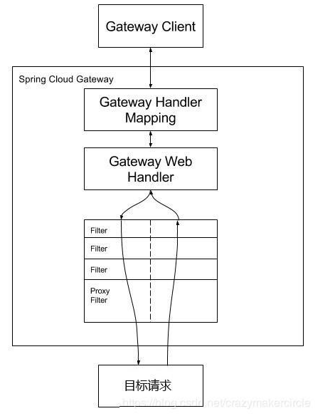

1. 服务发现框架Eureka  https://github.com/Snailclimb/JavaGuide/blob/master/docs/system-design/micro-service/spring-cloud.md：

   > 1. 服务注册register：当 `Eureka` 客户端（消费者与提供者）向 `Eureka Server` 注册时，它提供自身的**元数据**，比如IP地址、端口，运行状况指示符URL，主页等。
   > 2. 服务续约renew：**`Eureka` 客户会每隔30秒(默认情况下)发送一次心跳来续约**。 通过续约来告知 `Eureka Server` 该 `Eureka` 客户仍然存在，没有出现问题。 正常情况下，如果 `Eureka Server` 在90秒没有收到 `Eureka` 客户的续约，它会将实例从其注册表中删除。
   > 3. 获取注册列表信息 Fetch Registries：`Eureka` 客户端从服务器**获取注册表信息**，并将其缓存在本地。客户端会使用该信息查找其他服务，从而进行远程调用。该注册列表信息定期**（每30秒钟）更新一次**。每次返回注册列表信息可能与 `Eureka` 客户端的缓存信息不同, `Eureka` 客户端自动处理。如果由于某种原因导致注册列表信息不能及时匹配，`Eureka` 客户端则会重新获取整个注册表信息。 `Eureka` 服务器缓存注册列表信息，整个注册表以及每个应用程序的信息进行了压缩，压缩内容和没有压缩的内容完全相同。`Eureka` 客户端和 `Eureka` 服务器可以使用JSON / XML格式进行通讯。在默认的情况下 `Eureka` 客户端使用压缩 `JSON` 格式来获取注册列表的信息。
   > 4. 服务下线 Cancel：Eureka客户端在程序关闭时向Eureka服务器发送取消请求。 发送请求后，该客户端实例信息将从服务器的实例注册表中删除。该下线请求不会自动完成，它需要调用以下内容：`DiscoveryManager.getInstance().shutdownComponent()`。
   > 5. 服务剔除 Eviction：在默认的情况下，当Eureka客户端**连续90秒**(3个续约周期)没有向Eureka服务器发送服务续约，即心跳，Eureka服务器会将该服务实例从服务注册列表删除，即服务剔除。

2. RestTemplate：`RestTemplate`是`Spring`提供的一个访问Http服务的客户端类，怎么说呢？就是微服务之间的调用（消费者调用提供者的接口）是使用的 `RestTemplate`，Eureka框架中的 **注册**、**续约** 等，底层都是使用的 RestTemplate。（常用的rpc框架：http client   RestTemplate   dubbo）

3. 负载均衡Ribbon：一个客户端/进程内负载均衡器，**运行在消费者端**。其工作原理就是 `Consumer` 端获取到了所有的服务列表之后，在其**内部**使用**负载均衡算法**，进行对多个系统的调用。        几种负载均衡算法：**`RoundRobinRule`**：轮询策略。`Ribbon` 默认采用的策略。若经过一轮轮询没有找到可用的 `provider`，其最多轮询 10 轮。若最终还没有找到，则返回 `null`。   **`RandomRule`**: 随机策略，从所有可用的 `provider` 中随机选择一个。   **`RetryRule`**: 重试策略。先按照 `RoundRobinRule` 策略获取 `provider`，若获取失败，则在指定的时限内重试。默认的时限为 500 毫秒。更换默认的负载均衡算法，只需要在配置文件中做出修改就行，当然，在 `Ribbon` 中你还可以**自定义负载均衡算法**，你只需要实现 `IRule` 接口，然后修改配置文件或者自定义 `Java Config` 类。       nginx与ribbon的区别：nginx是集中式负载均衡，简单理解就是 **将所有请求都集中起来，然后再进行负载均衡**（即所有请求都先发送到nginx server在由nginx server发送给请求接受者）。

4. open feign：只使用restTemplate调用远程接口时，每次都要指定url，请求，返回类型。使用映射，我们可以将被调用的服务代码映射到消费者端，像调用原来代码一样进行各个服务间的调用。OpenFeign也是运行在消费者端的，使用 `Ribbon` 进行负载均衡，所以 `OpenFeign` 直接内置了Ribbon。使用时，我们需要用@FeignClient注解标识服务提供者，然后在消费者中直接注入提供者的bean，并像单体应用那样调用接口即可。

5. Hystrix之熔断和降级：服务雪崩：ServiceA调用ServiceB，ServiceB调用了ServiceC，当ServiceC发送故障阻塞时，不能返回响应，那么ServiceB也会阻塞，导致ServiceA也阻塞。所谓 **熔断** 就是服务雪崩的一种有效解决方案。当指定时间窗内的请求失败率达到设定阈值时，系统将通过 **断路器** 直接将此请求链路断开。也就是我们上面服务B调用服务C在指定时间窗内，调用的失败率到达了一定的值，那么 `Hystrix` 则会自动将 服务B与C 之间的请求都断了，以免导致服务雪崩现象。其实这里所讲的 **熔断** 就是指的 `Hystrix` 中的 **断路器模式** ，你可以使用简单的 `@HystrixCommand` 注解来标注某个方法，这样 `Hystrix` 就会使用 **断路器** 来“包装”这个方法，每当调用时间超过指定时间时(默认为1000ms)，断路器将会中断对这个方法的调用。      降级：**降级是为了更好的用户体验，当一个方法调用异常时，通过执行另一种代码逻辑来给用户友好的回复**。这也就对应着 `Hystrix` 的 **后备处理** 模式。你可以通过设置 `fallbackMethod` 来给一个方法设置备用的代码逻辑。比如这个时候有一个热点新闻出现了，我们会推荐给用户查看详情，然后用户会通过id去查询新闻的详情，但是因为这条新闻太火了，大量用户同时访问可能会导致系统崩溃，那么我们就进行 **服务降级** ，一些请求会做一些降级处理比如当前人数太多请稍后查看等等。

6. 微服务网关Zuul： Zuul 是一个对于 *消费者* 的统一入口，可以起到路由与过滤器的功能（Router and Filter），相当于网关。

   > 1. 路由功能：`Zuul` 需要向 `Eureka` 进行注册，就能拿到所有 `Consumer` 的信息（名称，ip，端口等），以做路由映射。比如我们调用消费者的接口（每个消费者ip端口都不同），就可以统一访问Zuul的ip端口了。Zuul还可以配置统一前缀（即统一在url中加入某个前缀），自定义路径来替代微服务名称（没有Zuul时，访问方式(直接使用服务名)，需要将微服务名称暴露给用户，会存在安全性问题），服务名屏蔽（配置了自定义路径代替微服务后，还是可以直接用微服务名称直接访问，所以我们要屏蔽所有服务名），路径屏蔽（只要用户请求中包含指定的 URI 路径，那么该请求将无法访问到指定的服务。通过该方式可以限制用户的权限），敏感请求头屏蔽（像 `Cookie`、`Set-Cookie` 等敏感请求头信息会被 `zuul` 屏蔽掉）
   > 2. 过滤功能：我们可以进行各种过滤，这样我们就能实现 **限流**，**灰度发布**，**权限控制** 等等。要实现自己定义的 `Filter` 我们只需要继承 `ZuulFilter` 然后将这个过滤器类以 `@Component` 注解加入 Spring 容器中就行了。过滤器类型：`Pre`、`Routing`、`Post`。前置`Pre`就是在请求之前进行过滤，`Routing`路由过滤器就是我们上面所讲的路由策略（即路由到哪一个服务），而`Post`后置过滤器就是在 `Response` 之前（即请求已经处理，即将返回响应）进行过滤的过滤器。利用pre与post，我们可以打印请求处理的时间。    令牌桶限流：令牌桶是什么？首先我们会有个桶，如果里面没有满那么就会以一定 **固定的速率** 会往里面放令牌，一个请求过来首先要从桶中获取令牌，如果没有获取到，那么这个请求就拒绝，如果获取到那么就放行。比如我们定义一个令牌桶，每秒产生两个令牌，每个请求都获取一个令牌才能执行，那么我们就限定了每秒最多处理两个请求。

7. 配置管理（spring cloud config）：为什么要进行配置管理？当我们的微服务系统开始慢慢地庞大起来，那么多 `Consumer` 、`Provider` 、`Eureka Server` 、`Zuul` 系统都会持有自己的配置，这个时候我们在项目运行的时候可能需要更改某些应用的配置，如果我们不进行配置的统一管理，我们只能**去每个应用下一个一个寻找配置文件然后修改配置文件再重启应用**。而使用spring cloud config**既能对配置文件统一地进行管理（git/svn），又能在项目运行时动态修改配置文件**。我们的应用只有启动的时候才会进行配置文件的加载，那么我们的 `Spring Cloud Config` 就暴露出一个接口给启动应用来获取它所想要的配置文件，应用获取到配置文件然后再进行它的初始化工作。那么在应用运行时我们更改了配置文件，应用怎么动态刷新呢？一般我们会使用 `Bus` 消息总线 + `Spring Cloud Config` 进行配置的动态刷新。  spring cloud bus：用于将服务和服务实例与分布式消息系统链接在一起的事件总线。在集群中传播状态更改很有用（例如配置更改事件），你可以简单理解为 `Spring Cloud Bus` 的作用就是**管理和广播分布式系统中的消息**，也就是消息引擎系统中的广播模式。

8. Gateway处理流程（https://www.cnblogs.com/crazymakercircle/p/11704077.html）：客户端发送请求，在Gateway Handler Mapping中找到匹配的路由，将其发送到Gateway web handler，Handler 再通过指定的过滤器链来将请求发送到我们实际的服务执行业务逻辑，然后返回。

   

9. 路由匹配规则配置（routes）：

   > 1. id：唯一的路由id
   > 2. uri：目标服务地址，使用注册中心时，uri的协议为lb类型（lb://**）。
   > 3. predicates：路由条件，匹配成功会转发到uri，失败会返回404，包括：Path（当-Path=/ecs/**，uri=http://localhost:9999/，传入的uri为http://localhost:8080/ecs/kjk/sf时，会转发到http://localhost:9999/），Before（在某个时间之前），After，Between，Cookie（cookie包含的键值对），Header（请求头的属性键值对），Host，Method，Query（传入的参数的键值对），RemoteAddr（ip地址）。

10. 过滤器（filters，配置在routes下）：PrefixPath（所有请求添加前缀），RedirectTo（返回码重定向），RemoveRequestHeader（去掉某个请求头信息），RemoveResponseHeader，RewritePath（改写路径），SetPath（设置请求路径），SetRequestHeader，SetStatus，StripPrefix（去掉路径签名的前n个部分），RequestSize（请求大小），Default-filters（默认过滤器，与routes同级配置），PreserveHostHeader(转发请求时保留原始的host头部)

11. 令牌桶限流：需要配置redis，配置RequestRateLimiter过滤器（配置key-resolver，redis-rate-limiter.replenishRate，redis-rate-limiter.burstCapacity三个参数，分别代表用于限流键的解析器的bean对象的名字，令牌桶每秒填充平均速率，令牌桶总容量）。

12. 

