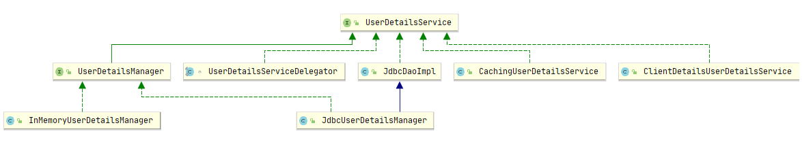
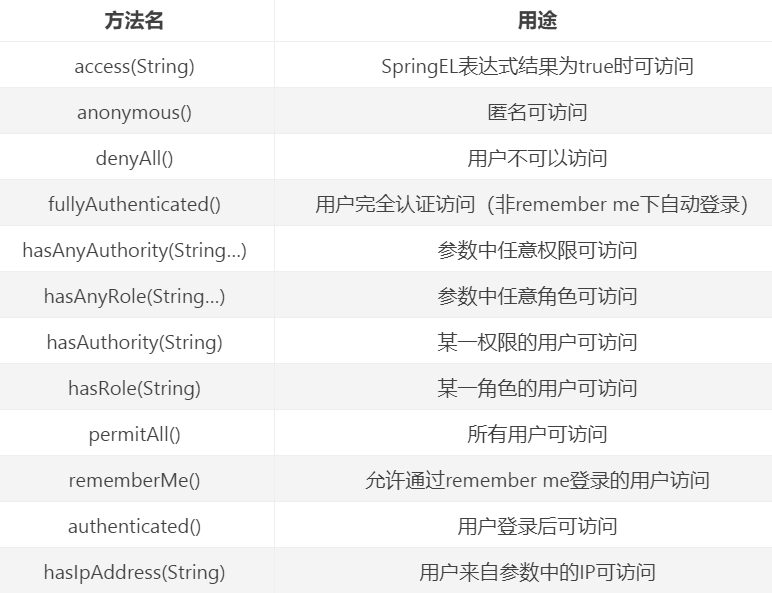
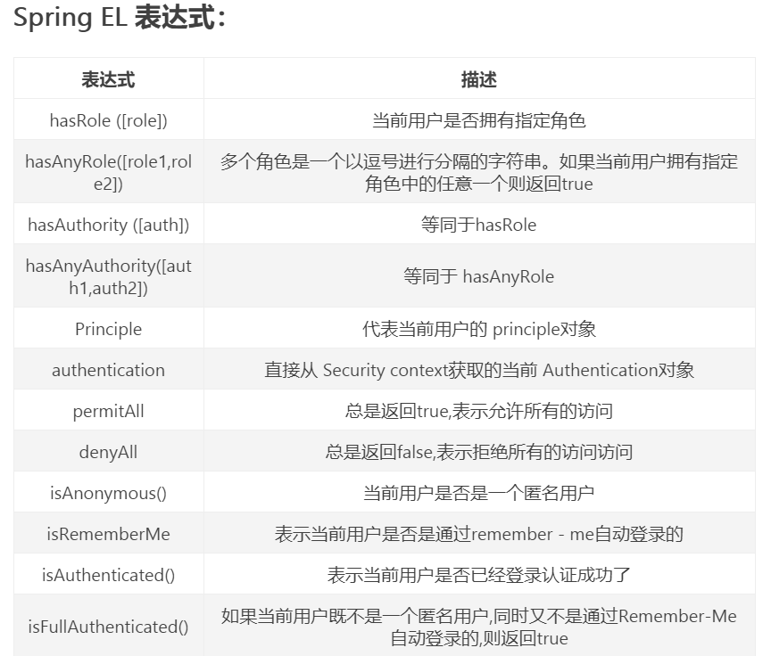
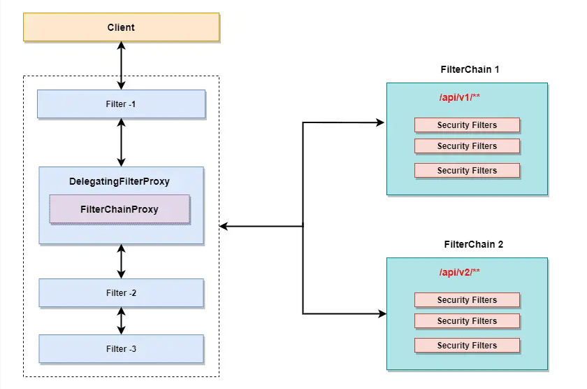
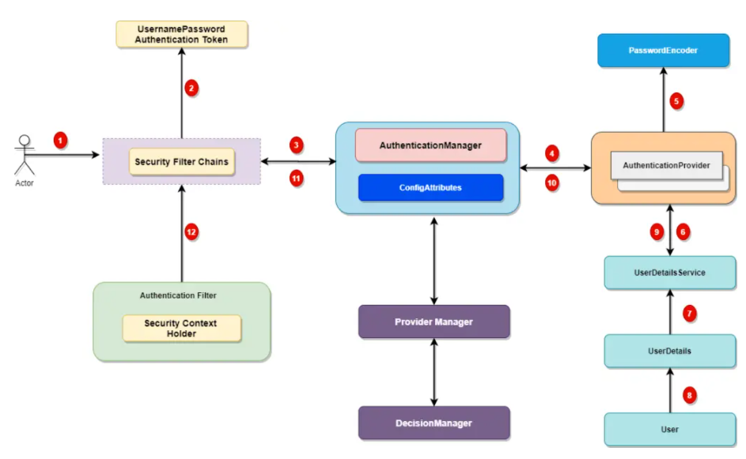

1. 前置学习

oAuth2.0：授权协议
用户认证后，为了避免用户的每次操作都进行认证，可将用户的信息保存在会话层中，如session，token等
服务端生成token，返回给客户端保存（可以保存在cookie，localstoage等），再次访问需要携带token，服务端解析token，并获得当前用户数据
授权数据模型：who对what（资源：功能资源，数据资源）进行how（权限）操作
为了方便给用户授权，创建角色（权限的打包）：用户表，角色表，权限表，用户角色表（用户与角色多对多），角色权限表（角色与权限多对多）
RBAC：授权方案（基于角色访问，基于资源访问）
基于角色访问：访问资源前要判断此用户是否拥有某角色，如果访问某一资源的角色增多了，要修改很多代码
基于资源：访问资源前要判断此用户是否拥有某访问资源权限，只要角色初始化时赋值了权限，后面不需改变（推荐）
session连接后自动生成，取得session只需要在controller方法中参数传入即可，sessionkey放到user类中，就是一个user对象
controller返回string需要配置produce为text/plain
权限控制：拦截器，在session中取出用户信息，校验用户权限与请求url比对

springsecurity不用自定义拦截器
继承websecurityconfigurerAdapter，@enablewebsecurity：配置用户信息，密码编码器，安全拦截机制（configure方法：配置登录，授权（配置拦截具体的url，不拦截则permmitAll，放在最下面），退出，csrf）
springboot会扫描当前目录以及当前子目录下面的所有类，所有不用配置扫描注解
集成springboot：配置websecurityconfig类
采用filter（filterchainproxy代理   authenticationmanager认证，accessdecisionmanager授权）与aop
filter：
1.securitycontextpersistencefilter，2.usernamepasswordauthenticationfilter（重要），3.filtersecurityinterceptor，4.exceptiontranslationflter
2将请求封装，交给authenticationmanager再委托给daoauthenticationProvider查询userdetailsservice获取用户信息，获取后返回userdetails，通过passwordencoder比对密码是否一致，
userdetailsservice通过我们配置的websecurityconfig中的userdetailsservice方法获取用户名密码
继承userdetailsservice实现loaduserbyusername方法加载用户与权限，写了这个类后，securityconfig中的配置用户信息的方法就不用写了
bcryptpasswordencoder加密，再security中配置passwordencoder返回此类，在pom中配置bcrypt依赖，用bcrypt.hashpw()方法加密密码（盐值不同，加密后的字符串不同，但是与原始密码校验都可以）
数据库中一定要存储加密后的密码，userdetailsservice返回的userdetails封装的就是加密后的密码，使用密码编码器，他会帮我们自动解码，然后与输入的密码比对

3获取用户访问受保护资源请求，通过securitymetadatasource获取当前资源所需权限，然后投票
三个投票实现类（投票：赞同，拒绝，弃权）：affirmativebased：只要有一个赞成就通过，全部弃权也通过  consensusbased：赞成多于反对则通过
unanimousbased：只要有一个反对就反对       不通过则抛出异常
从数据库查询权限（用户表，角色表，权限表，用户角色关系表，用户权限关系表），在userdetailsservice中授权
hasAuthority()基于资源授权，hasrole()基于角色授权/不推荐
方法授权：建议基于controller层的方法授权，@PreAuthorize（推荐使用，开启同secured）  @PostAuthorize  @Secured（开启：在配置类上写@EnableGlobalMethodSecurity（securedEabled=true））
@Secured（"IS_AUTHENTICATION_ANONYMOUS"）：可以匿名访问  @Secured（"ROLE_TELLER"）:具有teller的角色才能访问此方法
@PreAuthorize("isanonymous()")   @PreAuthorize("hasAuthority("p1")")：拥有p1权限

屏蔽掉csrf（跨站请求），可以在config中配置disable或者在请求页面加上token

Authentication接口获取用户身份，在用户访问资源时可以加上用户名
springsecurity配置session控制：always：没有session则创建一个，ifRequired（默认）：如果需要就创建一个session（登录时），never：永不创建，其他地方创建了也会使用，stateless：永不创建，也不使用
使用token时是不需要保存会话的，可以设置为stateless
可以设置退出url，设置logouthandle：退出成功时的清理工作等

分布式都有网关，通过了网关才能访问资源
分布式认证授权：每一个服务都写一个授权服务会冗余，所以需要共享：统一认证授权（UAA）（自己，外界都走这个授权服务）

网关校验客户端权限（校验token，验证客户端权限），微服务验证用户权限
/oauth/authorize：认证  /oauth/token：访问令牌
分布式：父工程，子工程
配置：ClientDetailsServiceConfigure客户端详情配置，AuthorizationServerEndpointsConfigure配置令牌访问端点与令牌服务，AuthorizationServerSecurityConfigurer配置令牌端点的安全约束
token令牌存储：inMemoryTokenStore：默认，存储在服务器内存中，jdbcTokenStore：存储数据库中，JWTtokenStore（JSON WEB TOKEN）：不需要存储，写到令牌中（最好）

JWT：用户认证通过会得到一个JWT令牌，令牌中包含了用户相关的信息，客户端只需要携带JWT令牌访问资源服务，资源服务根据实现约定的算法自动完成令牌
校验，无需每次都请求认证/授权服务器。（不使用JWT令牌时，资源服务器每次都要请求授权服务器验证token，很麻烦）
token令牌对应了内存中的用户数据，如用户名，密码，权限等，也就是说token并不存储用户信息，只是对应内存中的用户信息。而JWT本身存储用户信息
JWT优点：基于json，易扩展，可以使用非对称/对称加密算法，资源服务器可以不依赖认证服务器   缺点：JWT数据长
JWT包含：头部信息，内容，签名

2. Jwts类的使用：

   > 1. jwt的格式：Header头部+Payload荷载+Signature签名。
   >
   >    Header一般由两部分组成：token的类型与使用的算法。
   >
   >    Payload部分是JWT存储信息的部分，包含着Claims（声明），其实就是存储的的数据，一般分为三种类型：1. Registered claims：预定义的声明，如ISS为发布者的URL地址，exp为JWT的失效时间，sub为JWT面向的用户，iat为issued at jwt发布时间（builder时的时间）。2. Public claims：公开字段（无用）。3. Private claims：自定义私有字段（可以在这个字段里定义要传递的用户信息等）***不能在此字段传递加密的信息***，这部分采用对称加密方式，传输内容可以被解开
   >
   >    Signature签名的用途显而易见就是验证前面部分的内容是否有被篡改（因为前面是对称加密的，容易修改）。
   >
   > 2. Jwts解析：用Jwts.parser()创建一个JwtParser对象，指定要使用的秘钥setSigningKey()，调用parseClaimsJws()方法，用try/catch块包裹这部分内容，方便jjwt处理异常
   >
   > 3. sdf

3. 相关类https://www.jianshu.com/p/ac42f38baf6e：

   > 1. UserDetailsService：该接口仅有一个方法 loadUserByUsername，Spring Security 通过该方法获取UserDetails，通常实现此接口来自定义从数据库等加载用户，再封装入UserDetails。UserDetailsManager接口实现了UserDetailsService接口，还增加了创建用户，删除用户等方法，有两个实现类，InMemoryUserDetailsManager把传入的UserDetails存储在map中，JdbcUserDetailsManager从数据库中加载UserDetails中，或者创建用户存入数据库/从数据库删除用户。User类可以根据用户名密码权限人为创建UserDetails。
   >
   >    
   >
   > 2. UserDetails：该接口提供了getUsername()，getPassword()，getAuthorities()等方法，用于对用户与权限的封装。可以自己实现该接口，供 Spring Security 安全认证使用，Spring Security 默认使用的是内置的 User 类。通过 Authentication.getPrincipal() 的返回类型是 Object，但很多情况下其返回的其实是一个 UserDetails 的实例。
   >
   > 3. Authentication：Authentication 是一个接口，用来表示用户认证信息，在用户登录认证之前相关信息（用户传过来的用户名密码）会封装为一个 Authentication 具体实现类对象，默认情况下为 UsernamePasswordAuthenticationToken（封装了Object类型的principal与credentials），登录之后（通过AuthenticationManager认证）会生成一个更详细的、包含权限的对象。其中，getPrincipal()是用户的身份信息，大部分情况下返回的是UserDetails接口的实现类。getAuthorities()，权限信息列表，默认是GrantedAuthority接口的一些实现类，通常是代表权限信息的一系列字符串
   >
   > 4. GrantedAuthority：GrantedAuthority 是一个接口，它定义了一个 getAuthorities() 方法返回当前 Authentication 对象的权限字符串，用户有权限是一个 GrantedAuthority 数组，每一个 GrantedAuthority 对象代表一种用户。通常使用他的实现类SimpleGrantedAuthority 。  此实现类都是以集合的形式作为用户权限存储在UserDetails中。
   >
   > 5. AuthenticationManager：AuthenticationManager 是用来处理认证请求的**接口**，它只有一个方法 authenticate()，该方法接收一个 Authentication 作为对象，如果认证成功则返回一个封装了当前用户权限信息的 Authentication 对象进行返回。他默认的实现是 ProviderManager，但它不处理认证请求，而是将委托给 AuthenticationProvider 列表（List<AuthenticationProvider>），然后依次使用 AuthenticationProvider 进行认证，如果有一个 AuthenticationProvider 认证的结果不为null，则表示成功（否则失败，抛出 ProviderNotFoundException），之后不在进行其它 AuthenticationProvider 认证，并作为结果保存在 ProviderManager。认证校验时最常用的方式就是通过用户名加载 UserDetails，然后比较 UserDetails 密码与请求认证是否一致，一致则通过，Security 内部的 DaoAuthenticationProvider 就是使用这种方式。认证成功后加载 UserDetails 来封装要返回的 Authentication 对象，加载的 UserDetails 对象是包含用户权限等信息的。
   >
   > 6. AuthenticationProvider：是一个身份认证接口，实现该接口来定制自己的认证方式。该接口有两个方法：*Authentication authenticate(Authentication authentication)*：认证处理，返回一个 Authentication 的实现类则代表成功，返回 null 则为认证失败。s*upports(Class<?> aClass)*：如果该 AuthenticationProvider 支持传入的 Authentication 认证对象，则返回 true 
   >
   > 7. AuthorityUtils：是一个工具包，用于操作 GrantedAuthority 集合的实用方法。c*ommaSeparatedStringToAuthorityList(String authorityString)*：从逗号分隔符中创建 GrantedAuthority 对象数组。
   >
   > 8. AbstractAuthenticationProcessingFilter：该抽象类继承了 GenericFilterBean，是处理 form 登录的过滤器，与 form 登录相关的所有操作都在该抽象类的子类中进行（UsernamePasswordAuthenticationFilter 为其子类），比如获取表单中的用户名、密码，然后进行认证等操作。该类在 doFilter 方法中通过 **attemptAuthentication()** 方法进行用户信息逻辑认证，认证成功会将用户信息设置到 Session 中。
   >
   > 9. HttpSecurity：1. authorizeRequests()：返回一个配置对象用于配置请求的访问限制  2.antMatchers：匹配请求路径或请求动作类型，如：`.antMatchers("/admin/**")`    3.addFilterBefore: 在某过滤器之前添加 filter   4.addFilter()：添加过滤器   5. hasRole：结合 antMatchers 一起使用，设置请求允许访问的角色权限或IP，如`.antMatchers("/admin/**").hasAnyRole("ROLE_ADMIN","ROLE_USER")` 
   >
   >    
   >
   > 10. AuthenticationManagerBuilder：用于构建AuthenticationManager认证，允许快速构建内存认证（auth.inMemoryAuthentication()），LDAB身份认证，JDBC身份验证（auth.jdbcAuthentication()），添加UserDetailsService与AuthenticationProvider（定义认证方式）。
   >
   > 11. sdf

5. 常用注解：1. @**EnableWebSecurity**：开启 Spring Security 注解（支持security与mvc的集成）   2. @**EnableGlobalMethodSecurity(prePostEnabled=true)**：开启security方法注解   3. @**PreAuthorize**：在方法调用前，通过SpringEL表达式限制方法访问，如@PreAuthorize("isanonymous()")匿名可以访问   @PreAuthorize("hasAuthority("p1")")：拥有p1权限可以访问   4. @Secured不支持EL表达式，不推荐使用   5. @PostAuthorize：在方法执行后再进行权限验证，支持EL表达式

   

   

6. 密码加密：spring 提供的一个用于对密码加密的接口，首选实现类为 BCryptPasswordEncoder。

7. 过滤器chain：**SecurityContextPersistenceFilter**，SebAsyncManagerIntegrationFilter，HanderWriterFilter，CsrfFilter，LogoutFilter，**UsernamePasswordAuthenticationFilter**，DefaultLoginPageGeneratingFilter，**BasicAuthenticationFilter**，RequestCacheAwareFilter，SecurityContextHolderAwareRequestFilter，**AnonymousAuthenticationFIlter**，SessionManagementFilter，**ExceptionTranslationFilter**，**filterSecurityInterceptor**  注意，**security的一系列功能都是由过滤器完成的**   

7. 过滤器链：

   > 1. SecurityContextPersistenceFilter：请求在到达 UsernamePasswordAuthenticationFilter 之前都会先经过 SecurityContextPersistenceFilter。此类实现：每一个请求到达服务端的时候，首先从 session 中找出来 SecurityContext ，然后设置到 SecurityContextHolder 中去，方便后续使用，当这个请求离开的时候，SecurityContextHolder 会被清空，SecurityContext 会被放回 session 中，方便下一个请求来的时候获取。  流程：在 doFilter 方法中，它首先会从 repo 中读取一个 SecurityContext 出来，这里的 repo 实际上就是 HttpSessionSecurityContextRepository，读取 SecurityContext 的操作会进入到 readSecurityContextFromSession 方法中，在这里我们看到了读取的核心方法 `Object contextFromSession = httpSession.getAttribute(springSecurityContextKey);`，这里的 springSecurityContextKey 对象的值就是 **SPRING_SECURITY_CONTEXT**，读取出来的对象最终会被转为一个 SecurityContext 对象。在拿到 SecurityContext 之后，通过 SecurityContextHolder.setContext 方法将这个 SecurityContext 设置到 ThreadLocal 中去。接下来，通过 chain.doFilter 让请求继续向下走（这个时候就会进入到 `UsernamePasswordAuthenticationFilter` 过滤器中了，在过滤器链走完之后，数据响应给前端之后，finally 中还有一步收尾操作，这一步很关键。这里从 SecurityContextHolder 中获取到 SecurityContext，获取到之后，会把 SecurityContextHolder 清空，然后调用 repo.saveContext 方法将获取到的 SecurityContext 存入 session 中。获取不到用户信息：https://juejin.im/post/6844904111393996813
   > 2. BasicAuthenticationFilter：处理http请求的basic authorization头部（携带了用户名密码的base64编码的token），把用户信息放入SecurityContextHolder。如果设置了remember-me，则后续的请求不用携带basic authentication。如果验证失败，并且ignoreFailure设置为false（默认），则一个AuthenticationEntryPoint接口的实现将会被调用，通常是BasicAuthenticationEntryPoint，此类会提示用户通过basic authentication再次认证。
   > 3. AnonymousAuthenticationFilter：`Spirng Security` 为了整体逻辑的统一性，即使是未通过认证的用户，也给予了一个匿名身份。而 `AnonymousAuthenticationFilter` 该过滤器的位置也是非常的科学的，它位于常用的身份认证过滤器（如 `UsernamePasswordAuthenticationFilter、BasicAuthenticationFilter、RememberMeAuthenticationFilter` ）之后，意味着只有在上述身份过滤器执行完毕后，`SecurityContext` 依旧没有用户信息，`AnonymousAuthenticationFilter` 该过滤器才会有意义—-基于用户一个匿名身份。
   > 4. ExceptionTranslationFilter：`ExceptionTranslationFilter` 异常转换过滤器位于整个 `springSecurityFilterChain` 的后方，用来转换整个链路中出现的异常，将其转化，顾名思义，转化以意味本身并不处理。一般其只处理两大类异常：`AccessDeniedException` 访问异常和 `AuthenticationException` 认证异常。这个过滤器非常重要，因为它将 `Java` 中的异常和 `HTTP` 的响应连接在了一起，这样在处理异常时，我们不用考虑密码错误该跳到什么页面，账号锁定该如何，只需要关注自己的业务逻辑，抛出相应的异常便可。如果该过滤器检测到 `AuthenticationException` ，则将会交给内部的 `AuthenticationEntryPoint` 去处理，如果检测到 `AccessDeniedException`，需要先判断当前用户是不是匿名用户，如果是匿名访问，则和前面一样运行`AuthenticationEntryPoint`，否则会委托给`AccessDeniedHandler` 去处理，而 `AccessDeniedHandler` 的默认实现，是 `AccessDeniedHandlerImpl` 。所以 `ExceptionTranslationFilter` 内部的 `AuthenticationEntryPoint` 是至关重要的，顾名思义：认证的入口点。
   > 5. FilterSecurityInterceptor：由什么控制哪些资源是受限的，这些受限的资源需要什么权限，需要什么角色…这一切和访问控制相关的操作，都是由 `FilterSecurityInterceptor` 完成的。`FilterSecurityInterceptor` 从 `SecurityContextHolder` 中获取 `Authentication` 对象，然后比对用户拥有的权限和资源所需的权限

9. Postman中的发送请求Body格式：1. form-date：就是http请求中的multipart/form-data,它会将表单的数据处理为一条消息，以标签为单元，用分隔符分开。既可以上传键值对，也可以上传文件。当上传的字段是文件时，会有Content-Type来说明文件类型；content-disposition，用来说明字段的一些信息；由于有boundary隔离，所以multipart/form-data既可以上传文件，也可以上传键值对，它采用了键值对的方式，所以可以上传多个文件。  2. x-www-form-urlencoded：就是application/x-www-from-urlencoded,会将表单内的数据转换为键值对，当模拟表单上传数据时，用此选项，但当然此表单不能上传文件，只能是文本格式，要上传文件，使用上面的格式。比如,name=ah&age = 23   区别：multipart/form-data：既可以上传文件等二进制数据，也可以上传表单键值对，只是最后会转化为一条信息；  x-www-form-urlencoded：只能上传键值对，并且键值对都是间隔分开的。  3. raw：可以上传任意格式的文本，可以上传text、json、xml、html等，其实主要的还是传递json格式的数据，当后端**要求json数据格式**的时候，就要使用此种格式来测试。  4. binary：相当于Content-Type:application/octet-stream,只可以上传二进制数据，通常用来上传文件，由于没有键值，所以，一次只能上传一个文件。

10. 两种授权方法：web授权与方法授权，web（filtersecurityinterceptor）：通过url拦截进行授权，方法（methodsecurityinterceptor）：通过方法拦截进行授权。在代码中，web授权为security配置类中的授权，方法授权是通过Controller中@PreAuthorize等授权。

11. 授权相关类https://wiki.jikexueyuan.com/project/spring-security/core-classes.html：

    > 1. SecurityContext：安全上下文接口，即存储认证授权的相关信息，实际上就是存储"**当前用户**"账号信息和相关权限（存储的是Authentication类）。这个接口只有两个方法，Authentication对象的getter、setter。（使用token与jwt时，因为用户信息都是存储在token中，需要SecurityContext时，我们可以根据token生成SecurityContext）   SecurityContext默认存储在ThreadLocal中，在每一次 request 结束后都将清除当前线程的 ThreadLocal。
    > 2. SecurityContextHolder工具类（是用来保存SecurityContext）：SecurityContextHolder工具类就是**把SecurityContext存储在当前线程**中。SecurityContextHolder可以**用来设置和获取SecurityContext**。它主要是给框架内部使用的，可以利用它获取当前用户的SecurityContext进行请求检查，和访问控制等。在Web环境下，SecurityContextHolder是**利用ThreadLocal来存储SecurityContext**的。   通过调用 SecurityContextHolder.getContext().setAuthentication(...)  将 Authentication 对象赋给当前的 SecurityContext
    > 3. SecurityContextPersistenceFilter：SecurityContextPersistenceFilter是Security的拦截器，而且是拦截链中的第一个拦截器，请求来临时它会从HttpSession中把SecurityContext取出来，然后放入SecurityContextHolder。在所有拦截器都处理完成后，再把SecurityContext存入HttpSession，并清除SecurityContextHolder内的引用。
    > 4. 异常处理类：AuthenticationEntryPoint 用来解决匿名用户访问无权限资源时的异常，AccessDeineHandler 用来解决认证过的用户访问无权限资源时的异常。
    > 5. session与securitycontext：既然 SecurityContext 是存放在 ThreadLocal 中的，而且在每次权限鉴定的时候都是从 ThreadLocal 中获取 SecurityContext 中对应的 Authentication 所拥有的权限，并且不同的 request 是不同的线程，为什么每次都可以从 ThreadLocal 中获取到当前用户对应的 SecurityContext 呢？在 Web 应用中这是通过 **SecurityContextPersistentFilter** 实现的，默认情况下其会在每次请求开始的时候从 session 中获取 SecurityContext，然后把它设置给 SecurityContextHolder，在请求结束后又会将 SecurityContextHolder 所持有的 SecurityContext 保存在 session 中，并且清除 SecurityContextHolder 所持有的 SecurityContext。这样当我们**第一次访问系统的时候**，SecurityContextHolder 所持有的 **SecurityContext 肯定是空**的，待我们登录成功后，SecurityContextHolder 所持有的 SecurityContext 就不是空的了，且包含有认证成功的 Authentication 对象，待请求结束后我们就会**将 SecurityContext 存在 session 中**，等到下次请求的时候就可以从 session 中**获取到该 SecurityContext** 并把它赋予给 SecurityContextHolder 了，由于 SecurityContextHolder 已经持有认证过的 Authentication 对象了，所以下次访问的时候也就不再需要进行登录认证了。 注意，**这是针对默认session模式即ifRequired**，如果使用stateless（即jwt），需要每次都获取token（即在BasicAuthenticationFilter拦截器中解析token）。  如果使用session，不需要配置鉴权拦截器，只需要在configure中配置即可，他会自动获取securityContext。  
    > 6. 使用session如何获取登录信息（Authentication）？1. 使用SecurityContextHolder.getContext().getAuthentication()  2. 在Controller 的方法中，加入 Authentication 参数。 正常情况下，我们通过如上两种方式的任意一种就可以获取到已经登录的用户信息。异常情况，就是这两种方式中的任意一种，都返回 null。都返回 null，意味着系统收到当前请求时并不知道你已经登录了（因为你没有在系统中留下任何有效信息），当你发送任何请求，系统都会给你返回 401（HTTP401错误代表用户没有访问权限，需要进行身份认证）。
    > 8. asd
    
12. **postman开启cookie**：https://blog.csdn.net/xiangyubobo/article/details/51686215，如果需要用session，那么用postman测试时就需要开启cookie。

14. CORS（跨域）：跨域：在浏览器上当前访问的网站向另一个网站发送请求获取数据的过程就是跨域请求。同源策略就是向服务端发起请求的时候，以下三项必须与当前浏览器应用一致：域名、端口、协议，用白话说：就是你的应用发送请求**不能访问别人的资源**，否则浏览器就会限制你。当然也有例外，如：img、srcipt、iframe等资源引用的HTML标签不受同源策略的限制。如果缺少了同源策略，浏览器很容易受到XSS、CSRF等攻击。但是我们实际开发中又经常会跨站访问，比如前后端分离的应用是分开部署的，在浏览器看来是两个域。所以同源策略是用来禁止跨域访问的，CORS正好相反是根据自己的需求与规则，有限的开放部分资源的共享。在spring security中配置跨域可以允许别人访问我们的后端资源：在configure中开启，然后配置一个返回CorsConfigurationSource的@Bean

15. XSS（跨站脚本攻击）：XSS 攻击，一般是指攻击者通过在网页中注入恶意脚本，当用户浏览网页时，恶意脚本执行，控制用户浏览器行为的一种攻击方式。危害：窃取用户Cookie，获取用户隐私，盗取用户账号。劫持用户（浏览器）会话，从而执行任意操作，例如进行非法转账、强制发表日志、发送电子邮件等。 XSS 攻击的本质就是输入的内容被当做程序执行了，所以我们对于用户输入的内容不能完全的信任，需要考虑如何避免其被当做程序执行。  防御方法：**浏览器自带**X-XSS-Protection，**转义**：在 XSS 攻击中，攻击者主要是通过构造特殊字符来注入脚本，所以对用户的输入进行检测就很有必要，并且需要在客户端与服务端都进行输入检测，然后对用户输入的数据进行转义。  **过滤**：在富文本中因为需要保留 HTML ，所以我们不能使用转义的方法防御 XSS 攻击，这里使用过滤的方式防御 XSS 攻击，也就是通过只使用白名单允许的 HTML 标记及其属性，来防御攻击。**内容安全策略（CSP）**：实质就是白名单制度，开发者明确告诉客户端，哪些外部资源可以加载和执行，大大增强了网页的安全性。

14. spring security工作流：security中有15个过滤器，以特定的顺序执行，每一个请求都要按顺序经过这一条过滤器链。https://www.javadevjournal.com/spring-security/spring-security-filters/

    > 1. DelegatingFilterProxy过滤器作为一个桥梁，沟通Servlet容器与spring application context，DelegationFilterProxy作为一个正常的servlet过滤器注册到context中，然后他委托给spring bean（即FilterChainProxy）去启动security工作流。
    > 2. FilterChainProxy包含关于不同的security过滤器链（DefaultSecurityFilterChain包含了List类型的filters与RequestMatcher类型的匹配器）的信息，并且根据URI映射或者RequestMatcher接口把请求委托给不同的过滤器执行。FilterChainProxy是被DelegatingFilterProxy启动的。
    > 3. Security Filter chain：我们能够有多个security过滤器链在我们的应用中，比如内网一个，外网一个。我们调用servlet过滤器仅仅取决于URL，而spring security过滤器链更灵活，可以根据url，或者使用RequestMatcher去创建更强大的规则来启动不同的过滤器链，例如请求头部。请求将被FilterChainProxy匹配到的第一个过滤器链执行（一个while循环，直到request与某个过滤器链匹配）。

    

15. Authentication验证流程：

    > 1. 第一步：登录请求将通过过滤器链直到到达UsernamePasswordAuthenticationFilter，同样，Basic authentication请求将到达BasicAuthenticationFilter。
    > 2. 第二步：验证请求将到达验证过滤器，filter将从payload中提取请求用户名密码，并且根据传入的用户名密码创建一个Authentication（实现类即图中的UsernamePasswordAuthenticationToken）。
    > 3. 第三步：AuthenticationManager（常用实现类ProviderManager）是关键一步，定义了如何验证，manager内部将把验证交给AuthenticationProvider负责，manager将委托给一系列配置的Provider负责（manager中provider存储在list中）。
    > 4. 第四步：AuthenticationProvider负责具体的验证功能，它提供了一种机制，我们能够获取用户细节用于验证请求中的用户信息，实现类有：DaoAuthenticationProvider，RememberMeAuthenticationProvider等。我们可以实现AuthenticationProvider自定义验证方式，需要把实现类在config中配置（通过builder）。
    > 5. 一些provider（如DaoAuthenticationProvider）需要UserDetailsService从数据库获取用户信息，UserDetailsService接口仅有一个方法 loadUserByUsername，Spring Security 通过该方法获取UserDetails，通常实现此接口来自定义从数据库等加载用户，再封装入UserDetails。  
    > 6. 第12步：验证成功后将会有用户详细信息的Authentication对象放入到SecurityContext中，SecurityContext被包裹在SecurityContextHolder中。1. Holder是存储验证成功后的用户信息的地方  2.spring security并不会验证Holder如何被填充的  3.如果发现Holder中有值，则会把当前User对象看出已经验证的对象。
    > 7. 异常处理：验证失败一个AuthenticationException将会被抛出，验证成功将会返回一个Authentication对象，此对象包含了三种信息：User credentials，List of granted authorities，Authentication flag。

    

16. 登录：

    > 1. security支持三种登录方式：Form login，Basic authentication，Digest
    > 2. 支持4中读取UserDetails方式：In Memory Storage，JDBC Authentication，Custom User Details Service，LDAP（多用于内联网应用Intranet applications）。
    > 3. 登录流程：用户访问受限信息，没有登录则抛出异常，ExceptionTranslationFilter将处理异常发送登录页面给用户。spring security有一个默认的登录页面，我们也可以自己配置（通过http配置返回登录页面的controller的url，配置成功页面的url，失败页面的url（失败页面一般也是loging，只是传入了失败信息））。

17. 静态文件处理：一些css等文件，我们可以在config中用web配置ignoring().antMatchers("/static/**")，使他们不通过过滤器链，而需要通过过滤器链的要用http配置，至于通过过滤器链是匿名还是需要验证等具体分析。

18. 注意：数据库中角色应该带有role前缀，如role_admin，这样才能匹配成功。

19. 登出：使用http配置登出，如果开启了csrf（默认），则登出为post请求，我们能通过关闭csrf使用get请求登出。logoutSuccessUrl配置登出url，默认为/login?logout。使用logoutSuccessHandler()配置登出触发（实现LogoutSuccessHandler接口），如果配置了handler，则logoutSuccessUrl不起作用。invalidateHttpSession控制是否让session无效。deleteCookies(cookieName)删除cookie。  我们可以实现LogoutHandler与LogoutSuccessHandler并加入配置。

20. RememberMe：1.使用cookie 2.基于Token

    > 1. 在http中配置rememberMe().userDeTailsService(UserDetailsService)即可。系统会自动生成authentication token与cookie（包含username,password,expiration time,a private key的hash或者md5加密），并把cookie发送给浏览器，随后访问网页便会自动帮我们登录。安全问题：cookie被别人获取很危险，cookie在我们更改密码或者过期后失效。
    > 2. 创建一个存储token的表，和对此表操作的DAO层，登录时，创建cookie前security会将一些信息存储在数据库中。下次访问网站，security会根据cookie（存储了token与一些用户信息的加密）从数据库提取数据，如果数据匹配则自动登录成功。在http中配置remomberMe().tokenRepository(DAO bean)

21. springsecurity配置session控制：使用http配置。

    > 1. SessionCreationPolicy.ALWAYS：没有session则创建一个，SessionCreationPolicy.IF_REQUIRED（默认）：如果需要就创建一个session（登录时），SessionCreationPolicy.NEVER：永不创建，其他地方创建了也会使用，SessionCreationPolicy.STATELESS：永不创建，也不使用。  
    > 2.  注意，这些session配置只是spring security中的配置，并不影响我们的application，所以如果我们配置了stateless，在外面还是能看到session。如果配置允许使用session，则spring security能够使用application创建的session。
    > 3. spring security的登录与登出都使用了session，如果使用stateless，security将不会使用cookie，任何请求都需要重新验证。
    > 4. 配置session过期后的url，在http中配置invalidSessionUrl()，我们可以在properties文件中配置session的过期时间，另外，如果不指定时间单位，默认使用秒，在tomcat中，仅支持分钟级别的单位。

22. 并发session控制：我们需要控制相同用户的多次登录。

    > 1. 当用户已经验证后再次验证时有三种处理方式：a.使得已经存在session无效，并且创建一个新的经过验证的session   b.保持已经存在session并且抛出一个异常给新登录的请求   c.允许这两个session存在，并且运行用户从不同的地方登录。 
    > 2.  配置：在@Configuration中增加一个HttpSessionEventPublisher类的bean，在http配置sessionManagement().maximumSession(1)，控制最多session数量为1。当我们换不同的浏览器登录两次时，原来登录的页面会显示session已经过期（使用了a方式），我们可以通过配置expiredUrl()，显示我们自己配置的信息。我们可以通过配置maxSessionPreventsLogin(true)，使得新登录的session过期（即使用b方式）。注意，使用b方式当我们直接关闭浏览器而没有退出时，在原来的session过期前就不能再登录了。
    > 3. 原理：**SessionRegistry**维持了一个包含激活的HTTP session与已经验证的用户信息的map，通过session的创建于更新实时更新此map，我们上面创建的**HttpSessionEventPublisher**就是根据session生命周期事件更新SessionRegistry的map。每次当登录的用户访问受保护的信息时，**SessionManagementFilter**都会检查用户在SessionRegistry中的session。**ConcurrentSessionFilter**将会识别过期的session并且通知用户session已经过期。
    > 4. 使用security的并发控制时需要注意：1. 如果使用了自定义的UserDetails，则需要确保实现了equels与hashCode方法。（因为SessionRegistry使用map存储UserDetails） 2.如果使用了rememberMe功能，则不会强制执行并发控制。3.在集群环境中，默认的并发控制将不会工作，因为SessionRegistry把map存储到一台机器的内存中  4.如果应用重启，那么SessionRegistry中的数据也会清空。

23. 防止暴力登录：用户登录失败到达一定次数后锁定用户

    > 1. 原理：spring security每次验证失败/成功都会发布一个失败事件或成功事件，我们可以自定义一个验证失败Listener，持有一个数字每次验证失败数字加一，超过一定值之后锁定用户。自定义一个验证成功Listener，成功都会重置数字。
    > 2. 实现：失败监听器：实现ApplicationListener接口，泛型类为AuthenticationFailureBadCredentialsEvent代表监听此事件  成功监听器：实现相同的接口，泛型为AuthenticationSuccessEvent。  注意，数字与锁定作为user的属性，需要持久化。

24. sdf

25. oauth2.0规范：

    > 1. 认证方案：session：需要所有分布式实例都具有此session
    >    token：token中存储了用户信息，缺点：数据量比较大，安全性问题   对第三方接入认证更适合，可使用当前流行的开放协议Oauth2.0，JWT等  更适合分布式
    >
    > 2. 作用：使用授权服务器提供一个访问凭据给到第三方应用，让第三方应用可以在不知道资源所有者在资源服务器上的账号和密码的情况下，能获取到资源所有者在资源服务器上的受保护资源。
    >
    > 3. 流程：用户打开客户端（如可以用微信登录的网站）以后，客户端要求用户给予授权。用户同意给予客户端授权。客户端使用上一步获得的授权，向认证服务器（如微信）申请令牌。认证服务器对客户端进行认证以后，确认无误，同意发放令牌。客户端使用令牌，向资源服务器申请获取资源。资源服务器确认令牌无误，同意向客户端开放资源。
    >
    >    
    >
    > 4. sdf

26. oauth2.0授权方式：http://www.ruanyifeng.com/blog/2019/04/oauth-grant-types.html

    > 1. 授权码方式（authorization-code）：指的是第三方应用先申请一个授权码，然后再用该码获取令牌。第一步：A网站提供一个连接，用户点击后就会跳转到 B 网站，授权用户数据给 A 网站使用，链接示意：https://b.com/oauth/authorize?response_type=code&client_id=CLIENT_ID&redirect_uri=CALLBACK_URL&scope=read      response_type表示要求返回授权码，client_id让B知道谁在请求，redirect_uri是B接受或者拒绝请求后的跳转网址，scope表示要求的授权范围。  第二步：用户跳转后，B 网站会要求用户登录，然后询问是否同意给予 A 网站授权。用户表示同意，这时 B 网站就会跳回redirect_uri参数指定的网址。跳转时，会传回一个授权码。 第三步：A 网站拿到授权码以后，就可以在后端，向 B 网站请求令牌。第四步：B 网站收到请求以后，就会颁发令牌。具体做法是向redirect_uri指定的网址，发送一段 JSON 数据。
    > 2. 隐藏式(implicit)：有些 Web 应用是纯前端应用，没有后端。这时就不能用上面的方式了，必须将令牌储存在前端。第一步，A 网站提供一个链接，要求用户跳转到 B 网站，授权用户数据给 A 网站使用。与上面不同的是，response_type参数接收不是type而是token了，因此A网站直接在前端拿到令牌。第二步，用户跳转到 B 网站，登录后同意给予 A 网站授权。这时，B 网站就会跳回redirect_uri参数指定的跳转网址，并且把令牌作为 URL 参数，传给 A 网站。注意，B网站把token作为参数，token是以url锚点的方式(#带参数)，而不是查询字符串(?带参数)。
    > 3. 密码式(password)：把用户名密码直接告诉应用。第一步，A 网站要求用户提供 B 网站的用户名和密码。拿到以后，A 就直接向 B 请求令牌。链接示意：https://oauth.b.com/token?grant_type=password&username=USERNAME&password=PASSWORD&client_id=CLIENT_ID&client_secret=CLIENT_SECRET  其中，grant_type参数是授权方式，这里的password表示"密码式"，username和password是 B 的用户名和密码。 第二步：B 网站验证身份通过后，直接给出令牌。注意，这时不需要跳转，而是把令牌放在 JSON 数据里面，作为 HTTP 回应，A 因此拿到令牌。      自己本身有一套用户体系，在认证时需要带上自己的用户名和密码，以及客户端的client_id,client_secret。此时，accessToken所包含的权限是用户本身的权限，而不是客户端的权限。
    > 4. 凭证式(client credentials)：适用于没有前端的命令行应用，即在命令行下请求令牌。第一步，A 应用在命令行向 B 发出请求。链接示意：https://oauth.b.com/token?grant_type=client_credentials&client_id=CLIENT_ID&client_secret=CLIENT_SECRET  client_id与client_secret让B确认A的身份   第二步，B 网站验证通过以后，直接返回令牌。    **没有用户的概念**，直接与认证服务器交互，用配置中的客户端信息去申请accessToken，客户端有自己的client_id,client_secret对应于用户的username,password，而客户端也拥有自己的authorities，当采取client模式认证时，对应的权限也就是客户端自己的authorities。

27. 令牌使用与更新：

    > 1. 令牌的使用：在请求头上加上一个Authentication字段，令牌就放在这个字段里面。
    > 2. 更新：B网站颁发令牌的时候，一次性颁发两个令牌，一个用于获取数据，另一个用于获取新的令牌（refresh token 字段）。令牌到期前，用户使用 refresh token 发一个请求，去更新令牌。链接示意：https://b.com/oauth/token?grant_type=refresh_token&client_id=CLIENT_ID&client_secret=CLIENT_SECRET&refresh_token=REFRESH_TOKEN  grant_type参数为refresh_token表示要求更新令牌，client_id参数和client_secret参数用于确认身份，refresh_token参数就是用于更新令牌的令牌
    > 3. 

28. 获取令牌时（/oauth/token地址），客户端要经过服务器端ClientCredentialsTokenEndpointFilter验证（与UsernamePasswordAuthenticationFilter作用类似，通过获取clientId与clientSecret验证客户端身份，认证过程与Username不同的是，他获取客户端信息时调用的是ClientDetailsUserDetailsService，此类继承了UserDetailsService，但是内部调用的的是ClientDetailsService的loadClientByClientId方法），而此过滤器会判断客户端是否已经验证，如果没有则从请求中获取client_id与client_secret，通过AuthenticationManager验证。验证通过后，会到达TokenEndpoint，此类就是一个Controller（路径为/oauth/token），返回生成的token（OAuth2AccessToken）。

29. OAuth2 Provider包括两部分（https://projects.spring.io/spring-security-oauth/docs/oauth2.html）：鉴权服务与资源服务，他们可以放在同一个应用，或者分成不同的应用，或者多个资源服务共用一个鉴权服务。请求token的请求被spring mvc controller endpoint处理，请求受保护资源的请求被标准的spring security filter处理。以下的两个endpoint被要求去实现Oauth2鉴权服务：1. AuthorizationEndpoint被用于请求的鉴权，默认url：/auth/authorize    2. TokenEndpoint被用于获取token，默认url：/auth/token。 以下filter被要求去实现oauth2资源服务：OAuth2AuthenticationProcessingFilter被用于为携带了token的request加载Authentication。

30. Oauth2 Provider鉴权配置：我们需要配置授权类型，client details和token。@EnableAuthorizationServer注解与实现了AuthorizationServerConfigurer的@Bean(通常为AuthorizationServerConfigurerAdapter)被用于配置鉴权服务，AuthorizationServerConfigurer接口被spring传入了以下configurers供我们配置：1.ClientDetailsServiceConfigurer：定义client details。  2.AuthorizationServerSecurityConfigurer：定义了token endpoint的安全限制。 3.AuthorizationServerEndpointsConfigurer：定义鉴权，token endpoints和token服务。

    > 1. 配置client details：可以被用于定义in-memory或者JDBC实现的client Details，有以下重要属性：clientId，secret，scope，authorizedGrantTypes，authorities。
    > 2. 管理token：两点注意事项：1.创建token后，authentication一定要被存储起来，以便接受token的资源能够引用他。2.token被用于加载authentication，然后被用于授权token的创建。AuthorizationServerTokenServices接口定义了一些操作token的操作。我们可以通过实现它的实现类DefaultTokenServices来自定义一些操作。DefaultTokenServices通过随机数来创建token，通过委托给TokenStore来实现token的持久化，默认的token store策略存储在内存中，持久化策略：
    >    - InMemoryTokenStore：默认，被用于单台服务器。不需要任何其他依赖。
    >    - JdbcTokenStore：存储在数据库中，需要spring-jdbc依赖。
    >    - JwtTokenStore：把所有的授权数据都编码进了token里面，所以不需要存储token。劣势是难以使得token无效，所以我们需要比较短的token过期时间，并且当数据量很大时，token也会很大。
    > 3. JwtToken使用：我们需要JwtTokenStore在我们的授权服务器，并且资源服务器也需要解码token，所以JwtTokenStore有一个依赖JwtAccessTokenConverter被用于解码。token使用默认签名，资源服务器需要能够验证签名，所以他要么需要相同的签名key，要么需要与授权服务器的私钥匹配的公钥，公钥通过授权服务器的/oauth/token_key暴露，公钥默认是通过'denyAll()'规则拒绝访问的，我们可以在AuthorizationServerSecurityConfigurer中配置'permitAll()'开启访问。  使用JwtTokenStore我们需要spring-security-jwt依赖。
    > 4. 授权类型：授权类型有AuthorizationEndpoint支持，我们可以通过AuthorizationServerEndpointsConfigurer配置。默认支持所有授权类型，除了password。以下几个configurer中的重要属性：1.authenticationManager：通过注入一个AuthenticationManager开启密码授权。（并不需要实现AuthenticationManager类，直接@Autowired即可） 2.userDetailsService：如果注入了一个UserDetailsService，或者通过GlobalAuthenticationConfigurerAdapter配置全局UserDetailsService，刷新token授权将会检查这个service，确保账户仍然被激活。 3.authorizationCodeServices：定义鉴权码服务。 4.implicitGrantService：管理implicit授权方式时的状态。5.tokenGranter：完全控制授权并且忽略上面的所有属性。
    > 5. 配置endpoint url：AuthorizationServerEndpointsConfigurer有一个pathMapping()方法，有两个参数，分别是默认的url，自定义的url。默认的url包括：1./oauth/authorize（授权）  2./oauth/token（获取token）  3.oauth/confirm_access（用户发布为授权的同意）  4./oauth/error（授权服务中的错误）  5./oauth/check_token（资源服务器解码token）  6./oauth/token_key（jwt时暴露公钥）。/oauth/authorize应该被spring security保护以至于他仅仅能被验证的用户访问。
    > 6. 自定义页面：大多数的endpoints都由机器调用，但也有两个endpoints需要用户页面，即/oauth/confirm_access与/oauth/error，我们需要为这些endpoints提供controller。在/oauth/confirm_access中（默认endpoint为WhitelabelApprovalEndpoint），因为使用了@SessionAttributes()注解，所以session中绑定了AuthorizationRequest，AuthorizationRequest携带了寻求用户同意的所有数据，我们可以按我们喜欢的方式渲染这些数据，然后用户需要发送一个拒绝或者同意的post请求到/oauth/authorize，请求参数被传递到AuthorizationEndpoint中的UserApprovalHandler，默认的UserApprovalHandler取决于我们是否在AuthorizationServerEndpointsConfigurer中提供了ApprovalStore，提供了则为ApprovalStoreUserApprovalHandler（接受参数：user_oauth_approval="true"），否则为TokenStoreUserApprovalHandler（接收参数：一些列的scope前缀的参数，值为true或者approved）。  另外，别忘了在表单中加上CSRF保护。
    > 7. 自定义异常：只需要实现@RequestMapping("/oauth/error")的controller即可。
    > 8. 根据用户权限限制token的scope：如果在AuthorizationEndpoint中使用OAuth2RequestFactory，我们能够设置OAuth2RequestFactory中的标志checkUserScopes=true去根据用户权限限制token的权限范围。我们也能注入OAuth2RequestFactory到TokenEndpoint中，但仅仅在设置了TokenEndpointAuthenticationFilter到BasicAuthenticationFilter后面才有效。我们也能自己实现角色到scope的映射，通过在AuthorizationServerEndpointsConfigurer中配置我们自定义的Oauth2RequestFactory。

31. 资源服务配置：

    > 1. spring OAuth提供了spring security验证过滤器来实现OAuth2 token对资源的保护，我们可以通过@EnableResourceServer（增加了OAuth2AuthenticationProcessingFilter到ss过滤器链中）注解在注解了@Configuration的类上开启保护。可以配置一下特性：
    >    - tokenServices：token相关服务的bean，接口为ResourceServerTokenServices
    >    - resourceId：资源id，即是restful api中前面的名词，如student的增删改查，url为/student，通过改变方法类型来实现增删改查，那么resource就是student。
    >    - 请求到被保护资源的匹配，默认所有
    >    - 被保护资源的访问规则，默认authenticated
    > 2. 如果资源服务器与鉴权服务器在同一台机器，并且使用了DefaultTokenServices，那么我们不用过多考虑tokenService，如果两台服务器分开，那我们必须确保两台机器token正确的加密与解密。我们也可以使用RemoteTokenService，这允许我们通过鉴权服务器的HTTP资源（/oauth/check_token）来解密token。
    > 3. 配置基于表达的访问控制：表达式包括：#oauth2.clientHasRole, #oauth2.clientHasAnyRole, and #oath2.denyClient。表达式被用于提供基于oauth client的访问控制。

32. OAuth2.0 client

    > 1. 保护资源可以用OAuth2ProtectedResourceDetails定义（不同的授权类型有不同的实现，如ClientCredentialsResource时client_credentials类型），有如下属性：
    >    - id：资源id
    >    - clientId,clientSceret
    >    - accessTokenUri：provider的token访问uri
    >    - scope
    >    - clientAuthenticationScheme
    > 2. client配置：使用@EnableOAuth2Client配置，此注解做了两件事：1.创建了一个id为oauth2ClientCOntextFilter的过滤器bean，去存储当前的请求和上下文，在需要验证请求时负责管理重定向关系。2.在request scope中创建了一个AccessTokenRequest的bean，授权码授权客户端可以使用此方法来防止与单个用户相关的状态冲突。

33. Oauth2相关类：

    > 1. TokenStore：token持久化接口。
    > 2. OAuth2Authentication：
    
34. token生成逻辑（/oauth/token）：1.通过ClientDetailsService().loadClientByClientId()获取系统配置的客户端信息  2.通过客户端信息生成TokenRequest对象  3.将生成的TokenRequest作为TokenGranter.grant()方法参数，生成Oauth2AccessToken对象，即token  4.返回token。   其中第三步默认调用CompositeTokenGranter的grant()方法，此类聚合了所有TokenGranter，采用遍历的方式一个一个去尝试，直到验证成功，返回Oauth2AccessToken。由于Oauth2有4中模式外加token刷新，所以TokenGranter有5个子类，这5个子类还有一个共同父类AbstractTokenGranter，除了ClientCredentialsTokenGranter他们都是使用AbstractTokenGranter的grant()方法。

