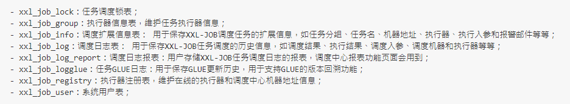
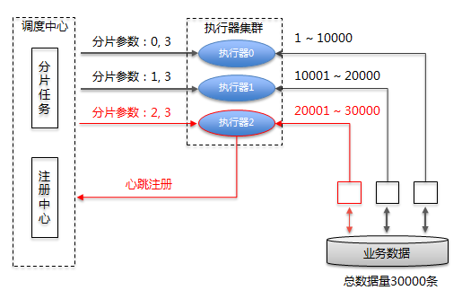

1. 任务配置属性（https://www.xuxueli.com/xxl-job/#%E3%80%8A%E5%88%86%E5%B8%83%E5%BC%8F%E4%BB%BB%E5%8A%A1%E8%B0%83%E5%BA%A6%E5%B9%B3%E5%8F%B0XXL-JOB%E3%80%8B）：

   > 1. 基础配置：
   >    - 执行器：任务的绑定的执行器，任务触发调度时将会自动发现注册成功的执行器，实现任务自动发现功能，另一方面也可以方便的进行任务分组。每个任务必须绑定一个执行器，可在执行器管理进行设置。
   >    - 报警邮件：任务调度失败时邮件通知的邮箱地址，支持配置多邮箱地址。
   > 2. 调度配置：
   >    - 调度类型：
   >      - 无：该类型不会主动触发调度。
   >      - CRON：该类型将会通过CRON，触发任务调度。
   >      - 固定速度：固定时间间隔周期触发
   >      - 固定延迟：上次任务执行结束，经过固定时间延迟触发下次调度
   >    - CRON：触发任务执行的CRON表达式
   > 3. 任务配置：
   >    - 运行模式：
   >      - BEAN模式：任务以JobHandler方式维护在执行器端，需要结合“JobHandler”属性（**通过@XxlJob注解配置JobHandler**）匹配执行器中的任务。
   >      - GLUE模式（java）：任务以源码方式维护在调度中心，该模式的任务实际上是一段继承自IJobHandler的java类代码并"groovy"源码方式维护，他在执行器项目中运行，可使用@Resource/@Autowired注入执行器例中的其他服务。（即我们在网页端写的代码）
   >    - JobHandler：BEAN模式时生效，对应执行器中新开发的JobHandler类“@JobHandler”注解自定义的value值。
   > 4. 高级配置：
   >    - 路由策略：当执行器集群部署时的路由策略：FIRST（固定选择第一个机器）,LAST（固定选择最后一个机器）,ROUND，RANDOM，FAILOVER(故障转移，按照顺序一次进行心跳检测，第一个心跳检测成功的机器将选定为目标执行器并发起调度)等。
   >    - 子任务：每个任务都拥有一个唯一的任务id（任务id可以从任务列表获取），当本任务执行结束并且执行成功时，将会触发子任务id所对应的任务的一次主动调度。
   >    - 调度过期策略：1.忽略：调度过期后，忽略过期的任务，从当前时间开始重新计算下次触发时间。2.立即执行一次：调度过期后，立即执行一次，并从当前时间开始重新计算下次触发时间。
   >    - 阻塞处理策略：调度过于密集执行器来不及处理时的处理策略
   >      - 单机串行：调度请求进入单机执行器后，调度请求进入FIFO队列以串行方式运行。
   >      - 丢弃后续调度：执行器正在运行调度任务时，新的调度请求进入时，新的请求会被丢弃
   >      - 覆盖之前调度：执行器正在运行调度任务时，新的调度请求进入时，将会终止运行中的调度任务并清空队列，然后运行本地调度任务。

2. BEAN模式：

   > 1. 类形式：每个任务对应一个java类。类继承JobHandler类，实现其中的execute方法。手动注入到XxlJobExecutor执行器。
   >    - 优点：不限制项目环境，兼容性好，即使是无框架项目，如main方法直接启动的项目也可以提供支持。
   >    - 缺点：每个任务需要占用一个java类，类浪费。不支持自动扫描任务并注入到执行器容器，需要手动注入。
   > 2. 方法形式：每个任务对应一个方法。推荐使用。
   >    - 优点：每个任务只需要开发一个方法，并添加@XxIJob注解即可，方便。支持自动扫描并注入到执行器容器。
   >    - 缺点：需要spring容器环境

3. 执行器：

   - AppName：每个执行器集群的唯一标识，执行器会周期性以AppName为对象进行自动注册，可通过配置自动发现注册成功的执行器，供任务调度时使用。
   - 名称：因为AppName限制字母，数字等，可读性不强，名称为了提高执行器的可读性。
   - 注册方式：调度中心获取执行器地址的方式
     - 自动注册：执行器自动注册，调度中心通过底层注册表可以动态发现执行器机器地址。
     - 手动录入：手动录入执行器地址信息
   - 机器地址：手动录入时有效，支持人工维护执行器地址信息

4. 系统架构：

   > 1. 设计思想：将调度行为抽象形成调度中心公共平台，而平台自身并不承担业务逻辑，调度中心负责发起调度请求。将**任务抽象成分散的JobHandler**，交由执行器统一管理，执行器负责接收调度请求并执行对应的JobHandler中的业务逻辑。因此，调度与任务可以相互解耦，提高系统整体稳定性与扩展性。
   >
   > 2. 系统组成：1.调度模块（调度中心）：负责管理调度信息，按照调度配置发出调度请求，自身不承担业务代码。同时支持监控调度结果以及执行日志，支持执行器Failover（故障转移）。 2.执行模块（执行器）：负责接收调度请求并执行任务逻辑。接收调度中心的执行请求，终止请求和日志请求。
   >
   > 3. 源码目录：admin：调度中心。core：公共jar依赖。sample：执行器实例项目（在该项目上开发）。
   >
   > 4. 调度数据库（前文在web端新增执行器(group表)，新增任务(info表)等，都会形成记录插入表中）：
   >
   >    
   >
   > 5. 架构图：
   >
   >    
   >
   >    

5. 调度中心详解：

   > 1. 调度：使用自研调度模块，将调度模块与任务模块完全解耦，调度模块进行任务调度时，将会解析不同的任务参数发起远程调用，**调用各自的远程执行器服务**。这种调用模型类似RPC调用，调度中心提供调用代理的功能，而执行器提供远程服务的功能。
   > 2. 集群：基于数据库的集群方案，数据库选用mysql，进行**定时任务**调度时，各个节点会上报任务，**存到数据库中**，执行时会从数据库中取出触发器来执行，如果触发器的名称和执行时间相同，则只有一个节点去执行此任务。
   > 3. 线程池：调度采用线程池方式实现，避免单线程因阻塞而引起任务调度延迟。
   > 4. 并行调度：**不同任务**之间并行调度，并行执行。XXL-JOB的**单个任务**，针对多个执行器是并行运行的，针对单个执行器是串行执行的。
   > 5. 过期处理策略：任务调度错过触发时间时的处理策略。可能原因：服务重启，线程被耗尽，上次调度持续阻塞。处理策略：超过5s，本次忽略，当前时间开始计算下次触发时间。5s内，立刻触发一次，当前时间开始计算下次触发时间。
   > 6. 日志回调服务：为执行器提供日志API回调服务。执行器在接收到任务执行请求后，执行任务，执行结束后会将执行结果回调通知调度中心。
   > 7. 全异步化：调度中心每次任务触发时仅发送一次调度请求，该调度请求首先推送异步调度队列，然后异步推送给远程执行器。执行器会将请求存入异步执行队列，并且立刻相应调度中心，异步运行。轻量级：因为全异步化设计，所以单个job的一次运行平均耗时基本为一次请求的网络开销，因此可以保证使用有线的线程支撑大量的job并发运行。

6. 执行器详解：

   > 1. BEAN模式任务源码分析：XxlJobExecutor为执行器类，有两个子类：XxlJobSpringExecutor（主要使用）与XxlJobSimpleExecutor，我们需要配置XxlJobSpringExecutor的appname，adminAddresses，address，ip，port等属性，此类会帮我们注册MethodJobHandler。IjobHandler有三个子类：MethodJobHandler，ScriptJobHandler，GlueJobHandler，此抽象类有三个方法：execute，init，destory，业务逻辑调用execute方法。IjobHandler存储在XxlJobExecutor的ConcurrentMap类型的jobHandlerRepository中。
   > 2. 日志：通过XxlJobHelper.log打印日志。

7. 通讯流程：1.调度中心向执行器发送http调度请求，执行器接收请求的服务，实际上是一台内嵌server，默认端口9999。2.执行器执行任务逻辑。3.执行器http回调调度中心调度结果，调度中心接收回调的服务，是针对执行器开放的一套API服务。

8. AccessToken：为提高系统安全性，调度中心和执行器进行安全性校验，双方AccessToken匹配才允许通讯。当调度中心和执行器都不设置AccessToken时，关闭安全性校验。当调度中兴和执行器设置了AccessToken时，AccessToken相同才允许通讯。

