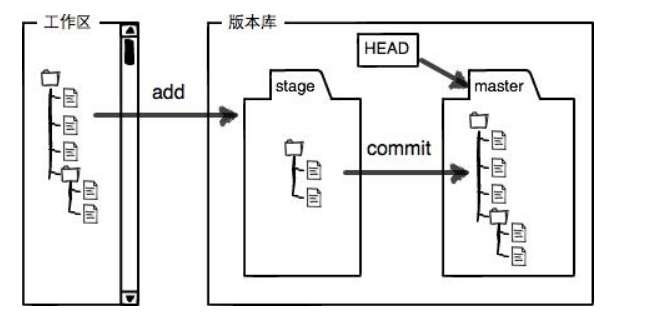
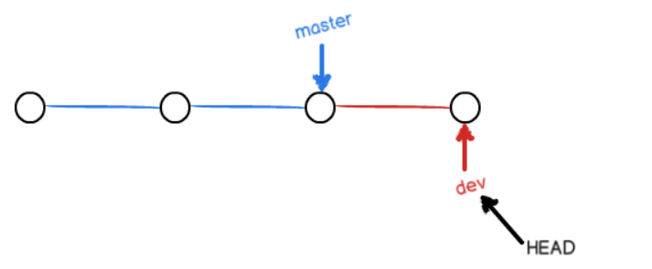
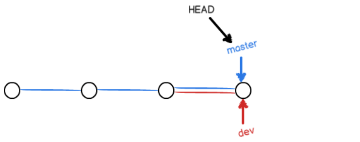
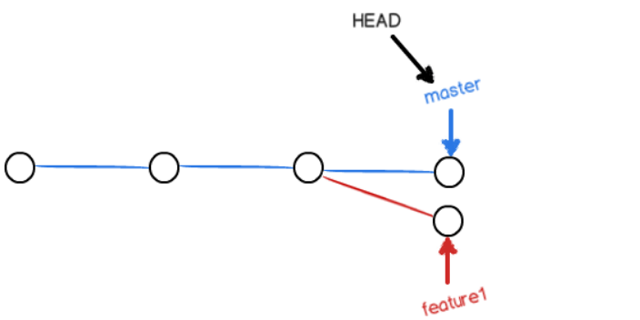
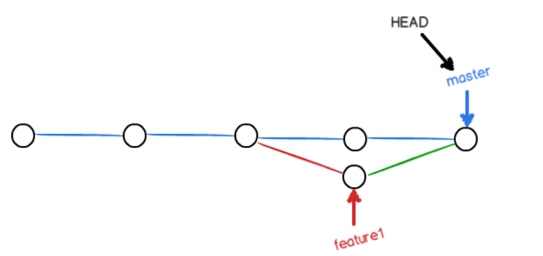
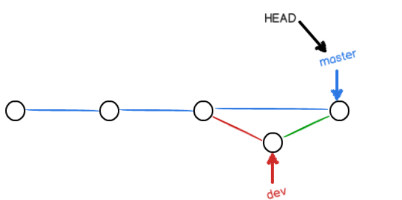

1. 初始化仓库：

   ```git
   git init 
   ```

2. 所有的版本控制系统，其实只能跟踪文本文件的改动，比如TXT文件，网页，所有的程序代码等等，Git也不例外。版本控制系统可以告诉你每次的改动，比如在第5行加了一个单词“Linux”，在第8行删了一个单词“Windows”。而图片、视频这些二进制文件，虽然也能由版本控制系统管理，但没法跟踪文件的变化，只能把二进制文件每次改动串起来，也就是只知道图片从100KB改成了120KB，但到底改了啥，版本控制系统不知道，不幸的是，Microsoft的Word格式是二进制格式，因此，版本控制系统是没法跟踪Word文件的改动的，如果要真正使用版本控制系统，就要以纯文本方式编写文件。

3. 把文件添加到仓库，添加成功后不会有任何提示信息

   ```
   git add readme.txt
   ```

4. 把文件提交到仓库，会打印多少文件添加了，多少行改变了   每次commit之前都需要执行上一个add命令。git中每次commit都会创建一个快照，这个快照在Git中被称为commit

   ```
   git commit -m "message"
   ```

5. 查看提交日志，可以显示所有的提交信息（即commit命令后的message）。

   ```
   git log
   ```

6. git中每一次提交都会有一个版本号，是一个SHA1计算出来的一个非常大的数字，用十六进制表示，如 `0c71ad7518a79f9d1cc10f1cf84630812076a239` ，在Git中，用`HEAD`表示当前版本，也就是最新的提交，上一个版本就是`HEAD^`，上上一个版本就是`HEAD^^`，当然往上100个版本写100个`^`比较容易数不过来，所以写成`HEAD~100`。退回到上一个版本，版本退回后，用git log查看上一次提交就不会显示了。 当我们反悔了，不想撤回到上一个版本时，可以在下面命令的hard后面写上我们想到达的版本号的前几位即可。  git的版本变更是很快的，因为Git在内部有个指向当前版本的`HEAD`指针，当你回退版本的时候，Git仅仅是把HEAD指向了别的版本。

   ```
   git reset --hard HEAD^
   ```

7. 查看所有版本号的前几位以及`head`指针变化，因为会显示撤销的版本，所有我们可以用此命令配合上一条命令实现版本的回退或者向前。

   ```
   git reflog
   ```

8. reset与revert的区别：如果已经有A -> B -> C，想回到B：

   方法一：reset到B，丢失C：

   A -> B

   方法二：再提交一个revert反向修改，变成B：

   A -> B -> C -> B

   C还在，但是两个B是重复的

   看你的需求，也许C就是**瞎提交错了**（比如把密码提交上去了），**必须reset**

   如果C就是**修改**，现在又要改回来，将来可能再改成C，那你就**revert**

   head为退回到上一个版本   head^为退回到上上版本。  输入两次git revert head还是此版本

   ```
   git revert head
   ```

   

9. 查看当前仓库状态（工作区情况），可以查看修改还未提交，如果全部都已经提交，就会提示 working tree clean

   ```
   git status
   ```

   

10. 查看不同的内容

    ```
    git diff      --工作区vs暂存区
    git diff --cached     --暂存区vs版本库
    git diff head     --工作区vs版本库
    ```

11. git的三个分区：

    > 1. 工作区（Working Directory） 是直接编辑的地方，肉眼可见，直接操作。
    >
    >    暂存区（Stage 或 Index） 数据暂时存放的区域。
    >
    >    版本库（commit History） 存放已经提交的数据，push 的时候，就是把这个区的数据 push 到远程git仓库了，Git 的版本库里存了很多东西，其中最重要的就是称为 stage（或者叫 index）的暂存区，还有 Git 为我们自动创建的第一个分支 master，以及指向 master 的一个指针叫 HEAD
    >
    >    
    >
    > 2.  `git add` 命令会将我们做的修改`添加到暂存区`中。`git commit`执行时，会提交所有`暂存区`的内容到版本库。
    >
    > 3. 三大分区的好处：1. 修改多个文件，但是指向提交某个文件时，可以先把此文件add进入暂存区，再提交。  2. 当修改到一半，突然想放弃修改了，怎么恢复修改前的文件呢？git checkout   3. 代码写一半，被打断去做其他功能开发，未完成代码保存用 git stash

12. git输出乱码的解决方法：1. git bash中文都乱码，则右键option->text把locale改为zh_CN，把字符集改为utf-8   2.使用git diff时输出的中文乱码，则需要修改windows的编码为unicode的utf-8全球编码格式，并且修改后原来的文件内容还是原来的格式，所有需要新创建文件重新输入内容。windows一定不要使用记事本，而要使用notepad++并且把格式改为utf-8 with bom

13. 删除文件，当我们删除文件时，不能仅仅简单的在本地删除文件，这样缓存区与仓库中还会存在这个文件，因为git add命令只是增加文件。从缓存区删除文件后，**需要commit到仓库**，这样仓库也删除了。   

    ```
    git rm filename.txt       --同时从工作区和缓存区中删除文件
    git rm --cached filename.txt     --从缓存区中删除文件，当我们不需要某文件版本控制时使用
    git rm -r mydir          --删除文件夹
    ```

    

14. 一下两条命令都是撤销修改，当工作区的内容还没有放入到缓存区时，工作区删除修改，变为缓存区一样。注意，restore后数据不能恢复，也就是说，明确确实没用的数据才用此返回。

    ```
    git restore <file>
    git checkout -- <file>
    ```

    

15. 撤销add，这里的撤销修改是缓存区的修改，上面的修改是工作区的，当需要把工作区也撤销时，就需要把使用此命令后使用上一个命令。注意，上面的版本号回退用了hard关键字。

    ```
    git reset head
    ```

    

16. 关联远程仓库，xxxx为远程仓库的https/ssh连接。使用ssh第一次push或者clone时，会得到一个警告，输入yes回车即可。如果本地仓库有文件，远程仓库创建时创建了一个readme文件，那么我们必须先把远程仓库的readme文件pull下来。  从零开发时，推荐先建立远程仓库，然后从远程仓库克隆。

    ```
    git remote add origin xxxx
    git pull origin master --allow-unrelated-histories   --pull远程仓库的readme文件
    ```

    

17. 推送到远程仓库，第一次时需要用-u，把本地的master与远程仓库的master关联起来，以后就不用了。

    ```
    git push -u origin master
    ```

    

18. 从远程仓库克隆（本地仓库不需要初始化，直接克隆就会出现.git文件），xxxx为https/ssh连接，使用`https`除了速度慢以外，还有个最大的麻烦是每次推送都必须输入口令，但是使用https很方便，可以直接克隆。而使用ssh需要先在本地生成ssh-key（用于标识电脑，相当于身份证），再复制到剪切板添加进入远程仓库，然后才能用ssh克隆。如何添加ssh：https://docs.github.com/en/free-pro-team@latest/github/authenticating-to-github/adding-a-new-ssh-key-to-your-github-account  其中，生成key时使用的邮箱就是github的注册邮箱

    ```
    git clone xxxx
    ```

    

19. 我们知道，每次提交git都把他们串成一条时间线，这条时间线就是一个分支，不新建分支时，只有一个分支，即master分支，head是指向master，master指向提交，所以**head指向的就是当前分支**。每次提交，master分支都会向前移动一步，这样，随着你不断提交，master分支的线也越来越长。当我们创建新的分支，例如`dev`时，Git新建了一个指针叫`dev`，指向`master`相同的提交，再把`HEAD`指向`dev`，就表示当前分支在`dev`上。从现在开始，对工作区的修改和提交就是针对`dev`分支了，比如新提交一次后，`dev`指针往前移动一步，而`master`指针不变，假如我们在`dev`上的工作完成了，就可以把`dev`合并到`master`上。Git怎么合并呢？最简单的方法，就是直接把`master`指向`dev`的当前提交，就完成了合并。合并完分支后，甚至可以删除`dev`分支。删除`dev`分支就是把`dev`指针给删掉，删掉后，我们就剩下了一条`master`分支。

    

20. 创建并切换分支，在dev分支下面修改文件并提交后，再切换回master分支，则文件会变为修改前的内容。

    ```
    git checkout -b dev   --创建一个名为dev的分支，并切换到dev分支
    git switch -c dev     --创建一个名为dev的分支，并切换到dev分支  相比checkout更容易理解
    上面的创建命令相当于下面的两条命令
    git branch dev    --创建一个名为dev的分支
    git checkout dev     --切换到dev分支
    git switch dev       --切换到dev分支
    ```

    

21. 查看当前分支，会列出所有分支，当前分支前面会标一个*号。

    ```
    git branch
    ```

    

22. 合并分支（需要切换到master分支时使用），此命令用于合并指定分支到当前分支，合并后，master指针就指向了dev指向的位置，所以dev修改的内容master也能看到了。（Fast-Forward合并方式，即master向前走到dev分支的位置）  下图中，一个圈就是一个commit

    ```
    git merge dev
    ```

    

23. 删除dev分支，d变为D为强制删除

    ```
    git branch -d dev
    ```

    

24. 解决冲突，当创建一个feature1分支并在此分支上修改后，在切换回master分支，也修改文件，（分支合并前，**每个分支都需要提交。**）这时合并分支就会报错，提示有冲突，这时用git status会显示有冲突的文件。并且，本地文件也会变化，会显示master分支与feature1分支各做的修改，当前分支会由`master`分支变为`master|merging`分支，在当前分支下面，手动修改本地文件的内容，并且add，commit后，分支合并成功，然后删除feature1分支即可。     注意，当一个分支修改前面几行，另一个分支修改后面几行，最后分支合并时并不会冲突。   注意，这里两个分支合并会**新创建一个commit**，而上面Fast-Forward模式并不会，只是让master走到dev的位置。

    

    

25. 查看分支合并图

    ```
    git log --graph
    ```

    

26. 因为Fast-Forward模式会丢失分支信息，所以我们要禁用Fast-Forward模式，这样git就能生成一个新的commit。因为生成commit都需要message，所以需要-m参数。（用非Fast-Forward模式合并后的历史有分支，能看出来曾经做过合并）

    ```
    git merge --no-ff -m "merge with no-ff" dev
    ```

    

27. 分支策略：首先，`master`分支应该是非常稳定的，也就是仅用来发布新版本，平时不能在上面干活；那在哪干活呢？干活都在`dev`分支上，也就是说，`dev`分支是不稳定的，到某个时候，比如1.0版本发布时，再把`dev`分支合并到`master`上，在`master`分支发布1.0版本。你和你的小伙伴们每个人都在`dev`分支上干活，每个人都有自己的分支，时不时地往`dev`分支上合并就可以了。

    

28. bug分支，每修复一个bug，都应该新建一个分支，修复完成后合并分支并把分支删除。当我们修复紧急bug时，原先的任务还没有完成，所以不能提交，而又要在短时间内修复这个紧急bug，怎么办呢？可以把现场工作储藏起来，等修复完bug后恢复现场后继续工作。下面的这条命令就是储藏现场。（使用存储现场后，本地文件会回退当上次提交时的状态，使用status命令查看会发现working tree clean，当修改的bug与我们保存的现场冲突时，也要解决冲突并提交）

    ```
    git stash     --存储现场
    git stash pop    --恢复现场并且删除stash内容
    git stash apply stash@{x}     --恢复现场到stash@{x}的状态
    git stash drop                --删除stash
    
    git stash list    --查看stash内容
    ```

    

29. 查看远程仓库信息

    ```
    git remote -v
    ```

    

30. 多人协作流程：

    > 1. 开始做事：
    >
    >    a. 查看远程仓库 $ git remote -v 这样可以看到自己连接的仓库是否正确
    >
    >    b. 拉取远程最新的代码 $ git pull (此时路径应该在master下）
    >
    >    c. 创建并切换分支分支，分支名称自己定义
    >
    > 2. 提交：
    >
    >    a. add并commit提交
    >
    >    b. 这时候切换到主分支
    >
    >    c. 再次拉取远程最新代码，因为在这一天可能别人已经提交了，所以我们要更新到最新状态
    >
    >    d. 分支合并，提交，删除分支

31. sdf

