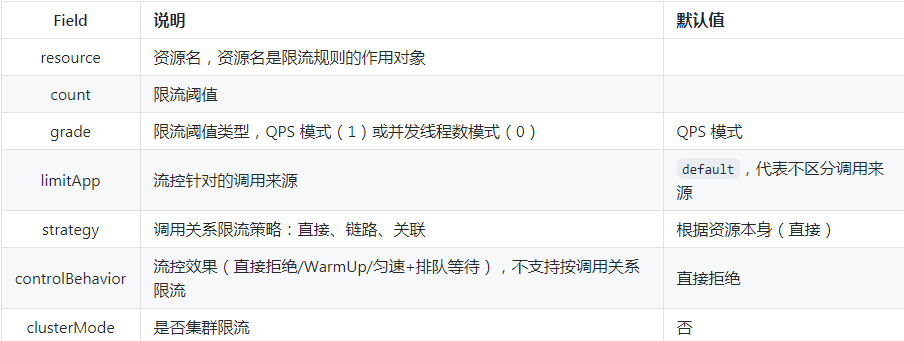
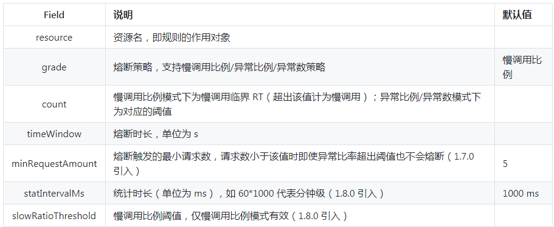
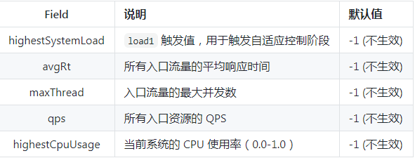
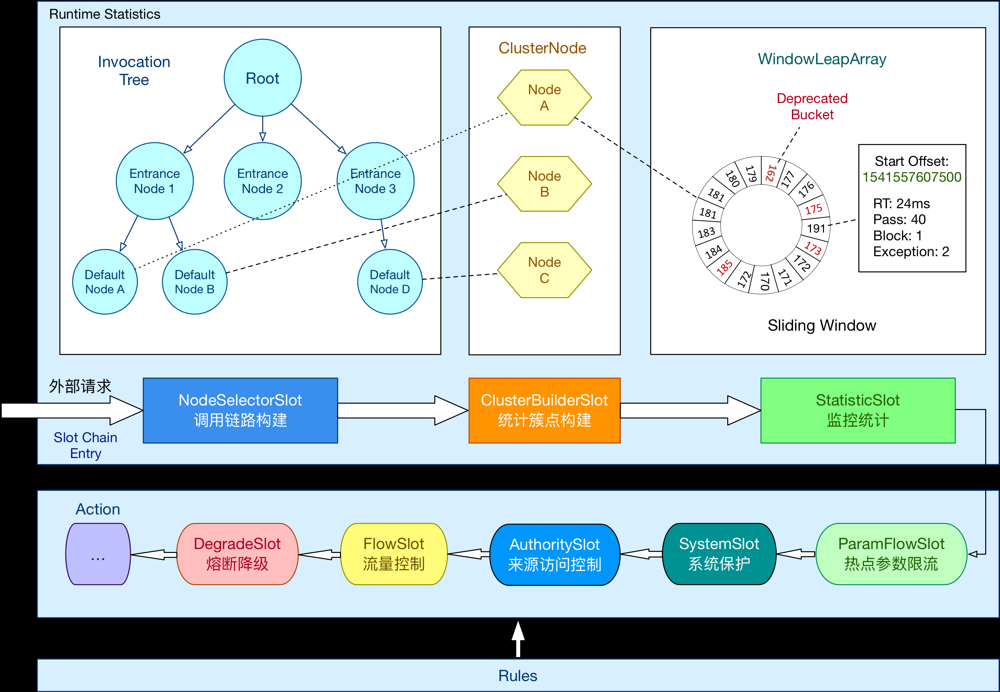
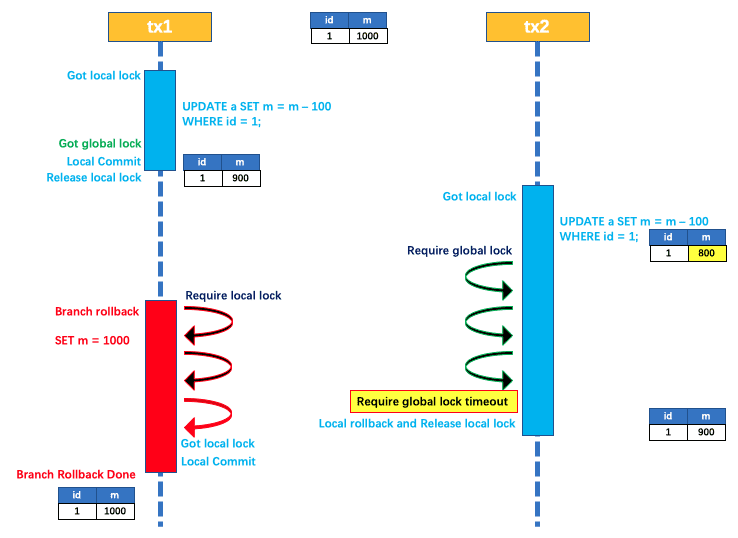

## nacos

1. 相关概念：https://nacos.io/zh-cn/docs/what-is-nacos.html

   > 1. 命名空间：不同的命名空间下，可以存在相同的 Group 或 Data ID 的配置。Namespace 的常用场景之一是不同环境的配置的区分隔离，例如**开发测试环境和生产环境**的资源（如配置、服务）隔离等。
   > 2. 配置集：一组相关或者不相关的配置项的集合称为配置集。在系统中，**一个配置文件**通常就是一个配置集，包含了系统各个方面的配置。例如，一个配置集可能包含了数据源、线程池、日志级别等配置项。
   > 3. 配置分组：通过一个有意义的字符串（如 Buy 或 Trade ）对配置集进行分组，从而**区分 Data ID 相同的配置集**。当您在 Nacos 上创建一个配置时，如果未填写配置分组的名称，则配置分组的名称默认采用 **DEFAULT_GROUP** 。配置分组的常见场景：不同的应用或组件使用了相同的配置类型，如 database_url 配置和 MQ_topic 配置。可以通过spring.cloud.nacos.config.group配置
   > 4. Data id：dataid拼接如下：${prefix} - ${spring.profiles.active} . ${file-extension}    
   >    - prefix 默认为 spring.application.name 的值，也可以通过配置项spring.cloud.nacos.config.prefix来配置。
   >    - spring.profiles.active为当前环境对应的profile。当profile为空时，中间的连接符'-'也将不存在，dataid的拼接变为 ${prefix}.${file-extension}
   >    - file-extension 为配置内容的数据格式，可以通过配置项 spring.cloud.nacos.config.file-extension来配置。 目前只支持 properties 类型
   >    - Nacos Config 主要通过 dataId 和 group 来唯一确定一条配置，Nacos Client 从 Nacos Server 端获取数据时，调用的是此接口 `ConfigService.getConfig(String dataId, String group, long timeoutMs)`。
   > 5. 配置快照：Nacos 的客户端 SDK 会在**本地生成配置的快照**。当客户端无法连接到 Nacos Server 时，可以使用配置快照显示系统的整体容灾能力。配置快照类似于 Git 中的本地 commit，也类似于缓存，会在适当的时机更新，但是并没有缓存过期（expiration）的概念。
   > 6. 元数据：Nacos数据（如配置和服务）描述信息，如服务版本、权重、容灾策略、负载均衡策略、鉴权配置、各种自定义标签 (label)，从作用范围来看，分为服务级别的元信息、集群的元信息及实例的元信息。
   > 7. 健康检查：以指定方式检查服务下挂载的实例 (Instance) 的健康度，从而确认该实例 (Instance) 是否能提供服务。根据检查结果，实例 (Instance) 会被**判断为健康或不健康**。对服务发起解析请求时，不健康的实例 (Instance) 不会返回给客户端。
   > 8. 健康保护阈值：为了防止因过多实例 (Instance) 不健康导致流量全部流向健康实例 (Instance) ，继而造成流量压力把健康实例 (Instance) 压垮并形成雪崩效应，应将健康保护阈值定义为一个 0 到 1 之间的浮点数。当域名**健康实例 (Instance) 占总服务实例 (Instance) 的比例小于该值（如果为0.5则为超半数实例不健康时）**时，无论实例 (Instance) 是否健康，都会将这个实例 (Instance) 返回给客户端。这样做虽然损失了一部分流量，但是保证了集群的剩余健康实例 (Instance) 能正常工作。

2. 自动注入：Nacos Config Starter 实现了org.springframework.cloud.bootstrap.config.PropertySourceLocator接口（此接口支持自定义配置加载到spring Environment），并将优先级设置成了最高。在 Spring Cloud 应用启动阶段，会主动从 Nacos Server 端获取对应的数据，并将获取到的数据转换成 PropertySource 且注入到 Environment 的 PropertySources 属性中，所以使用 @Value 注解也能直接获取 Nacos Server 端配置的内容。

3. 动态刷新：Nacos Config Starter 默认为所有获取数据成功的 Nacos 的配置项添加了监听功能，在监听到服务端**配置发生变化**时会实时触发 org.springframework.cloud.context.refresh.ContextRefresher 的 refresh 方法 （刷新spring Environment）。如果需要对 Bean 进行动态刷新，请参照 Spring 和 Spring Cloud 规范。推荐给**类添加 @RefreshScope** 或 @ConfigurationProperties 注解

4. 服务注册与发现：引入discovery包，配置nacos server相关信息，使用@EnableDiscoveryClient注解开启服务注册与发现功能。Provider端提供相关controller，Consumer端使用RestTemplate或者Feign调用Provider端的接口。Nacos Discovery Starter默认集成了Ribbon。

5. 服务注册发现原理：

   > 1. 注册：Spring Cloud Nacos Discovery 遵循了 spring cloud common 标准，实现了 AutoServiceRegistration、ServiceRegistry、Registration 这三个接口。在 spring cloud 应用的启动阶段，监听了 WebServerInitializedEvent 事件，当**Web容器初始化完成后**，即收到 WebServerInitializedEvent 事件后，会触发注册的动作，**调用 ServiceRegistry 的 register 方法**，将服务注册到 Nacos Server。
   > 2. 发现：NacosServerList 实现了 com.netflix.loadbalancer.ServerList 接口，并在 @ConditionOnMissingBean （此注解动态注入bean，即当某个类的bean不存在时注入此注解注解的bean）的条件下进行自动注入，默认集成了Ribbon。如果需要有更加自定义可以使用 @Autowired 注入一个 NacosRegistration 实例，通过其持有的 NamingService 字段内容直接调用 Nacos API。

## sentinel

1. 基本概念：https://github.com/alibaba/Sentinel/wiki/%E4%B8%BB%E9%A1%B5

   > 1. 资源：资源是 Sentinel 的关键概念。它可以是 Java 应用程序中的**任何内容**，例如，由应用程序提供的服务，或由应用程序调用的其它应用提供的服务，**甚至可以是一段代码**。在接下来的文档中，我们都会用资源来描述代码块。只要通过 Sentinel API 定义的代码，就是资源，能够被 Sentinel 保护起来。大部分情况下，可以使用方法签名，URL，甚至服务名称作为资源名来标示资源。
   > 2. 规则：围绕资源的实时状态设定的规则，可以包括流量控制规则、熔断降级规则以及系统保护规则。所有规则可以动态实时调整。
   > 3. 埋点：定义保护资源。Sentinel starter 默认为所有的 HTTP 服务提供了限流埋点，如果只想对 HTTP 服务进行限流，那么只需要引入依赖，无需修改代码。

2. sentinel熔断降级：当检测到调用链路中某个资源出现不稳定的表现，例如请求响应时间长或异常比例升高的时候，则对这个资源的调用进行限制，让请求快速失败，避免影响到其它的资源而导致级联故障。  设计理念：1.通过**并发线程数**进行限制：通过限制资源并发线程的数量，来减少不稳定资源对其它资源的影响。这样不但没有线程切换的损耗，也不需要您预先分配线程池的大小。当某个资源出现不稳定的情况下，例如响应时间变长，对资源的直接影响就是会造成线程数的逐步堆积。当线程数在特定资源上堆积到一定的数量之后，对该资源的新请求就会被拒绝。堆积的线程完成任务后才开始继续接收请求。 2.通过**响应时间**对资源进行降级：当依赖的资源出现响应时间过长后，所有对该资源的访问都会被直接拒绝，直到过了指定的时间窗口之后才重新恢复。

3. sentinel流量控制的几个角度：1.资源调用关系，例如资源的调用链路，资源与资源的关系。2.运行指标，例如 QPS、线程池、系统负载等。3.控制的效果，例如直接限流、冷启动、排队等。

4. sentinel系统保护：防止雪崩，是系统防护中重要的一环。当系统负载较高的时候，如果还持续让请求进入，可能会导致系统崩溃，无法响应。在集群环境下，网络负载均衡会把本应这台机器承载的流量转发到其它的机器上去。如果这个时候其它的机器也处在一个边缘状态的时候，这个增加的流量就会导致这台机器也崩溃，最后导致整个集群不可用。针对这个情况，Sentinel 提供了对应的保护机制，让系统的**入口流量和系统的负载达到一个平衡**，保证系统在能力范围之内处理最多的请求。

5. sentinel的使用可以分为两个部分：1.核心库（Java客户端）：不依赖任何框架/库（也不依赖控制台），能够运行于 Java 7 及以上的版本的运行时环境。2.控制台（Dashboard）：控制台主要负责管理推送规则、监控、集群限流分配管理、机器发现等。

6. sentinel使用：1.定义资源 2.定义规则 3.检查规则是否生效

   > 1. 定义资源方式：
   >
   >    - 提供了对主流框架的默认适配，我们只需要引入sentinel依赖即可。
   >    - 通过注解方式定义资源。
   >    - 直接编码等多种方式，参考官方文档。
   >
   > 2. Sentinel 的所有规则都可以在**内存态**中动态地查询及修改，修改之后立即生效。查询规则可以使用http://localhost:8719/getRules?type=<XXXX>连接，其中type包括flow，degrade，system等。应用重启后规则都会失效，所以我们可以通过实现DataSource接口来定义规则存储数据源。如何配置规则：编写json/xml文件，在properties配置文件中引入。包括以下规则种类：
   >
   >    - 流量控制规则：FlowRule类，包括如下属性。统一资源可以同时又多个限流规则，监察时会依次检查。
   >
   >      
   >
   >    - 熔断降级规则：DegradeRule类。同一资源可以有多个降级规则。
   >
   >      
   >
   >    - 系统保护规则：Sentinel 系统自适应限流从**整体维度（不是资源维度）**对应用入口流量进行控制，结合应用的 **Load、CPU 使用率、总体平均 RT、入口 QPS 和并发线程数**等几个维度的监控指标，通过自适应的流控策略，让系统的入口流量和系统的负载达到一个平衡，让系统尽可能跑在最大吞吐量的同时保证系统整体的稳定性。 SystemRule类，只针对**入口资源生效（即进入应用的流量）**。
   >
   >      
   >
   >    - 访问控制规则：很多时候，我们需要根据调用方来限制资源是否通过，这时候可以使用 Sentinel 的访问控制（**黑白名单**）的功能。黑白名单根据资源的**请求来源（origin）限制资源是否通过**，若配置白名单则只有请求来源位于白名单内时才可通过；若配置黑名单则请求来源位于黑名单时不通过，其余的请求通过。AuthoriryRule类，包括source，limitApp（origin，如appA，appB），strategy（限制规则，如默认AUTHORITY_WHITE白名单模式）属性。
   >
   >    - 热点规则，ParamFlowRule类。
   >
   > 3. 规则相关异常：所有流控降级相关异常都是BlockException的子类，包括：流控异常（FlowException），熔断降级异常（DegradeException），系统保护异常（SystemBlockException），热点参数限流异常（ParamFlowException）。
   >
   > 4. block事件：sentinel提供一下扩展接口，可以通过StatisticSlotCallbackRegistry想StatisticSlot注册回调函数：ProcessorSlotEntryCallback（onPass，onBlocked），ProcessorSlotExitCallback（onExit）
   >
   > 5. 判断规则是否生效：1.通过运行http://localhost:8719/cnode?id=<资源名称>，观察返回的数据的block参数  2.观察日志，位置${user_home}/logs/csp/sentinel-block.log。
   >
   > 6. 其他API：如Tracer异常统计类，ContextUtil上下文工具类。

7. @SentinelResource：用于资源埋点，并提供可选的异常处理blockhandler和fallback配置项，包括如下属性：

   > - value：资源名称，必填
   > - entryType：默认EntryType.OUT
   > - blcokHandler/blockHandlerClass：blockHandler对应BlcokException异常处理函数名称，此方法必须为public，返回类型与原方法相匹配，参数类型与原方法相匹配并且要增加一个BlockException参数。blockHandler默认与原方法在同一个类中，如果想使用其他类中的函数，需要使用blockHandlerClass指定其他类，并且对应的函数必须为static函数。
   > - fallback/fallbackClass：抛出异常时提供fallback处理逻辑，fallback可以针对所有异常类型，方法签名要求与blcokHandler相似，但是他增加的参数为Throwable类型。fallbackClass用法与blcokHandlerClass也相同。与blockHandler同时配置时，抛出BlockException只会执行blockHandler。
   > - defaultFallback：默认的fallback函数名称，用于通用的fallback逻辑，如果同时配置了fallback与defaultFallback，只有fallback生效。方法签名与fallback编写一致。
   > - exceptionsToIgnore：指定异常不计入异常统计，不会进入fallback逻辑，会原样抛出（没有配置blcokHandler，fallback，defaultFallback时，也会原样抛出）。

8. 原理：每次资源调用都会创建一个Entry对象，Entry可以通过对主流框架的适配自动创建，也可以通过注解的方式或者调用SphU API显示创建，Entry创建时，同时也会创建一系列功能插槽：

   > 1. NodeSelectorSlot：负责收集资源的路径，并将这些资源的调用路径，以树状结构存储起来，用于根据调用路径来限流降级。
   >
   > 2. ClusterBuilderSlot：用于存储资源的统计信息以及调用者信息，例如该资源的RT,QPS,thread count等。这些信息将用作多维度限流，降级的依据。
   >
   > 3. StatisticSlot：最重要的类之一，用于记录，统计不同维度的runtime指标监控信息。采用滑动窗口LeapArray来统计clusterNode，origin，defaultnode，入口流量的相关信息的秒级指标数据。
   >
   > 4. FlowSlot：根据预设的限流规则以及前面slot统计的状态，来进行流量控制。
   >
   > 5. AuthoritySlot：根据配置的黑白名单和调用来源信息，做黑白名单控制。
   >
   > 6. DegradeSlot：通过统计信息以及预设的规则，做熔断降级。
   >
   > 7. SystemSlot：通过系统状态，例如load1等，控制总的入口流量。
   >
   > 8. 下图是各个Slot的调用链，我们可以实现ProcessSlot接口，自行扩展Slot，并把自定义的slot加入调用链。
   >
   >    
   >
   > 9. sdf
   
9. 核心类解析：

   > 1. ProcessorSlotChain：Sentinel的核心骨架，将不同的Slot按照顺序串在一起（责任链模式）。目前的设计是一个chain对应一个资源，因为某些slot是每个资源对应一个slot，如NodeSelectorSlot。内部实现就是一个包含ProcessorSlot类型的first，ent的链表。通过SlotChainBuilder接口构建。
   > 2. Node（统计结点）：
   >    - StatisticNode：最基础的统计结点，包含秒级和分钟级两个滑动窗口结构。
   >    - DefaultNode：链路结点，统计调用链路上某个资源的数据，维持树状结构，维度（个数）是resource*Context。存在于每个NodeSelectorSlot的map里面。
   >    - ClusterNode：统计每个资源全局的数据（不区分调用链路），以及存放该资源的按来源区分的调用数据（类型为StatisticNode），维度是resource。
   >    - EntranceNode：入口结点，对应某个Context入口的所有调用数据，在ContextUtil.exter()的时候创建，放入到Context中，一个结点对应一个Context
   > 3. Context：调用链路上下文，贯穿一次调用链路中的所有Entry，维持着EntranceNode，本次调用链路的curNode，调用来源（origin）等信息，Context名称即为调用链路入口名称。Context 维持的方式：通过 ThreadLocal 传递，只有在入口 enter 的时候生效。由于 Context 是通过 ThreadLocal 传递的，因此对于异步调用链路，线程切换的时候会丢掉 Context，因此需要手动通过 ContextUtil.runOnContext(context, f) 来变换 context。
   > 4. Entry：每一次**资源调用**都会创建一个 Entry。Entry 包含了资源名、curNode（当前统计节点）、originNode（来源统计节点）等信息。

## seata

1. 使用：各个微服务引入seata包，在调用各个服务的业务方法上面标注@GlobalTransactional即可。其中，注解的属性timeoutMills表示获取不到全局锁的等待时间。     http://seata.io/zh-cn/docs/overview/what-is-seata.html

2. seata为用户提供了 AT、TCC、SAGA 和 XA 事务模式

   > 1. AT：
   >
   >    - 前提：基于支持本地ACID事务的关系型数据库，java，使用JDBC访问数据库
   >
   >    - 两阶段提交协议：1. 一阶段：业务数据和回滚日志记录在同一个本地事务中提交，释放本地锁和连接资源。2. 二阶段：提交异步化，非常快速地完成。回滚通过一阶段的回滚日志进行反向补偿。
   >
   >    - 写隔离：一阶段本地事务提交前，需要确保先拿到全局锁。拿不到全局锁，不能提交本地事务，拿到全局锁并提交本地事务后释放本地锁。拿全局锁的尝试被限制在一定范围内，超出范围将放弃，并回滚本地事务，释放本地锁。拿到了全局锁的事务需要回滚时，会一直持有全局锁，并尝试获取本地锁，获取本地锁后提交回滚。
   >
   >      
   >
   >    - 读隔离：在数据库本地事务隔离级别 读已提交（Read Committed） 或以上的基础上，Seata（AT 模式）的**默认全局隔离级别是 读未提交**（Read Uncommitted） 。如果应用在特定场景下，必需要求全局的 读已提交 ，目前 Seata 的方式是通过 SELECT FOR UPDATE 语句的代理。SELECT FOR UPDATE 语句的执行会申请 全局锁 ，如果 全局锁 被其他事务持有，则释放本地锁（回滚 SELECT FOR UPDATE 语句的本地执行）并重试。这个过程中，查询是被 block 住的，直到 全局锁 拿到，即读取的相关数据是 已提交 的，才返回。
   >
   >    - 更新操作具体执行流程：一阶段：根据where信息得到某条记录的前镜像，更新此条记录，根据前镜像结果的主键信息得到后镜像，把前后镜像及业务SQL相关信息组成一条回滚日志记录，插入到UNDO_LOG表，提交前，向TC（即事务协调者：维护全局和分支事务的状态，驱动全局事务提交或回滚。）注册分支，申请此表中**此主键的全局锁**，提交更新和UNDO_LOG，将本地事务提交的结果上报TC。 二阶段-提交：收到 TC 的分支提交请求，把请求放入一个**异步任务的队列中**，马上返回提交成功的结果给 TC。异步任务阶段的分支提交请求将异步和批量地**删除**相应 UNDO LOG 记录。  二阶段-回滚：收到 TC 的分支回滚请求，开启一个**本地事务**，执行后续操作。通过 XID 和 Branch ID 查找到相应的 UNDO LOG 记录。数据校验：拿 UNDO LOG 中的**后镜与当前数据进行比较**，如果有不同，说明数据被当前全局事务之外的动作做了修改。这种情况，需要根据配置策略来做处理。根据 UNDO LOG 中的前镜像和业务 SQL 的相关信息生成并执行回滚的语句，提交本地事务。并把本地事务的执行结果（即分支事务回滚的结果）上报给 TC。
   >
   > 2. TCC模式：AT模式基于支持本地ACID的关系型数据库，而TCC模式不依赖数据库事务支持。
   >
   > 3. SAGA模式：Saga模式是SEATA提供的**长事务解决方案**，在Saga模式中，业务流程中每个参与者都提交本地事务，当出现某一个参与者失败则补偿前面已经成功的参与者，一阶段正向服务和二阶段补偿服务都由业务开发实现。

3. 事务上下文：seata的**事务上下文由RootContext管理**，应用开启一个全局事务后，RootContext会**自动绑定**该**事务的XID**，事物结束，RootContext会**自动解绑XID**。应用可以通过RootContext的getXID()方法来获取当前运行的全局事务XID。应用是否运行在一个全局事务的上下文中，就是通过RootContext是否绑定XID来判定的。

4. 事务传播：seata全局事务的传播机制就是指事务上下文的传播，根本上就是XID在应用运行时的传播方式。1.服务内部传播：RootContext的**实现是基于ThreadLocal**的，即XID绑定到当前线程上下文中。所以服务内部的 XID 传播通常是天然的通过**同一个线程的调用链路串连起来**的。默认不做任何处理，事务的上下文就是传播下去的。如果希望挂起事务上下文，则需要通过 RootContext 提供的 API 来实现（RootContext的unBind()方法）。  2.跨服务调用的事务传播：跨服务调用场景下的事务传播，本质上就是要**把 XID 通过服务调用传递到服务提供方**，并绑定到 RootContext 中去。

5. seata api：包括两大类，High-Level API与Low-Level API

   > 1. High-Level API：GlobalTransaction接口，实现类为DefaultGlobalTransaction，全局事务：包括开启事务，提交，回滚，获取当前状态等方法。GloablTransactionContext类：通过此类获取GlobalTransaction。TransactionalTemplate类，通过上面的两个类把一个业务服务的调用包装成带有分布式事务支持的服务。
   > 2. Low-Level API：RootContext，负责在应用运行时维护XID。

