### 注解

1. java5新增注解特性：	可以通过注解为程序编写元数据，如@Override（重写），@Deprecated（不推荐使用），@SuppressWarning（忽略该段代码产生的警告）等等。

2. 创建注解：通过@interface关键字创建注解，注解的每一个方法就是注解的属性，返回类型就是属性的数据类型，通过default来配置属性的默认值，如果不指定则说明该参数为必填参数。如果注解只包含一个属性，在声明注解时可以忽略属性名，当属性为数组类型时，如果只配置一个值，可以省略花括号，多个值不可省略。

3. 元注解：用来定义注解的注解叫做元注解。

   > 1. @Retention：定义注解的保留级别
   >    - RetentionPolicy.SOURCE ：注解存在于源代码中，编译时会被抛弃
   >    - RetentionPolicy.CLASS ：注解会被编译到class文件中，但是JVM会忽略
   >    - RetentionPolicy.RUNTIME ：JVM会读取注解，同时会保存到class文件中
   > 2. @Target：用于描述注解的使用范围(即被描述的注解可以用在什么地方)
   >    - ElementType.TYPE 用于类，接口，枚举但不能是注解
   >    - ElementType.FIELD 作用于字段，包含枚举值
   >    - ElementType.METHOD 作用于方法，不包含构造方法
   >    - ElementType.PARAMETER 作用于方法的参数
   >    - ElementType.CONSTRUCTOR 作用于构造方法
   >    - ElementType.LOCAL_VERIABLE 作用于本地变量或者catch语句
   >    - ElementType.ANNOTATION_TYPE 作用于注解
   >    - ElementType.PACKAGE 作用于包
   > 3. @Inherited：默认情况下，注解不会被子类继承。但是，如果把注解标记为 @Inherited，那么使用注解修饰 class 时，子类也会继承该注解。该注解仅适用于 class。注意：使用该注解修饰接口时，实现类不会继承该注解。
   > 4. @Documented：用于指明该注解可以用于生成javaDoc
   > 5. @Repeatable：表示可以对同一个元素多次使用相同的注解
   
4. 注解的分类

   > 1. SOURCE类型的注解主要由编译器使用，因此我们一般只使用，不编写。如@Override：让编译器检查该方法是否正确地实现了重写。@SuppressWarnings：告诉编译器忽略此处代码产生的警告。这类注解不会被编译进入.class文件，它们`在编译后就被编译器扔掉了`。
   > 2. CLASS类型的注解主要由底层工具库使用，涉及到class的加载，一般我们很少用到。
   > 3. RUNTIME类型的注解它们在加载后一直存在于JVM中，这也是最常用的注解。例如: 一个配置了`@PostConstruct`的方法会在调用构造方法后自动被调用（这是Java代码读取该注解实现的功能，JVM并不会识别该注解）。

5. 因为注解定义后也是一种class，所有的注解都继承自`java.lang.annotation.Annotation`，因此，读取注解，需要使用反射API。

6. 常用注解：

   > 1. @Value：将我们配置文件的属性读取出来。
   >    - @Value("${property:default_value}")读取配置文件中的属性
   >    - @Value("#{obj.property:default_value}")读取bean中的某个对象的属性值

### ioc简介

1. ioc的理念：让别人为我们服务（即把创建对象的控制权交给容器）。 ioc的好处：解耦类的使用者与被使用者。ioc的职责：业务对象的构造管理和业务对象间的依赖绑定。ioc如何管理对象间依赖关系：直接编码方式，配置文件方式，元数据方式。
2. 三种依赖注入方式：构造器注入，setter注入，接口注入（不推荐）
   构造器注入：优点：构造完成对象即可使用。缺点参数太多时会比较长，构造对象时类型相同比较难处理，不能被继承，不能设置默认值，参数数量变化时不易维护。
   setter注入：缺点：对象构造完成后无法立刻使用。

### BeanFactory容器

1. spring的ioc容器支持ioc，aop等其他一些功能。

2. BeanFactory与ApplicationContext区别：

   > - BeanFactory：当获取某个对象时，才对该对象进行初始化以及依赖注入操作，所以，相对来说容器启动初期速度快，所需资源有限。
   > - ApplicationContext：在BeanFactory的基础上构建，是相对高级的容器实现，除了拥有BeanFactory的所有支持，还提供了其他高级特性，如国际化支持。ApplicationContext管理的对象，在容器启动之后，默认全部初始化并绑定完成。所以容器启动时间较长一些。
   > - 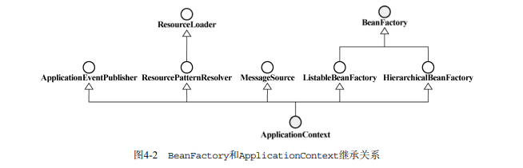

3. BeanFactory源码：如下图代码中的方法基本上都是查询相关的方法，例如，取得某个对象的方法（getBean），查询某个对象是否存在于容器中的方法（containsBean）

   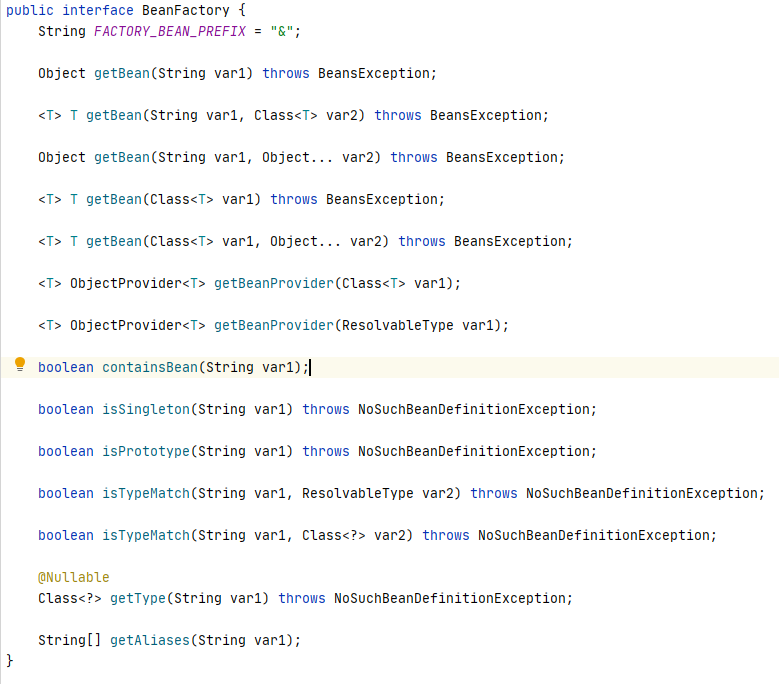

4. BeanFactory对象注册与依赖绑定方式

   > - 直接编码方式
   > - 外部配置文件方式：根据不同的配置文件格式，给出相应的BeanDefinitionReader实现，由实现类读取配置文件并映射到BeanDefinition，然后将BeanDefinition注册到BeanDefinitionRegistry。加载自己的文件格式需要实现BeanDefinitionReader或者继承他的某个实现类。
   >   - Properties配置格式：PropertiesBeanDefinitionReader
   >   - XML配置格式：XmlBeanDefinitionReader或者直接使用XmlBeanFactory（此类可以生成容器，加载与解析xml文件，注册到registry）
   > - 注解方式

5. BeanDefinitionRegistry与BeanDefinition：BeanFactory接口只定义了如何访问容器内Bean的方法，各个BeanFactory的具体实现类负责具体Bean的注册与管理工作。BeanDefinitionRegistry接口定义了抽象Bean的注册逻辑。通常，具体的BeanFactory实现类会实现这个接口来管理Bean的注册。BeanFactory是查询Bean的，而Registry是存放BeanDefinition的（用map存储）。每一个Bean，都会有一个BeanDefinition的实例与之相对应，BeanDefinition负责保存对象的必要信息，包括其对应的对象的class类型，是否是抽象类，构造方法参数以及其他属性。

   

6. xml文件格式：Spring2.x之前，xml配置文件采用DTD实现文档的格式约束，2.x之后，引入了基于XSD的约束方式，不过原来的DTD的方式依然有效，因为从DTD到XSD只是形式上的转变

7. xml标签：只给出简单描述，详细描述查阅spring揭秘

   > - beans：最顶层元素，包含0/1个description，多个bean，import，alias标签。可以给所有bean设置，如default-lazy-init=true/false，用来标志是否对所有bean进行延迟初始化。还有：default-autowire，default-dependency-check，default-init-method，default-destroy-method。
   > - description：在配置文件中指定一些描述性信息，通常省略。
   > - import：导入别的配置文件。价值不大，因为容器实际上可以同时加载多个配置，没有必要非通过一个配置文件加载所有配置。
   > - alias：给bean起别名
   > - bean：id（bean的名字），class，name（别名，可以使用id不能使用的一些字符）

8. xml依赖注入（可以同时使用构造器注入与setter注入）：

   > 1. 构造器注入：<constructor-arg>  属性：type，index
   > 2. setter注入：<property>  属性：name指定实例变量名字
   > 3. 两种注入共有配置项：value，ref（属性：local/parent/bean），bean（内部bean），idref（注入String类型的实例名称），null，list（List或数组），set，map（标签：entry），props（特殊的map，键值都为String）
   > 4. depends-on：用ref等都是显示的依赖，而depends-on是隐式依赖，比如系统中所有需要日志记录的类，都隐式地依赖日志记录类。depends-on能让实例A在实例B之前初始化。大部分用于静态代码块初始化或者数据库驱动注册之类的场景。
   > 5. autowire：通过自动获取，可以无需用ref指定，让实例之间相互依赖。手工绑定会覆盖自动绑定。
   >    - no：默认，无需自动绑定，通过人工指定。
   >    - byName：通过id（即beanName）
   >    - byType：当同一type有多个实例时，会报错
   >    - constructor：byName与byType是针对属性，而这是针对构造方法参数类型（即按照type匹配）。
   >    - autodetect：byType与constructor的结合。如果对象有默认无参构造，容器会优先考虑byType，否则会使用constructor。如果构造方法绑定之后还有属性没有绑定，则使用byType对剩余属性绑定。
   > 6. dependency-check：主要与自动绑定结合使用，帮我们检查每个对象某种类型的所有依赖是否全部已经注入完成。none，simple，object，all
   > 7. lazy-init：延迟初始化，针对ApplicationContext容器的bean初始化施加控制，当不想让某个bean在容器初始化时初始化使用。如果某个非延迟初始化的bean依赖于延迟初始化的bean，则容器还是会首先初始化此延迟初始化实例。

9. bean的继承：parent属性，当实例A继承实例B时，实例A可以继承实例B的所有属性的默认值，只需要将特定的属性进行更改即可，而不用全部重新写一遍。parent属性还可以与abstract属性结合使用，达到将相应bean定义模板化的目的。使用abstract属性时，可以不指定bean的class属性，只指定这个模板的属性，表示这只是一个模板，不对应任何类。如果不想延迟加载某个bean，也可以使用abstract属性。

10. bean的生命周期（也可以说作用域）：当对象不再处于这些scope场景时，容器通常会销毁这些对象。singleton，prototype，request，session，global session（后三者只有ApplicationContext容器中才存在）。XmlWebApplicationContext会为每个HTTP请求创建一个全新的Requestprocessor对象，当请求结束时，此对象的生命周期即结束。global session只有应用基于portlet的web应用才有意义，如果在普通的基于servlet的web应用中使用，会被当做session。    自定义scope类型：实现Scope接口，且必须实现get与remove方法，然后把scope注册到容器中。

11. 工厂方法与FactoryBean（就是不使用xml生成bean）：面对接口编程可以解耦类与类，当使用第三方库时，我们不能强制第三方类实现某个接口，所以可以使用工厂方法与FactoryBean来解耦

    > 1. 静态工厂方法：bean中指定此第三方类实例的beanName，class指定此静态方法类，factory-method指定此静态方法类中返回第三方类实例的方法。当生成第三方类实例需要参数时，我们可以用constructor-arg指定。
    > 2. 非静态工厂方法：把此工厂类作为bean注册到容器中，然后使用与静态工厂方法相同的bean来注册第三方类实例。
    > 3. FactoryBean（推荐）：FactoryBean接口提供了三个方法：getObject，getObjectType，isSingleton。getObject返回第三方类实例，getObjectType返回对象类型，无法确认时返回null。我们需要到xml中注册此FactoryBean，然后在需要第三方类的地方，直接ref引用该FactoryBean，spring会自动帮我们把FactoryBean中getObject方法生成的第三方类实例注入引用此FactoryBean的地方。如果需要取得此FactoryBean而不是getObject返回的类，则加上&符号。

12. 方法注入与方法替换：类A注入了类B，当我们在类A的某个方法F中使用类B（通过getB方法获取类B）时，我们希望每调用一次此F方法，容器就能注入一个全新的类B，仅仅通过把类B声明为prototype是不行的，因为我们不能获取容器，也就不能每次在F方法中通过容器获取类B了。

    > 1. 方法注入：我们希望每次getB方法都返回一个全新的类B，我们需要把getB方法声明为能被子类实现或者覆盖的，然后xml中生成类A的的语句下面使用<lookup-method>标签，标签属性name为getB方法，bean为B类。 原理：容器会为我们要进行方法注入的对象（即A实例）使用CGlib动态生成一个子类实现，替换当前对象，这样每次生成一个A的子类的实例就会自动从容器获取类B的新的实例。这就是为什么getB方法必须要是可被覆盖的，因为A的子类每次都会向上转型为A。
    > 2. 使用BeanFactoryAware接口：容器在实例化实现了该接口的bean定义的过程中，会自动将容器本身注入该bean，这样我们可以将类A的getB直接从容器中获取B。类A需要BeanFactory域，并实现setBeanFactory方法。
    > 3. 使用ObjectFactoryCreatingFactoryBean类：直接在xml中注册此类的bean（注意用idref标签指明类B），然后注入类A，在类A中用此类的getObject方法获取类B的实例。实际上此类也是实现了BeanFactoryAware接口，我们使用该类的好处是，隔离了容器与客户端。
    > 4. 方法替换：使用AOP，用新的方法替换掉原来的方法。实现MethodReplacer接口，实现方法：reimplement，在xml中注册此类，然后在某个要被替换的类的bean中加上标签<replaced-method>，属性name为要替换的方法，replacer为实现了MethodReplacer接口的类的beanName。

13. 实现容器功能的两个阶段：

    > 1. 容器启动阶段：加载xml文件，解析xml文件并生成BeanDefinition，将BeanDefinition注册到BeanDefinitionRegistry。
    > 2. bean实例化阶段：在BeanFactory容器中，当getBean方法请求某个对象时，或者因为依赖关系而调用getBean方法时，就会触发第二阶段。检查请求对象是否已经初始化，没有则根据BeanDefinition提供的信息初始化Bean并为其注入依赖。ApplicationContext会在第一阶段完成后自动通过getBean获取所有的bean。

14. 第一阶段的扩展：

    > 1. BeanFactoryPostProcessor：第一阶段末尾的扩展。修改BeanDefinition中保存的bean信息。当有多个processor时，如果需要严格的顺序，我们需要实现Ordered接口。对于BeanFactory容器，我们需要手动编码应用process，而ApplicationContext，只需要在xml中简单配置process，容器就会自动识别并应用。以下是几个spring实现的processor
    >    - PropertyPlaceholderConfigurer：为了便于管理，我们将如数据库url，username等信息放置在propertes文件中，然后在xml文件中只需要写占位符即可，当BeanFactory加载完所有配置信息时，此Configurer会将properties中的信息替换相应的BeanDefinition中的信息。此Configurer还会检查java的system类中的properties，有三种模式。
    >    - PropertyOverrideConfigurer：从properties文件中读取配置信息，对容器中配置的任何bean的property信息进行**替换**。用于替换bean的**默认值**。此类的父类PropertyResourceConfigurer提供了一个protected类型的方法convertPropertyValue，可以用此方法进行如对加密后的字符串解密后再覆盖到bean中。
    >    - CustomEditorConfigurer：由xml字符串到具体的对象的转换（每种类对应一个PropertyEditor：如StringArrayPropertyEditor，classEditor等，这些editor都会默认加载使用），需要转换规则的相关信息，此类就是**传达类似信息**的。与上两个processor不同的是，他不会更改BeanDefinition，只是将后期会用到的信息注册容器中。当我们需要的类型在已经实现的PropertyEditor中没有时，就需要自定义PropertyEditor（可以实现PropertyEditorSupport，就不用实现PropertyEditor的所有方法了），并通过CustomEditorConfigurer告知容器，以便容器在适当的实际使用适当的PropertyEditor。 实现PropertyEditorRegistrar并配置此bean，在此bean中注入我们自定义的类型，在xml中配置Custom...的bean，在此bean的注入registrar）。

15. bean的实例化（第二阶段）：通过getBean（AbstractBeanFactory类实现了此方法）获取对象后会检查bean是否实例化，没有则开始通过createBean（AbstractAutowireCapableBeanFactory实现了此方法）方法来实例化。

    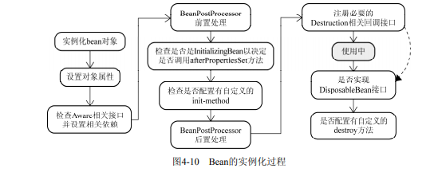

    > 1. bean的实例化与BeanWrapper：InstantiationStrategy是实例化策略的抽象接口，它的直接子类SimpleInstantiationStrategy实现了反射实例化对象实例，但不支持方法注入方式的实例化，它的子类CglibSubclassingInstantiationStrategy（默认采用）另外还支持通过CGLIB的动态字节码生成功能，即可以动态生成某个类的子类（第一步）。实例化对象后，不是直接返回，而是以BeanWrapper对对象进行包裹。BeanWrapper继承了PropertyAccessor，PropertyEditorRegistry和TypeConverter接口，它的实现类BeanWrapperImpl可以对包裹的bean进行设置获取属性等操作。构造完成BeanWrapperImpl的实例后，spring会把之前CustomEditorConfigurer注册的PropertyEditor复制一份给BeanWrapperImpl实例，这样当BeanWrapper设置对象属性时就不会无从下手了，BeanWrapper就不用繁琐地使用反射操作属性了（第二步）。
    > 2. Aware接口：完成第二部后，容器会检查当前对象是否实现了一系列aware接口，如果是则将这些接口定义中规定的依赖注入给当前对象实例。BeanFactory：BeanNameAware，BeanClassLoaderAware，BeanFactoryAware     ApplicationContext：ResourceLoaderAware，ApplicationEventPublisherAware，MessageSourceAware，ApplicationContextAware。ApplicationContext的这几个aware都会把AplicationAware容器本身注入实例对象。
    > 3. BeanPostProcessor：该接口声明了两个方法：前置处理与后置处理（如上图4-10）。这两个方法都传入了对象实例，我们几乎可以对传入的对象执行任何操作。ApplicationContext对应的那些Aware的注入实际上就是通过BeanPostProcessor的子类ApplicationContextAwareProcessor的前置处理实现的。除了在BeanPostProcessor中应用自定义逻辑外，还可以替换当前对象或者字节码增强当前对象实例等，如AOP。  自定义processor：如某些类需要在processor中取得服务器密码进行解密，我们可以定义一个相关接口，让需要此功能的类都实现接口，然后在processor前置处理中检查类是否实现了此接口，如果是则执行取密码解密等操作。  BeanFactory需要手动编码将processor注册到容器，ApplicationContext只需要在xml中配置即可。    spring内部使用的特殊processor：InstantiationAwareBeanPostProcessor接口，在第一步之前，容器会检查是否有类实现了此接口，如果有则使用此接口来构造对象实例，构造成功后直接返回，而不会进行4-10所示的流程。
    > 4. InitializingBean与init-method：在调用完processor的前置处理后，会调用InitializingBean接口的方法，因为具有较强侵入性，所以不推荐使用。init-method方法更推荐。
    > 5. DisposableBean与destroy-method：最后，容器将检查singleton类型的bean实例，看是否实现了DisposableBean接口或者指定了destroy-method，如果是，则会为该实例注册一个用于对象销毁的回调。回调注册后并不会立刻执行，而是在实例不再使用时，通常也是容器关闭时才调用，但是容器关闭时并不会自动调用，需要我们告知容器。对于BeanFactory：在应用程序的主程序退出之前，调用ConfigurableBeanFactory提供的destroySingletons方法，如果没有手动调用，则DisposableBean与destroy-method不会执行。  对于ApplicationContext：容器为我们提供了registrerShutdownHook方法，该方法底层使用标准的Runtime类的addShutdownHook方法来调用销毁逻辑，从而保证在java虚拟机退出之前，这些singleton类型的销毁逻辑会被执行。 prototype在实例化并返回给请求发后，容器就不管这些对象的生命周期了。

### ApplicationContext容器

1. 为什么要有统一资源策略：java的统一资源定位器虽说是统一资源，但却只能定位网络资源，并职责划分不清，资源的查找与资源的表示没有一个清晰的界限，资源查找后返回的形式也是多种多样，没有一个统一的抽象，理论上返回的资源应该是一个统一的抽象接口，客户端对资源进行什么处理，应该由资源抽象接口来界定，而不是资源的定位于查找者需要关心的（类似于后端传送数据到前端应该有一个同一的接口）。所以，spring提出了一套基于Resource与ResourceLoader接口的资源抽象与加载策略。

2. Resource接口作为所有资源的抽象访问接口，提供了以下实现类：ByteArrayResource（字节数组），ClassPathResource（ClassPath中的资源），FileSystemResource（文件），UrlResource，InputStreamResource。也可以自己实现Resource接口或者继承AbstractResource抽象类。

3. ResourceLoader接口，查找与定位资源，有一个getResource方法，返回查找的资源。

   > 1. DefaultResourceLoader：首先检查资源路径是否以classpath前缀开头，如果是，则尝试构造ClassPathResource类型资源并返回，否则，尝试通过URL，根据资源路径来定位资源，如果没有抛出MalformedURLException异常，则会构造UrlResource类型的资源，如果还是无法定位资源，则委派getResourceByPath方法来定位，此方法默认会构造CLassPathResource资源（实际上并不存在的资源）。
   >
   > 2. FileSystemResourceLoader：继承自DefaultResourceLoader，重写了getResourceByPath方法，使之从文件系统加载资源并以FileSystemResource类型返回。FileSystemXmlApplicationContext也是重写了此方法，并返回FileSystemResource类型的资源。
   >
   > 3. ResourcePatternResolver接口：对ResourceLoader接口的扩展，可以每次返回多个Resource，引入了新的协议前缀classpath*。此接口最常用的实现类PathMatchingResourcePatternResolver，构造此类时，可以指定一个ResourceLoader，默认会构造一个DefaultResourceLoader，此类会将匹配后的资源路径委派给它的ResourceLoader来查找和定位。
   >
   >    

4. ApplicationContext与ResourceLoader：

   ​		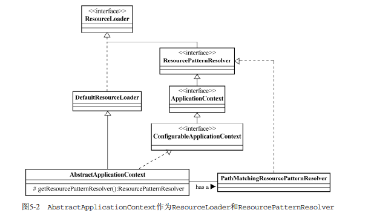

   > 1. sdf
   > 2. sdf

### spring aop

1. aop的实现：实现aop的语言为Aspect-Oriented Language简称AOL，Aspectj是扩展自java的一种aol，spring aop采用java作为aol。java平台的aop实现：动态代理（实现相同的接口），动态字节码增强（生成某个类的子类），自定义类加载器（加载class文件时改动），aol扩展。   动态织入与静态织入：aspectj两种都支持，springaop只支持动态，静态织入直接以java字节码的形式在运行前编译到java类中，无性能损失，动态织入通过java语言的特性运行时织入到当前系统。

2. 术语介绍：

   > 1. joinpoint：系统中要织入的点。常见的joinpoint：方法调用（调用此方法的地方），方法调用执行（开始执行此方法的地方），异常处理执行（某些异常抛出后），类初始化，字段设置（setter方法设置或者直接设置）。
   > 2. pointcut：是joinpoint的表述方式。一个程序有多个joinpoint，pointcut用来表述到底插入那个joinpoint。pointcut的表述方式：直接指定joinpoint所在的方法名称，正则表达式，使用特定的pointcut表述语言（AspectJ）。pointcut运算：pointcut之间的逻辑运算
   > 3. advice：横切关注点逻辑的载体。相当于class中的method。根据advice在joinpoint位置执行时机的差异或完成功能的不用，advice可以分为多种形式：before/after advice，在joinpoint之前或之后。after advice还可以分为：after returning advice，after throwing advice，after advice。（顺序：before->after returning->after throwing->after）。around advice：在joinpoint之前与之后。introduction：根据功能来区分的advice，在AspectJ中称Inter-Type Declaration。
   > 4. aspect：对系统中横切关注点逻辑进行模块化封装的aop概念实体，可以包含多个pointcut以及相关advice定义。
   > 5. 织入与织入器：织入器将Aspect模块化的横切关注点集成到oop系统中，AspectJ有专门的编译器来完成织入操作，即ajc。
   > 6. 目标对象：符合pointcut所指定的条件，将在织入过程中被织入横切逻辑的对象。

3. spring aop的实现机制（动态代理与字节码）：静态代理（需要人为实现各个代理类），动态代理（需要被代理类实现了接口），动态字节码生成（无法对final方法进行覆写）。默认情况下，如果springaop发现目标对象实现了相应的interface，则采用动态代理，如果没有，则采用CGLIB。

4. spring aop中的joinpoint：只支持方法执行类型的joinpoint。如果需要提供属性级别的joinpoint，可以通过getter与setter。如果不能满足需求，可以使用AspectJ，但AspectJ也不支持所有类型的joinpoint，如循环。

5. spring aop中的pointcut：Pointcut接口作为AOP框架中所有Pointcut的顶层抽象。提供了两个方法来帮助捕捉系统中相应的Joinpoint，一个返回ClassFilter，一个返回MethodMatcher。前者匹配被操作对象的类型，后者匹配方法。ClassFilter接口有一个matches方法，当匹配成功时返回true。MethodMatcher接口有三个方法，两个参数与三个参数的matches方法，前者只匹配方法的名称，后者会检查方法的参数（影响性能）。还有一个isRuntime方法，返回false时，只会匹配方法名称（StaticMethodMatcher），即只会执行两参数matches方法。返回true时，会对方法参数进行检查（DynamicMethodMatcher），两个matches都会执行，但是当两参数matches方法返回false时，三参数matches也不会执行了。  Pointcut也可以分为两类：StaticMethodMatcherPointcut与DynamicMethodMatcherPointcut。

   

6. 常见的Pointcut：

   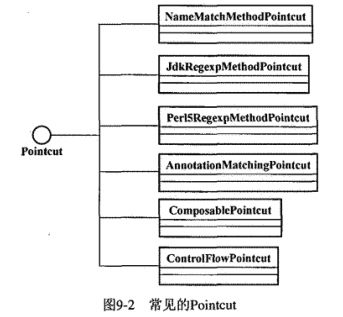

   > 1. NameMatchMethodPointcut：匹配方法名。
   > 2. JdkRegexpMethodPointcut：基于正则表达式匹配方法名称，注意必须使用整个方法签名
   > 3. AnnotationMatchingPointcut：基于注解匹配，匹配有某个注解的类与方法。有三种构造器，类级别的注解，方法级别的注解，同时限定类与方法的注解。
   > 4. ComposablePointcut：可以进行逻辑运算。union(并)，interselection(交)方法。
   > 5. ControlFlowPointcut：根据被拦截方法以及调用被拦截方法的类与方法进行匹配。应为需要检查调用栈，所以效率低。

7. 扩展Pointcut：继承StaticMethodMatcherPointcut与DynamicMethodMatcherPointcut重写matches方法。   容器中的pointcut：将各个Pointcut注册到容器中使用是完全合理的。

8. spring aop中的advice：spring中的advice全部遵循aop alliance规定的接口。AfterAdvice，BeforeAdvice，Interceptor都是无方法的接口（方便以后扩展）。per-class类型的advice：在同一个类之间的所有实例间共享，除了introduction类型外的所有advice（下面介绍的四种advice）。per-instance：为不同的实例对象保存他们各自的状态和相关逻辑。

   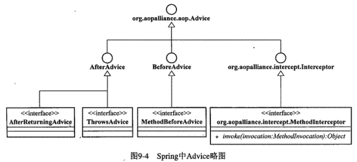

   > 1. BeforeAdvice：业务代码紧接着此advice执行，所以如果抛出异常可以中断业务代码执行。我们需要实现MethodBeforeAdvice接口，重写before方法。
   > 2. ThrowsAdvice：该接口无方法，但是实现时定义方法需要遵循一定的规则，如方法名称一定要是afterThrowing，框架会使用反射调用我们的方法。
   > 3. AfterReturningAdvice：此接口有一个afterReturning方法，通过此方法我们可以访问Joinpoint的方法返回值，方法，方法参数以及所在的目标对象。因为只有在正常返回时才会执行，所以不适用于清理工作。不能改变方法的返回值。
   > 4. AroundAdvice：MethodInterceptor接口，需要重写invoke方法，可以使用此接口实现after advice特性实现资源清理的工作，前几种advice能完成的工作此advice也能。

9. per-instance advice（Introduction）：为目标对象添加新的属性与行为。声明相应的接口以及实现，然后在通过特定的拦截器将新的接口定义以及实现类中的逻辑附加到目标对象之上。这个特定的拦截器为IntroductionInterceptor，继承了DynamicIntroductionAdvice（目标对象实现了那些接口）与MethodInterceptor（调用新添加的接口方法）接口，并且因为是新添加的方法，所以不需要调用proceed()方法了。IntroductionInfo接口：与Dynamic...相反，他是返回预定的目标接口类型。   相比aspectj有性能损失。

   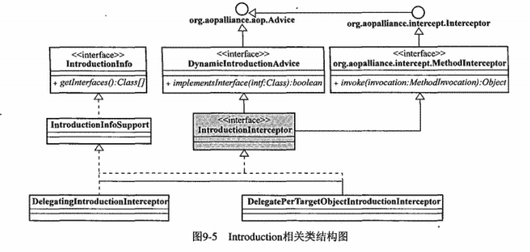

   > 1. DelegationIntroductionInterceptor：不会自己实现将要添加到目标对象上的新的逻辑行为，而是委派给其他实现类。此类会使用它所持有的同一个delegate接口实例，供同一目标类的所有实例共享。所以并没有实现：’为不同的实例对象保存他们各自的状态和相关逻辑‘，下一个类实现了。
   > 2. DelegatePerTargetObjectIntroductionInterceptor：与上一个类不同，此类会在内部持有一个目标对象与相应introduction逻辑实现类之间的映射关系。

10. spring aop中的aspect：Advisor代表Spring中的Aspect，但是与正常Aspect不同，Advisor通常只持有一个pointcut和一个advice。

    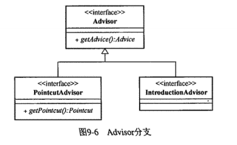

    > 1. pointcutadvisor：可以在IOC容器中注册并使用，内部没有相应实例的话，需要注入相应的advice与pointcut实例。
    >
    >    
    >
    >    - DefaultPointcutAdvisor：用于除了Introduction类型外的所有Advice
    >    - NameMatchMethodPointcutAdvisor：细化后的Default....，只能使用NameMatchMethodPointcut（内部包含此实例）类型的pointcut，除Introduction类型的所有advice。
    >    - RegexpMethodPointcutAdvisor：只能使用正则表达式的pointcut，内部有一个AbstractRegexpMethodPointcut实例（默认为jdk...），如果要使用Per15...可以通过setPer15()方法设置。
    >    - DefaultBeanFactoryPointcutAdvisor：自身绑定到了beanfactory，通过容器中的Advice注册的beanName来关联对应的advice，只有当对应的pointcut匹配成功，才会去实例化对应的advice，减少了容器启动初期advisor与advice的耦合。
    >
    > 2. IntroductionAdvisor：只能应用于类级别的拦截，只能使用Introduction类型的Advice。
    >
    >    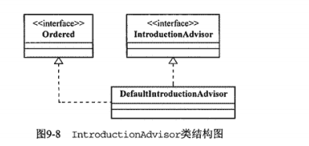
    >
    > 3. Ordered作用：同一个joinpoint的多个advice执行顺序。默认按照声明的顺序执行。也可以在配置advisor时指定order属性的值。

11. spring aop的织入：使用ProxyFactory作为织入器，接受被代理对象与advisor后返回代理对象。还可以直接指定advice，对于Introduction类型的advice，如果是IntroductionInfo的子类，ProxyFactory会默认为其构造一个DefaultIntroductionAdvisor，而DynamicIntroductionAdvice则会抛出错误，因为无法从此类型获得必要的目标对象信息。对于其他类型的advice，ProxyFactory会默认为其构造相应的Advisor，但是默认的Pointcut为Pointcut.TRUE，即被应用与所有的joinpoint。

    > 1. 基于接口的代理：目标对象实现至少实现了一个接口。
    > 2. 基于类的代理：没有实现任何接口。如果ProxyFactory的proxyTargetClass或sptimize属性被设置为true，则不管有没有实现接口都会采用类的代理。
    > 3. Introduction的织入：因为是对象级别的拦截，所以不需要指定pointcut，只需要指定目标接口类型。并且Introduction的织入可以随意指定基于接口还是类。

12. ProxyFactory本质：

    > 1. ProxyFactory集AopProxy和AdvisedSupport与一身，为了可重用逻辑（ProxyCreatorSupport有多个子类如下面的ProxyFactoryBean，这些子类就只需要继承ProxyCreatorSupport即可，而不用再去实现AopProxy接口），Spring aop在实现时，ProxyFactory只继承了ProxyCreatorSupport，然后把AopProxyFactory（可以生成AopProxy）当作成员变量放在了ProxyCreatorSupport中（所以下面的图是不准确的）。
    >
    >    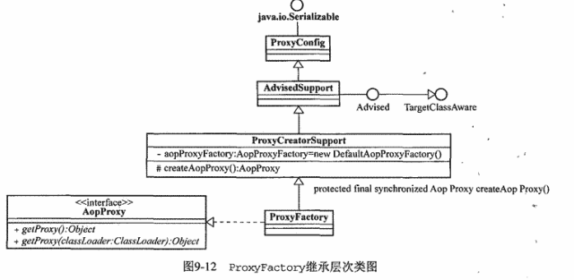
    >
    > 2. AdvisedSupport所承载的信息可以分为两类，ProxyConfig类记录了生成代理对象的控制信息，Advised接口承载了生成代理对象所需要的必要信息，如目标类，Advice，advisor等。ProxyConfig定义了5个boolean属性：proxyTargetClass，optimize，opaque（代理对象是否可以强转为Advised，默认false），exposeProxy（生成代理对象时，将代理对象绑定到ThreadLocal，false），frozen（如果为true则代理对象信息配置完成后不可更改）。Advised接口可以访问相应代理对象的Advisor，进行添加Advisor，移除等操作，即使代理对象已经生成完毕。
    >
    >    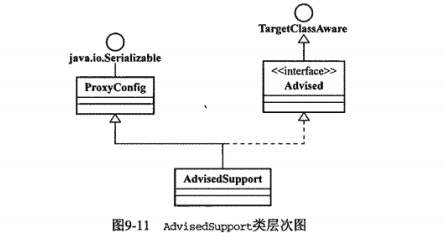
    >
    > 3. AopProxy接口是生成不同代理实现机制的抽象，**getProxy方法能够返回代理对象**，有Cgli2AopProxy与JdkDynamicAopProxy两种实现。因为动态代理需要InvocationHandler，所以实现了此接口。AopProxyFactory根据传入的AdvisedSupport（AopProxyFactory是AdvisedCreatorSupport的成员变量，所以Ad...使用Ao..时需要把自己传入AoproxyFactory）实例提供相关信息，来决定生成什么类型的AopProxy（抽象工厂模式）。  AopProxyFactory中的createAopProxy方法生成AopProxy，逻辑就是一个if else，判断optimize是否为false，proxyTargetClass是否为false，是否实现了接口，三个都满足则用动态代理否则使用CGLIB。
    >
    >    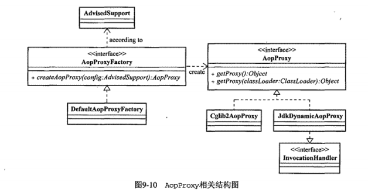

13. 容器中的织入器：ProxyFactoryBean。使用ProxyFactory能让我们独立于SpringIoc容器使用aop（通过手动编码方式），而使用ProxyFactoryBean必须要与SpringIoc结合使用，这样可以大大简化对pointcut与advice等依赖的管理。

    > 1. ProxyFactoryBean的本质：ProxyFactoryBean是Proxy与FactoryBean的结合，他实现了FactoryBean接口并继承了ProxyCreatorSupport类，我们可以通过ProxyFactoryBean的getObject()方法返回我们需要的代理对象，此方法中，可以生成Singleton（类中有一个缓存的成员变量，每次返回此变量即可）或prototype（每次都会生成新的代理对象，有性能损失）类型的代理对象。
    > 2. ProxyFactoryBean的几个独有属性：1. interceptorNames，通过该属性，可以一次性指定多个Advice，拦截器，Advisor。可以通过在interceptorNames某个元素后面添加*通配符，可以让ProxyFactoryBean在容器中查找所有符合条件的Advisor。2. singleton：指明getObject方法返回的代理对象生命周期。
    > 3. 普通advice使用：把pointcut与advice的依赖注入advisor，然后把目标对象与advisor的依赖注入ProxyFactoryBean并且设置需要代理的接口。autodetectInterfaces默认为true，如果确认目标对象所实现的接口就是要代理的接口，则可以不指定接口。也可以设置proxyTargetClass使用类方法实现代理。
    > 4. introduction类型的advice使用：同样注入目标对象与Interceptor给ProxyFactoryBean，但是涉及到的所有bean都需要为prototype类型。这样才能保证每次取得的对象都有各自的状态和行为（如果使用的advisor为DelegatePerTargetObjectIntroductionInterceptor则此advisor可以使用singleton类型）。

14. 自动代理：每一个bean都去配置工作量太大，使用自动代理解决使用ProxyFactoryBean配置工作量较大的问题。

    > 1. 原理：必须要使用spring ioc，在BeanPostProcessor中实现当前bean符合拦截条件则生成代理的功能。那么，那些bean需要生成代理，那些不用呢？可以使用自动代理类来读取信息并且生成代理类。
    >
    > 2. BeanNameAutoProxyCreator：指定需要拦截的bean的beanName，InterceptorName。
    >
    > 3. DefaultAdvisorAutoProxyCreator：只需要注册此bean即可，他会自动搜寻容器内的所有Advisor，然后根据Advisor提供的拦截信息，为符合条件的目标对象生成相应代理对象。注意，他只对Advisor有效，因为只有Advisor才有pointcut与advice。
    >
    > 4. 扩展AutoProxyCreator：继承AbstractAutoProxyCreator或者AbstractAdvisorAutoProxyCreator。    另外，所有的AutoProxyCreator都是InstantiationAwareBeanPostProcessor，这种类型的bean只会进行实例化这第一步，后面的步骤都不会执行。
    >
    >    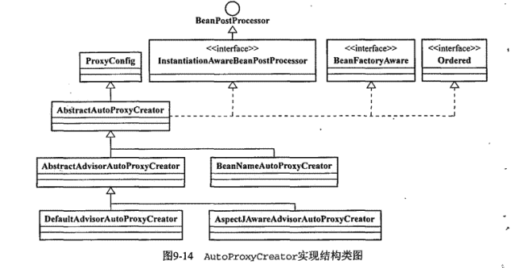

15. TargetSource：

    > 1. SingletonTargetSource：使用最多的，在ProxyFactoryBean的setTarget方法设置完目标对象后，会自动使用SingletonTargetSource对目标对象封装（或者可以先使用目标对象创建TargetSource，在把此TargetSource注入ProxyFactoryBean）。此targetsource只是一个目标对象的容器，没有其他功能。
    > 2. PrototypeTargetSource：每次都会返回一个新的目标对象。所以目标对象的bean必须为prototype，并且通过targetBeanName属性指定目标对象的bean，而不是ref引用，因为使用引用后面就一直会用这个引用，达不到prototype的目的。
    > 3. HotSwappableTargetSource：常用，封装目标对象后，可以在程序运行时，动态替换目标对象类的具体实现。如同一个接口下的多个实现类可以相互替换。使用swap方法替换。
    > 4. CommonsPoolTargetSource：提供目标对象的池子，每次都从中取目标对象。目标对象必须为prototype。
    > 5. ThreadLocalTargetSource：不同的线程调用提供不同的目标对象。目标对象为prototype。
    > 6. 自定义：直接实现TargetSource接口（isStatic方法判断是否返回同一目标对象，singletonTargetSource肯定为true，getTarget方法返回目标对象），或者继承aop.target包中的几个抽象类。

16. @AspectJ形式的Spring AOP：2.0之后的springaop集成了AspectJ，但是仅仅只是使用了AspectJ的一些特性，底层原理还是Springaop（需要导入aspectj的weaver与aspectjrt包）。@AspectJ代表一种定义Aspect的风格，他让我们能够以POJO的形式定义Aspect，没有其他接口定义限制。唯一需要的，就是使用相应的注解标注这些Aspect定义的POJO类，之后SpringAop会将其织入系统。织入方式：

    > 1. 编程方式织入：通过AspectJProxyFactory织入，使用java代码的形式织入。
    > 2. 自动代理织入：AnnotationAwareAspectJAutoProxyCreator，在xml文件中注册此类，他会自动搜集Ioc容器中注册的Aspect（**只是从IOC中搜寻，Aspect还是需要我们手动注册到IOC中**）。  推荐。

17. @AspectJ形式的Pointcut：

    > 1. 声明方式：使用@Pointcut注解，声明包括两个部分：Pointcut Expression与PointcutSignature。前者规定了Pointcut匹配规则。后者为一个方法定义，返回类型必须为void，如public等方法修饰符语义与java相同。 可以将某个方法的Signature作为别的方法的Expression，则另一个方法的匹配规则与此方法相同。 支持的逻辑运算：&&与||与！。
    >
    > 2. 标志符：因为springaop只支持方法级别的joinpoint，所以只能使用AspectJ中的少量标志符。
    >
    >    - execution：匹配拥有方法签名的joinpoint。方法的名称，参数类型，返回类型必须指定。通配符：*可以代替某个单词，用在参数中代表某个参数。..在方法参数中使用可以匹配多个参数，其他地方代表多个层次（如某个包的所有包及这些包的子包）。
    >    - within：类型声明，他会匹配指定类型下的所有joinpoint，即某个类下面的所有方法。
    >    - this与target：this代表匹配目标对象的代理对象的所有方法，target代表匹配目标对象的所有方法。修饰目标对象的代理对象时，功能一样。修饰目标对象时，基于类的代理相同，基于接口的代理就不同了，target可以匹配目标对象的所有方法，this则只能匹配目标对象中实现了代理对象的方法。
    >    - args：捕获所有类型中拥有指定参数类型，参数数量的方法。args会在运行时动态检查参数，如method(Object o)如果传入的类型与args指定的类型匹配时，也能捕获到，而execution是静态匹配，就不能了。
    >    - @within：匹配有某个注解的类的所有方法，静态匹配。
    >    - @target：与@within相同，动态匹配。
    >    - @args：检查传入的参数是否为注解了@args指定的注解的类，如把某个接口作为参数，而此接口有多个实现类，这些实现类有些有@args指定的注解，有些没有，则只有有注解的作为参数传入才会匹配。
    >    - @annotation：检查所有方法的注解。
    >
    > 3. 原理：@Aspectj形式的所有Pointcut表达式，都会转化为具体的专门面向AspectJ的Pointcut对象，AspectJExpressionPointcut类代表Spring aop中面向AspectJ的pointcut具体实现。  AspectJProxyFactory或者AnnotationAwareAspectJAutoProxyCreator通过反射获取到Pointcut定义后，会构造一个AspectJExpressionPointcut对象（属于Springaop的pointcut定义之一），此对象内部持有Pointcut表达式。AspectJEx...内部依然通过ClassFilter与MethodMatcher进行匹配工作，AspectJEx..会委托AspectJ类库中的PointcutParser来对他所持有的Pointcut表达式进行解析，PointcutParser解析完成后会返回一个PointcutExpression对象（AspectJ类库中的类），之后匹配就委托给PointcutExpression对象进行处理。  AspectJEx...也可以向Spring Aop中的其他pointcut类那样使用，只不过构造时需要传入@AspectJ形式的pointcut表达式。
    >
    >    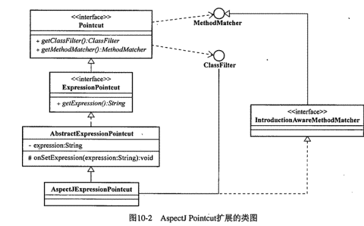

18. @AspectJ形式的Advice：除了@DeclareParents，所有注解都是方法级别的注解。为Advice指定pointcut：可以直接指定@AspectJ形式的Pointcut表达式（即Pointcut Expression），也可以指定Pointcut Signature。

    > 1. @Before，如何获取方法参数？1. 将定义的advice方法第一个参数声明为JoinPoint类型，通过此类的getArgs方法访问Joinpoint处的方法参数，如果不需要则JoinPoint参数可以省略。（除了around advice与introduction外都可以使用）2. 通过args标志符绑定。前面通过args指定参数类型可以达到匹配的目的，而这里使用args指定参数名称时，我们就可以将这些参数绑定在advice方法的参数上。  除了execution标志符外，都可以以指定参数名称的方法绑定参数到advice，还可以取得事务。
    > 2. @AfterThrowing：有一个参数throwing，可以通过throwing="e"，将异常参数绑定到advice方法参数上。
    > 3. @AfterReturning：有一个参数returning，可以获取返回值。
    > 4. @After：2.0增加了Finally advice。
    > 5. @Around：此advice方法第一个参数必须是JoinPoint（他的子类），我们可以通过JoinPoint的proceed方法继续调用链的执行。如果要修改被调用方法的参数可以在proceed方法中传入一个Object[]代替方法参数列表。
    > 6. @DeclareParents：即introduction，只能修饰实例变量（修饰要添加的功能的接口）。目标对象为prototype类型。因为introduction类型的aspect没有pointcut，所以用@DeclareParents的value属性指定要添加功能的目标对象类型，defaultImpl属性指定新增加的接口的实现类。

19. @AspectJ中的Aspect：

    > 1. 同一个joinpoint多个aspect执行顺序：如果在同一个aspect中，则按声明的先后顺序执行。如果不是，则相应aspect需要实现Ordered接口，实现getOrder方法，返回较小值的advice优先级较高。
    > 2. aspect只支持singleton（默认，即容器中只有一个aspect），perthis，pertarget三种实例化模式。可以通过@Aspect注解指定实例化模式，后两种中，前者会为相应的代理对象实例化各自的Aspect实例，后者会为单独的目标对象实例化相应的Aspect实例。使用后两种时，在xml中注册aspect时scope需要为prototype类型。

20. 基于Schema的AOP：不能使用注解，又不想使用基于POJO的Aspect声明方式时，可以使用此方式。使用基于Schema的Aop时，需要在配置文件增加针对aop的命名空间。<aop：config>注解只有一个属性proxyTargetClass，可以指定基于接口还是类的代理。<aop：config>内部可以有三个子元素：<aop：pointcut>，<aop：advisor>，<aop：aspect>，他们三个必须按照顺序进行配置。<aop：config>底层基本上是使用1.x中的自动代理机制实现的。

21. spring aop代理模式的问题：当一个类的某个方法调用自己的另一个方法时，如果这两个方法都添加了横切逻辑，那么只有调用方法的横切逻辑会被执行，因为代理终归是通过在代理对象中调用被代理对象实现的，而被代理对象调用自身通过的是被代理对象的引用，所以执行被调用方法时就不会执行横切逻辑。  解决：通过AopContext.currentProxy方法，我们可以获得此对象的代理对象，在类中声明一个getThis方法获取代理对象，方法之间互相调用时，都要通过getThis方法。

22. asd

### 数据访问

1. spring提供的数据访问层：统一的数据访问异常层次体系，jdbc api的最佳实践(基于template的jdbc使用方式，基于操作对象的jdbc使用方式)，以统一的方式对各种orm方案的集成。

2. DAO层的作用：屏蔽不同数据库访问机制的差异性，即更换数据库时不需要修改客户端代码（即使用DAO层的代码通常为service层）。问题：DAO层有异常如何处理？不抛出客户端不知道，抛出，客户端代码受其影响。且不同数据库可能抛出的异常也不同。解决：使用unchecked exception封装（为什么使用ue：客户端无法处理处理dao层异常且unchecked exception不需要编译器检查，dao层接口就不用声明抛出异常）异常然后抛出，使用异常的分类转译（异常不抛给客户端对象，由DAO层或者某个工具类专门处理，捕获到各种异常后统一抛出几个规定的异常）。

3. spring dao层异常大部分均以DataAccessException为父类，其子类包括如下：CleanupFailureDataAccessException（清理资源时的异常），DataAccessResourceFailureException（无法访问相应资源时的异常），InvalidDataAccessResourceUsageException（错误的方式访问数据资源，如传入错误的sql）等等。

4. 基于template的jdbc使用方式：

   > 1. 由来：使用jdbc容易出错，大量代码冗余。解决：模板方法模式：把相同的逻辑封装到模板中，让子类来实现不同逻辑的地方。每次都实现一个子类太过繁琐，我们可以把有不同的逻辑的地方放入接口（StatementCallback），每次我们只需要实现接口，然后把接口传入模板即可。
   > 2. 实现：JdbcTemplate继承了JdbcAccessor，实现了JdbcOperations接口。JdbcAccessor抽象类主要为子类提供一些公有的属性（接口），如：**DataSource（用来替代基于DriverManager的数据库创建方式，获取数据库资源的统一接口）**，SQLExceptionTranslator（SQLException转译）。
   > 3. JdbcTemplate各种模板中，根据相应Callback接口所公开的自由度大小，可以简单划分为4组：面向Connection的模板方法（通过ConnectionCallback接口所公开的Connection进行数据访问），面向Statement的模板方法（静态sql，StatementCallback接口公开的Statement类型），面向PreparedStatement的模板方法（包含参数的sql，PreparedStatementCallback公开的PreparedStatement），面向CallableStatement的模板方法（存储过程，CallableStatementCallback公开的CallableStatement）。每一组的模板方法都有一个核心的方法实现，其他属于同一组的重载的模板方法会调用这个核心的方法。
   > 4. sdf

5. spring对ibatis的集成：

   > 1. sdf

### springmvc

1. 入门：

   > 1. DispatcherServlet简短流程：HandlerMapping灵活管理web请求到具体的处理类之间的映射关系。DispatcherServlet将寻求HandlerMapping实例，获取对应当前web请求的具体处理类，即Controller。Controller实现了对应某个具体web请求的处理逻辑，处理完成DispatcherServlet交给他的请求后将返回一个ModelAndView对象，此对象包含两部分信息：视图的逻辑名称，模型数据（视图渲染过程中需要将这些模型数据并入视图的显示中）。ViewResolver与View：屏蔽web框架在使用不同web视图技术时的差异性。Servlet提供文本与二进制两种视图输出方式（通过HttpServletResponse），在HttpServletResponse将视图输出之前，借助不同视图技术API，并结合模型数据和相应的模板文件，就能生成最终的视图结果。ViewResolver根据modelandview中的逻辑视图名查找相应的View接口实现类，View实现了视图模板与模型数据的合并，以及合并后的视图结果的输出。
   > 2. Spring MVC物理结构：在web.xml中通过<listener>元素增加一个ServletContextListener即ContextLoaderListener，此类将为整个web应用程序加载顶层的WebApplicationContext，我们使用的DataSource，DAO，Service等，都在该Context中注册，相当于普通Spring程序的ApplicationContext，只是WebApplicationContext专属于web环境下，加载完成后此Context将被绑定到ServletContext中，我们可以通过ServletContext获取WebApp....。WebApplicationContext的默认配置文件路径为**/WEB-INF/applicationContext.xml**，可以contextConfigLocation中配置多个applicationContext.xml。      DispatcherServlet使用外部配置文件，用来配置HandlerMapping，Controller，ViewResolver等等。该外部配置文件路径/WEB-INF/，由web.xml中的<servlet-name>决定，名称为:**xxx-servlet.xml**，如controller-servlet.xml，可以在contextConfigLocation中配置多个xxx-servlet.xml。DispatcherServlet将根据配置文件构建相应的WebApplicationContext，这些context都是由listener构建的context的子容器。

2. 主要角色：

   > 1. HandlerMapping：为什么叫HandlerMapping而不是ControllerMapping呢？因为处理请求的控制器除了Controller还有其他的如Struts中的Action，这些控制器统称为Handler。HandlerMapping为一个接口，包含了一个getHandler的方法，返回HandlerExecutionChain对象，此对象中包含了具体的Handler。
   >
   >    - 可用的HandlerMapping：SimpleUrlHandlerMapping，ControllerClassNameHandlerMapping，DefaultAnnotationHandlerMapping。
   >    - HandlerMapping执行序列：DispatcherServlet按照优先级（Ordered借口）使用HandlerMapping，如果某个HandlerMapping反悔了Handler，则后面的HandlerMapping将不再被执行。
   >
   > 2. Controller：此接口会中有一个handleRequest方法，返回ModelAndView对象。为了将Controller中需要的如请求参数抽取，请求编码设定等通过处理服用，spring mvc提供了一套Controller实现体系，分为自由挥洒派（包括AbstractController与MultiActionController。获取参数，验证（如验证是否为空），业务逻辑等都由我们操作，自由度大）和规范操作派（包括其余所有Controller。规范了参数抽取到Command对象，提供了统一数据验证方式，规范了表单请求处理流程）。
   >
   >    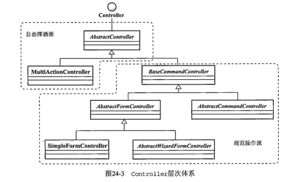
   >
   >    - AbstractController：作为所有Controller的起源，通过模板方法模式，解决了通用功能：管理当前Controller支持的请求方法类型（GET/POST），管理页面的缓存设置，管理执行流程在session上的同步。需要实现handleRequestInternal(request,response)方法。
   >    - MultiActionController：继承了AbstractController，另外，还完成了：请求参数到Command对象的绑定，通过Validator数据验证，细化的异常处理方法（处理web请求处理过程中所抛出的特定类型异常）。此Controller可以处理多个web请求，需要我们实现多个方法  methodName(request,response,[command])。通过MethodNameResolver接口来处理请求与每个方法的一一对应，需要实现String getHandlerMethodName(request)方法。可用的Resolver：
   >      1. InternalPathMethodNameResolver：默认，匹配url最后一个/之后的部分并去除扩展名，作为Controller的方法名。
   >      2. PropertiesMethodNameResolver：通过配置mapping属性指定url与方法名称的对应。
   >      3. ParameterMethodNameResolver：根据请求中的某个参数值（默认参数为action）作为方法名，或者一组参数来映射方法名（指定一组参数，请求参数中存在这一组参数中的某一个则映射到与此参数同名的方法上）。
   >    - SimpleFormController：BaseCommandController提供了自动数据绑定与通过Validator的数据验证功能。AbstractFormController在Base...的基础上，实现了一套模板化的form处理流程，完成了从数据的封装，验证，再到处理流程的模板化。SimpleFormController继承了AbstractFormController。
   >      1. 数据绑定：帮我们自动提取request中的参数，然后转型为需要的对象类型，我们需要提供一个Command类型的目标对象，此后web处理逻辑直接与Command打交道。
   >    - AbstractWizardFormController：
   >
   > 3. ModelAndView：
   >
   > 4. 

