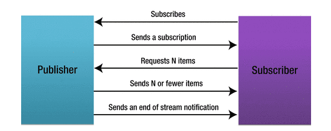

1. webflux是一个自底向上构建的非阻塞web框架。它是完全地非阻塞的，支持Reactive Streams背压，运行在如Tomcat，Jetty，Netty，Servlet3.1+，Netty，Undertow等容器中。与Spring mvc共存于spring框架之中，两个模块是可选的，也可以同时使用。另外，spring webflux不支持关系型数据库。

2. 如何理解非阻塞：如创建一个返回Mono<String>类型的handler，一个返回String类型的handler，两个handler都需要阻塞5秒钟，当前端请求这两个handler时，都是5秒钟之后接收到响应，但是我们可以通过日志观察，Mono类型的handler在几毫秒内就处理完毕了，退出了函数，线程并没有阻塞，而String类型的handler线程阻塞了5秒。在spring mvc中，servlet容器会使用一个大的线程池来应对请求处理过程中可能出现的阻塞问题，而在spring webflux中，会假定应用程序不会阻塞，因此，非阻塞服务器使用一个小的，固定大小的线程池来处理请求。

3. 推拉模式与背压：push：发布者主动将元素推送给订阅者。pull：订阅者会向发布者主动索要。当订阅者比发布者快时，同步数据处理机制中订阅者需要阻塞等待，直到有消息可用，而在异步数据处理机制中，当出现准备就绪的消息时，发布者会将它们异步发送给订阅者，订阅者无需阻塞。当发布者比订阅者快时，有两种解决方案：一是使订阅者拥有一个无界缓冲区来保存消息。二是改变发布者，即**背压**，策略，订阅者告诉发布者让其减缓发布速度并保持信息，直到订阅者准备好，此机制需要发布者拥有无限缓冲区。**响应式流**：订阅者向发布者发送多个元素的异步请求，发布者向订阅者异步发送多个元素。响应式流会在pull模型与push模型之间动态切换，订阅者慢时，使用pull模型，发布者慢时，使用push模型，谁慢谁主动。

4. 响应式流接口：在JDK9之后的Flow类中声明了四个响应式流接口：Publish<T>接口，Subscriber<T>接口，Subscription接口，Processor<T,R>接口。发布者向订阅者发送Subscription，使用Subscription，订阅者可以从发布者那里请求多个消息，或取消订阅。Processor充当订阅者与发布者的处理阶段，Processor接口继承了Publisher和Subscriber接口，它会将来自发布者的T类型的消息数据，转换为R类型的数据，并将R类型的数据发布给订阅者，一个发布者可以拥有多个处理器。

   

5. Subscriber：onSubscribe(Subscription subscription)：到发布者第一次发布消息时会自动调用此方法，此方法一般设置subscription订阅消息的数量。onNext(Object item)：订阅者对数据的消费方法。onError(Throwable throwable)：订阅过程中出现异常方法。onComplete()：subscription中全部消息消费完毕方法。  Publisher：subscribe(Subscriber var)：订阅者订阅发布者。

6. Mono与Flux：两者都实现了Publisher接口。一个Mono对象最多发送一个信号（可能是一个值，或者空，或者error），而Flux可以发送多个信号。Mono提供了一些方法创建包含不同元素的Mono子类，如create，just，error等方法。

