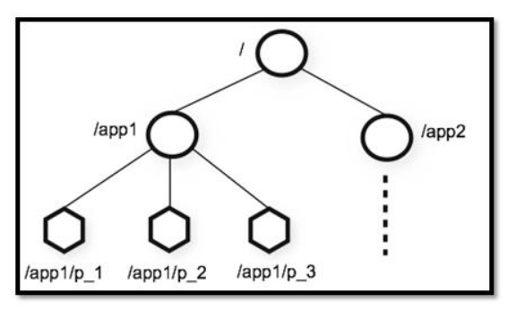
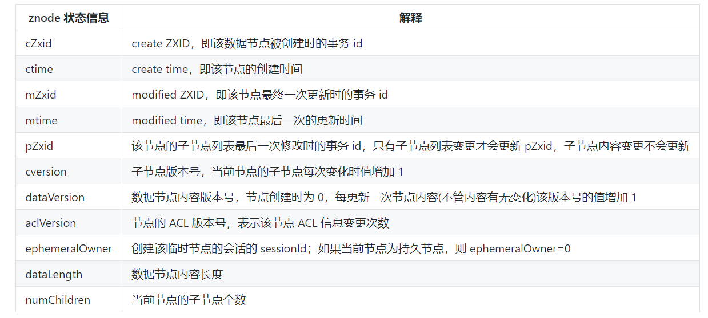
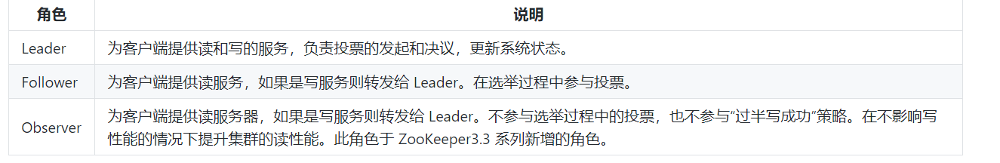
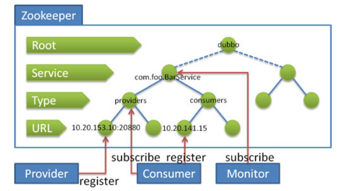

1. zookeeper是什么：ZooKeeper 是一个开源的**分布式协调服务**，它的设计目标是将那些复杂且容易出错的分布式一致性服务封装起来，构成一个高效可靠的原语集（原语具有原子性，不可拆分），并以一系列简单易用的接口提供给用户使用。ZooKeeper 为我们提供了高可用、高性能、稳定的分布式数据一致性解决方案，**通常被用于**实现诸如数据发布/订阅（监听 ZooKeeper 上节点的变化来实现配置的动态更新。）、负载均衡、命名服务（可以通过 ZooKeeper 的顺序节点生成全局唯一 ID）、分布式协调/通知、集群管理、Master 选举、分布式锁和分布式队列等功能。ZooKeeper 将数据保存在**内存中**，性能是非常棒的。 在“读”多于“写”的应用程序中尤其地高性能，因为“写”会导致所有的服务器间同步状态。（“读”多于“写”是协调服务的典型场景）。客户端的**读请求**可以被集群中的任意一台机器处理，如果读请求在节点上注册了监听器，这个监听器也是由所连接的 zookeeper 机器来处理。对于**写请求**，这些请求会同时发给其他 zookeeper 机器并且达成一致后，请求才会返回成功。因此，随着 zookeeper 的集群机器增多，读请求的吞吐会提高但是写请求的吞吐会下降。

2. zookeeper的特点：

   > 1. 顺序一致性：从同一客户端发起的事务请求，最终将会严格地按照顺序被应用到 ZooKeeper 中去。针对同一个Follower A提交的写请求request1、request2（有客户端发送给A），某些Follower虽然可能不能在请求提交成功后立即看到（也就是强一致性），但经过自身与Leader之间的同步后，这些Follower在看到这两个请求时，一定是先看到request1，然后再看到request2，两个请求之间不会乱序，即顺序一致性
   > 2. 原子性： 所有事务请求的处理结果在整个集群中所有机器上的应用情况是一致的，也就是说，要么整个集群中所有的机器都成功应用了某一个事务，要么都没有应用。
   > 3. 单一系统映像：无论客户端连到哪一个 ZooKeeper 服务器上，其看到的服务端数据模型都是一致的。
   > 4. 可靠性：一旦一次更改请求被应用，更改的结果就会被持久化，直到被下一次更改覆盖。

3. 分布式与集群的区别：集群是多台机器提供一样的服务，比如多台机器都提供秒杀服务。分布式是将一个服务拆分成多个子服务，然后将这些子服务部署在不同的服务器上（同时分布式还会带来一系列问题：比如各个分布式组件如何协调起来，如何减少各个系统之间的耦合度，分布式事务的处理，如何去配置整个分布式系统等等，zookeeper就是来解决这些问题的）。

4. 数据模型：ZooKeeper 数据模型采用层次化的**多叉树形结构**，每个节点上都可以**存储数据**，这些数据可以是数字、字符串或者是二级制序列。并且。每个节点还可以拥有 N 个子节点，最上层是**根节点**以“/”来代表。每个数据节点在 ZooKeeper 中被称为 **znode**，它是 ZooKeeper 中数据的最小单元。并且，每个 znode 都一个唯一的路径标识。ZooKeeper 主要是用来协调服务的，而不是用来存储业务数据的，所以**不要放比较大的数据**在 znode 上，ZooKeeper 给出的上限是每个结点的数据大小最大是 1M。

   

5. znode（数据节点）：

   > 1. 4种类型：a. 持久节点：一旦创建就一直存在即使 ZooKeeper 集群宕机，直到将其删除。 b. 临时节点：临时节点的生命周期是与 **客户端会话（session）** 绑定的，**会话消失则节点消失** 。并且，**临时节点只能做叶子节点** （因为如果临时节点做主干几点，如果他消失了，那他的子节点怎么办呢？所以只能做叶子节点），不能创建子节点。 c. 持久顺序节点：除了具有持久（PERSISTENT）节点的特性之外， 子节点的名称还具有顺序性。比如 `/node1/app0000000001` 、`/node1/app0000000002`   d. 临时顺序节点：除了具备临时（EPHEMERAL）节点的特性之外，子节点的名称还具有顺序性（注意，是临时节点只能做叶子节点，临时顺序节点可以做任何节点）。
   >
   > 2. znode的数据结构：每个znode由两部分组成：stat（状态信息）与data（节点存放的数据的具体内容）。Stat 中包含了一个数据节点的所有状态信息的字段，包括事务 ID-cZxid、节点创建时间-ctime 和子节点个数-numChildren 等等。Stat中还记录了znode的三个相关版本信息：dataVersion表示当前znode的版本号，cversion表示当前znode的子节点的版本号，aclversion表示当前znode的acl版本。
   >
   >    

6. ACL（权限控制AccessControlLists）：对znode操作的5种权限：create表示能创建子节点，read表示能获取节点数据并列出其子节点，write表示能设置/更新节点数据，delete表示能删除子节点，admin表示设置节点的acl权限。（增（子）/删（子）/改（data）/查（data与子）  4种身份认证方式：world默认认证方式，所有用户都可以无条件访问，auth不使用任何id，代表任何已认证的用户，digest 用户名:密码认证方式，ip对指定 ip 进行限制。

7. Watcher（事件监听器），是 ZooKeeper 中的一个很重要的特性。ZooKeeper 允许用户在指定节点上注册一些 Watcher，并且在一些特定事件触发的时候，ZooKeeper 服务端会将事件通知到感兴趣的客户端上去，该机制是 ZooKeeper 实现分布式协调服务的重要特性。

8. Session（会话）（是，sessionTimeout，sessionId）：Session 可以看作是 ZooKeeper 服务器与客户端的之间的一个 TCP 长连接，通过这个连接，客户端能够通过心跳检测与服务器保持有效的会话，也能够向 ZooKeeper 服务器发送请求并接受响应，同时还能够通过该连接接收来自服务器的 Watcher 事件通知。Session 有一个属性叫做：**sessionTimeout** ，`sessionTimeout` 代表会话的超时时间。当由于服务器压力太大、网络故障或是客户端主动断开连接等各种原因导致客户端连接断开时，只要在`sessionTimeout`规定的时间内能够重新连接上集群中任意一台服务器，那么之前创建的会话仍然有效。另外，在为客户端创建会话之前，服务端首先会为每个客户端都分配一个 `sessionID`。由于 `sessionID`是 ZooKeeper 会话的一个重要标识，许多与会话相关的运行机制都是基于这个 `sessionID` 的，因此，无论是哪台服务器为客户端分配的 `sessionID`，都务必保证全局唯一。

9. zookeeper集群：zookeeper服务器的数量一定是奇数的，通常 3 台服务器就可以构成一个 ZooKeeper 集群了，组成 ZooKeeper 服务的服务器都会在内存中维护当前的服务器状态，并且每台服务器之间都互相保持着通信。集群间通过 ZAB 协议（ZooKeeper Atomic Broadcast）来保持数据的一致性。zookeeper集群为啥是奇数台：ZooKeeper 集群在宕掉几个 ZooKeeper 服务器之后，如果剩下的 ZooKeeper 服务器个数大于宕掉的个数的话整个 ZooKeeper 才依然可用（半数机制）。假如我们的集群中有 n 台 ZooKeeper 服务器，那么也就是剩下的服务数必须大于 n/2。 比如假如我们有 3 台，那么最大允许宕掉 1 台 ZooKeeper 服务器，如果我们有 4 台的的时候也同样只允许宕掉 1 台。 假如我们有 5 台，那么最大允许宕掉 2 台 ZooKeeper 服务器，如果我们有 6 台的的时候也同样只允许宕掉 2 台。综上，何必增加那一个不必要的 ZooKeeper 呢

10. 集群中服务器状态与概念：LOOKING：寻找leader     LEADING：leader状态，对应的节点为leader   FOLLOWING：follower状态，对应的节点为follower   OBSERVING: Observer 状态，对应节点为 Observer，该节点不参与 Leader 选举。     zxid（zookeeper transaction id）：每个改变zookeeper状态的操作都会形成一个对应的zxid，并记录到transaction log中，这个指越大表示更新越新。   SID：服务器的唯一标识。

11. zookeeper集群角色：zookeeper中引入了 Leader、Follower 和 Observer 三种角色。ZooKeeper 集群中的所有机器通过一个 **Leader 选举过程** 来选定一台称为 “**Leader**” 的机器。当 Leader 服务器出现网络中断、崩溃退出与服务器初始化启动时，就会进入 Leader 选举过程，这个过程会选举产生新的 Leader 服务器。

    > 选举过程：
    >
    > 1. **Leader election（选举阶段）**：节点在一开始都处于选举阶段，只要有一个节点得到超半数节点的票数，它就可以当选**准 leader。**
    > 2. **Discovery（发现阶段）** ：在这个阶段，followers 跟准 leader 进行通信，同步 followers 最近接收的最新历史事务日志。
    > 3. **Synchronization（同步阶段）** :同步阶段主要是利用 leader 前一阶段获得的最新提议历史，同步集群中所有的副本。同步完成之后 准 leader 才会成为真正的 leader。
    > 4. **Broadcast（广播阶段）** :到了这个阶段，ZooKeeper 集群才能正式对外提供事务服务，并且 leader 可以进行消息广播。同时如果有新的节点加入，还需要对新节点进行同步。

12. 分布式一致性算法paxos介绍：Paxos算法解决的问题正是分布式一致性问题，即一个分布式系统中的各个进程如何就某个值（决议）达成一致。Paxos算法运行在允许宕机故障的异步系统中，不要求可靠的消息传递，可容忍消息丢失、延迟、乱序以及重复。它利用大多数 (Majority) 机制保证了2F+1的容错能力，即2F+1个节点的系统最多允许F个节点同时出现故障。Paxos算法运行在允许宕机故障的异步系统中，不要求可靠的消息传递，可容忍消息丢失、延迟、乱序以及重复。它利用大多数 (Majority) 机制保证了2F+1的容错能力，即2F+1个节点的系统最多允许F个节点同时出现故障。Paxos中有三类角色`Proposer`、`Acceptor`及`Learner`，主要交互过程在`Proposer`和`Acceptor`之间。

    > - **Proposer**: 提出提案 (Proposal)。Proposal信息包括提案编号 (Proposal ID) 和提议的值 (Value)。
    > - **Acceptor**：参与决策，回应Proposers的提案。收到Proposal后可以接受提案，若Proposal获得多数Acceptors的接受，则称该Proposal被批准。
    > - **Learner**：不参与决策，从Proposers/Acceptors学习最新达成一致的提案（Value）。

13. paxos通过决议过程（分为两个阶段，learn阶段之前决议已经通过）：

    > 1. 第一阶段：Prepare阶段。Proposer向Acceptors发出**Prepare请求**，Acceptors针对收到的Prepare请求进行**Promise承诺**。
    >
    > 2. 第二阶段：Accept阶段。Proposer收到多数Acceptors承诺的Promise后，向Acceptors发出**Propose请求**，Acceptors针对收到的Propose请求进行**Accept处理**。
    >
    > 3. 第三阶段：Learn阶段。Proposer在收到多数Acceptors的Accept之后，标志着本次Accept成功，决议形成，将形成的决议发送给所有Learners。
    >
    > 4. 其中每条信息描述：**Prepare**: Proposer生成全局唯一且递增的Proposal ID (可使用时间戳加Server ID)，向所有Acceptors发送Prepare请求，这里无需携带提案内容，只携带Proposal ID即可。**Promise**: Acceptors收到Prepare请求后，做出“两个承诺，一个应答”。  两个承诺：不再接受Proposal ID小于等于（注意：这里是<= ）当前请求的Prepare请求。不再接受Proposal ID小于（注意：这里是< ）（为什么这里不能等于呢？因为后面Proposer还要发出当前Proposal ID的提案）当前请求的Propose请求。  一个应答：不违背以前作出的承诺情况下，回复已经Accept过的提案中Proposal ID最大的那个提案的Value和Proposal ID，没有则返回空值。**Propose**: Proposer 收到多数Acceptors的Promise应答后，从应答中选择Proposal ID最大的提案的Value，作为本次要发起的提案。如果所有应答的提案Value均为空值，则可以自己随意决定提案Value。然后携带当前Proposal ID，向所有Acceptors发送Propose请求。**Accept**: Acceptor收到Propose请求后，在不违背自己之前作出的承诺下，接受并持久化当前Proposal ID和提案Value。**Learn**: Proposer收到多数Acceptors的Accept后，决议形成，将形成的决议发送给所有Learners。    acceptor会记录minProposal（下图中的MaxN），acceptedProposal（下图中的）与acceptedValue到磁盘中    MaxN解释：每个表决者在 `accept` 某提案后，会将该提案编号N记录在本地，这样每个表决者中保存的已经被 accept 的提案中会存在一个编号最大的提案，其编号假设为 `maxN `    
    >
    >    

14. ZAB：`ZooKeeper` 在解决分布式数据一致性问题时并没有直接使用 `Paxos` ，而是专门定制了一致性协议叫做 `ZAB(ZooKeeper Automic Broadcast)` 原子广播协议，该协议能够很好地支持 **崩溃恢复** 。三个角色：Leader，Follower，Observer。在 `ZAB` 协议中对 `zkServer`(即上面我们说的三个角色的总称) 还有两种模式的定义，分别是 **消息广播** 和 **崩溃恢复** 。

15. 消息广播

    > 1. 是什么：消息广播就是ZAB协议是如何处理写请求的，只有Leader能处理写请求，那么Follower与Observer是如何同步更新数据的呢？如何在整个集群中保持数据的一致性？
    > 2. 过程：Leader中有两个队列，分别为FollowerQueue与ObserverQueue。首先Leader把写请求（也就是提案）广播给所有Follower，如果超过半数以上同意，则把commit请求发送给所有Follower与Observer。为什么需要queue呢？因为AZB需要让Follower与Observer保持顺序性。何为顺序性：比如我现在有一个写请求A，此时 `Leader` 将请求A广播出去，因为只需要半数同意就行，所以可能这个时候有一个 `Follower` F1因为网络原因没有收到，而 `Leader` 又广播了一个请求B，因为网络原因，F1竟然先收到了请求B然后才收到了请求A，这个时候请求处理的顺序不同就会导致数据的不同，从而 产生数据不一致问题 。所以在 `Leader` 这端，它为每个其他的 `zkServer` 准备了一个 **队列** ，采用先进先出的方式发送消息。由于协议是 **通过 `TCP` **来进行网络通信的（TCP是可靠连接，没有收到确认回复不会发送下一个字节），保证了消息的发送顺序性，接受顺序性也得到了保证。

16. 崩溃恢复模式

    > 1. 启动时的选举：假设我们有三台机器，比如这个时候我们启动了 `server1` ，它会首先 **投票给自己** ，投票内容为服务器的 `myid` 和 `ZXID` ，因为初始化所以 `ZXID` 都为0，此时 `server1` 发出的投票为 (1,0)。但此时 `server1` 的投票仅为1，所以不能作为 `Leader` ，此时还在选举阶段所以整个集群处于 **`Looking` 状态**。接着 `server2` 启动了，它首先也会将投票选给自己(2,0)，并将投票信息广播出去（`server1`也会，只是它那时没有其他的服务器了），`server1` 在收到 `server2` 的投票信息后会将投票信息与自己的作比较。**首先它会比较 `ZXID` ，`ZXID` 大的优先为 `Leader`，如果相同则比较 `myid`，`myid` 大的优先作为 `Leader`**。所以此时`server1` 发现 `server2` 更适合做 `Leader`，它就会将自己的投票信息更改为(2,0)然后再广播出去，之后`server2` 收到之后发现和自己的一样无需做更改，并且自己的 **投票已经超过半数** ，则 **确定 `server2` 为 `Leader`**，`server1` 也会将自己服务器设置为 `Following` 变为 `Follower`。整个服务器就从 `Looking` 变为了正常状态。当 `server3` 启动发现集群没有处于 `Looking` 状态时，它会直接以 `Follower` 的身份加入集群。
    > 2. 崩溃后的选举：假设三台服务器的leader（即server2）挂了，首先毫无疑问的是剩下的两个 `Follower` 会将自己的状态 **从 `Following` 变为 `Looking` 状态** ，然后每个 `server` 会向初始化投票一样首先给自己投票（这不过这里的 `zxid` 可能不是0了，这里为了方便随便取个数字）。假设 `server1` 给自己投票为(1,99)，然后广播给其他 `server`，`server3` 首先也会给自己投票(3,95)，然后也广播给其他 `server`。`server1` 和 `server3` 此时会收到彼此的投票信息，和一开始选举一样，他们也会比较自己的投票和收到的投票（`zxid` 大的优先，如果相同那么就 `myid` 大的优先）。这个时候 `server1` 收到了 `server3` 的投票发现没自己的合适故不变，`server3` 收到 `server1` 的投票结果后发现比自己的合适于是更改投票为(1,99)然后广播出去，最后 `server1` 收到了发现自己的投票已经超过半数就把自己设为 `Leader`，`server3` 也随之变为 `Follower`。
    > 3. 崩溃恢复（当集群中有机器挂了，我们整个集群如何保证数据一致性）：如果follower挂了，因为leader会维护队列，所以不用担心。如果leader挂了，就要确保已经被Leader提交的提案最终能够被所有的Follower提交 和 跳过那些已经被丢弃的提案 。第一种情况：假设leader只发送了commit请求給部分follower，而其他follower没有接受到，这时候那些接受到的follower会成为leader（因为接受到的follower的zxit肯定比没接受到的大）。  第二种情况：假设leader发送提案收到半数同意，正准备发送commit请求，这时挂了，重新选举一个leader后，这个旧的leader又复活了，他会变为follower，而这个follower已经同意刚才没发送commit的提案，这样就会出现数据不一致问题，所以该提案最终要被抛弃掉。

17. zookeeper的用处：

    > 1. 选主：是什么：在主从结构的集群中，我们假设硬件机器是很脆弱的，随时可能会宕机，当master挂掉之后需要从slave中选出一个节点作为新的master，使用zookeeper可以很简单的实现集群选主功能。  原理：利用zookeeper在高并发情况下保证znode节点创建的全局唯一性，我们可以让多个客户端创建一个指定节点（**创建节点是原子操作**），创建成功的就是master，但是master挂了怎么办呢？首先，创建节点时，我们是创建临时节点，如果master挂了，那么临时节点也会消失，所以我们可以让其他不是master的节点监听（watcher）此临时节点的父节点的状态，如果子节点个数变了就代表 `master` 挂了，这个时候我们 **触发回调函数进行重新选举** ，或者我们直接监听节点的状态，我们可以通过节点是否已经失去连接来判断 `master` 是否挂了等等。   **利用 临时节点、节点状态 和 `watcher` 来实现选主的功能**
    > 2. 分布式锁：非公平锁：利用znode节点的全局唯一性，实现互斥锁，又因为能在分布式的情况下，所以能实现分布式锁。首先肯定是如何获取锁，因为创建节点的唯一性，我们可以让多个客户端同时创建一个临时节点，**创建成功的就说明获取到了锁** 。然后没有获取到锁的客户端也像上面选主的非主节点创建一个 `watcher` 进行**节点状态的监听**，如果这个互斥锁被释放了（可能获取锁的客户端宕机了，或者那个客户端主动释放了锁）可以**调用回调函数重新获得锁**。`zk` 中不需要向 `redis` 那样考虑锁得不到释放的问题了，因为当客户端挂了，节点也挂了，锁也释放了。   公平锁：所有加锁请求都是在同一个znode下面创建一个接一个的临时顺序节点，如果自己是znode下面的第一个节点，则加锁成功，如果不是znode下面的第一个节点，就监听自己的上一个节点，只要上一个节点释放锁，自己就能排上去，获取锁成功了。
    > 3. 那能不能使用 `zookeeper` 同时实现 **共享锁和独占锁** 呢？答案是可以的，不过稍微有点复杂而已。利用有序节点，规定所有创建节点必须有序，当你是读请求（要获取共享锁）的话，在znode下创建一个临时顺序节点，然后获取znode下面的所有子节点，检查此读锁之前是否有写锁，若有则监听此写锁节点，然后阻塞该读锁的获取，直到前面的写锁释放锁。当你是写请求的话，在znode下创建一个临时顺序节点，然后获取znode下面的所有子节点，检查此写锁之前是否有锁，若有则监听此写锁的前一个有锁节点，然后阻塞该写锁的获取，直到前面的锁释放锁。
    > 4. 命名服务：如何给一个对象设置ID，大家可能都会想到 `UUID`，但是 `UUID` 最大的问题就在于它太长了。。。(太长不一定是好事，嘿嘿嘿)。那么在条件允许的情况下，我们能不能使用 `zookeeper` 来实现呢？我们之前提到过 `zookeeper` 是通过 **树形结构** 来存储数据节点的，那也就是说，对于每个节点的 **全路径**，它必定是唯一的，我们可以使用节点的全路径作为命名方式了。而且更重要的是，路径是我们可以自己定义的，这对于我们对有些有语意的对象的ID设置可以更加便于理解。
    > 5. 集群管理与注册中心：管理：可能我们会有这样的需求，我们需要了解整个集群中有多少机器在工作，我们想对及群众的每台机器的运行时状态进行数据采集，对集群中机器进行上下线操作等等。而 `zookeeper` 天然支持的 `watcher` 和 临时节点能很好的实现这些需求。我们可以为每条机器创建临时节点，并监控其父节点，如果子节点列表有变动（我们可能创建删除了临时节点），那么我们可以使用在其父节点绑定的 `watcher` 进行状态监控和回调。   注册：至于注册中心也很简单，我们同样也是让 **服务提供者** 在 `zookeeper` 中创建一个临时节点并且将自己的 `ip、port、调用方式` 写入节点，当 **服务消费者** 需要进行调用的时候会 **通过注册中心找到相应的服务的地址列表(IP端口什么的)** ，并缓存到本地(方便以后调用)，当消费者调用服务时，不会再去请求注册中心，而是直接通过负载均衡算法从地址列表中取一个服务提供者的服务器调用服务。当服务提供者的某台服务器宕机或下线时，相应的地址会从服务提供者地址列表中移除。同时，注册中心会将新的服务地址列表发送给服务消费者的机器并缓存在消费者本机。
    > 6. 

18. 在dubbo中使用zookeeper用于服务的注册发现与配置管理（通常的使用是用zookeeper做注册中心，dubbo做rpc（远程过程调用）），首先，所有dubbo相关的数据都组织在 `/dubbo` 的根节点下，二级目录是服务名，如 `com.foo.BarService`，三级目录有两个子节点，分别是 `providers` 和 `consumers`，表示该服务的提供者和消费者。四级目录记录了与该服务相关的每一个应用实例的 URL 信息，在 `providers` 下的表示该服务的所有提供者，而在 `consumers` 下的表示该服务的所有消费者。举例说明，`com.foo.BarService` 的服务提供者在启动时将自己的 URL 信息注册到 `/dubbo/com.foo.BarService/providers` 下；同样的，服务消费者将自己的信息注册到相应的 `consumers` 下，同时，服务消费者会订阅其所对应的 `providers` 节点，以便能够感知到服务提供方地址列表的变化。

    

19. sdf

20. sdfs

21. sf

22. sdf