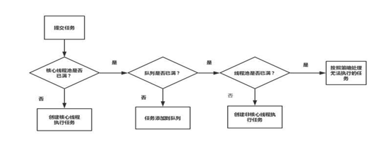

1. 进程与线程

   进程是资源分配的基本单位（进程），线程是cpu调度的基本单位（cpu的一个核心每次只能运行一个线程），进程之间基本上是独立的，而线程共享堆和方法区（每个线程都有自己的程序计数器，虚拟机栈，本地方法栈），所以线程之间切换负担比进程小很多，一个进程至少拥有一个线程

2. Syn与ReentrantLock区别：1.lock获取锁时可以中断，可以设置获取锁的时间，可以用condition实现多路通知，lock获取锁后要手动释放锁 2. 两者都是可重入锁，syn为非公平锁，lock可以设置公平与非公平（非公平锁与公平锁区别：非公平锁首先会尝试获取锁，没有获取到才加入阻塞队列）3.syn是基于jvm层面实现的，lock是java代码层面基于AQS与CAS自旋机制实现的

3. Syn的底层原理：进入同步块会**执行monitorenter指令**来尝试获取此对象的**monitor对象（存在于每个java对象的对象头中）的持有权**，当monitor没有被任何对象持有时，为0，每获取一次，**monitor+1**。退出同步块时，会执行**monitorexit**（有正常退出和异常退出，都会释放锁）指令，monitor-1，直到monitor变为0。当修饰方法时，会增加一个标识符注明这是一个同步方法，每次执行同步方法尝试获取monitor。   Syn在实际中的使用：单例模式（双重校验锁）

4. https://juejin.im/post/5c936018f265da60ec281bcb#heading-8  Monitor是基于mutex计算机原语实现的重量级锁（开销大），jvm对syn的优化：1.自旋锁：线程并不会马上进入阻塞状态，而是会自旋指定时间（因为如果每次获取不到锁都进入阻塞状态，执行上下文切换开销很大），在此时间内没有获取锁则阻塞 2.适应性自旋锁：自旋时间不固定，而是由前一次在同一个锁上的自旋时间及锁的拥有者的状态决定。如果上次自旋获取成功，那么这次自旋次数会增多，上次获取失败，那么这次次数会减少甚至忽略  3.锁消除：代码上要获取锁，但实际检测到并没有线程安全问题，则会消除锁 4.锁粗化：在使用锁的时候，需要让同步块的作用范围尽可能小，这样做的目的是为了使需要同步的操作数量尽可能小，如果存在锁竞争，那么等待锁的线程也能尽快拿到锁 5.轻量级锁，偏向锁

5. 轻量级锁（**建立，拷贝，指针，自旋，膨胀**）：不再使用monitor，而是基于对象头。1.如果锁状态为无锁（01），虚拟机首先将在当前线程的栈帧中**建立一个名为锁记录**（Lock Record）的空间。2.将对象头的**mark word拷贝到线程的锁记录**中去。 3. 拷贝成功后，虚拟机将使用**CAS操作**尝试将对象的Mark Word更新为**指向Lock Record的指针**。如果这个更新成功了，则执行步骤4，否则执行步骤5 4.更新成功，这个线程就拥有了该对象的锁，并且对象Mark Word的锁标志位将转变为"00"，即表示此对象处于轻量级锁的状态  5.更新失败，虚拟机**检查对象的mark word**是否指向当前线程的栈帧，如果是就说明当前线程已经拥有了这个对象的锁，可以直接进入同步块继续执行，否则说明这个锁对象已经被其其它线程抢占了。进行**自旋执行步骤3**，如果自旋结束仍然没有获得锁，轻量级锁就需要**膨胀为重量级锁**，锁标志位状态值变为"10"，Mark Word中储存就是指向monitor对象的指针，当前线程以及后面等待锁的线程也要进入阻塞状态

6. 释放锁：1.使用CAS操作将对象当前的Mark Word和线程中复制的Displaced Mark Word（即Lock Record中拷贝的Mark word）**替换回来** 2.如果成功，那么恢复无锁状态 3.如果失败，说明有其他线程已经尝试了获取该锁(此时锁已膨胀)，那就要在释放锁的同时，**唤醒**被挂起的线程。

7. 偏向锁（**检查（锁，id），CAS，轻量级锁**）：默认开启，无竞争情况下，连CAS自旋操作也省略了。1.检查mark word是否是可偏向锁状态 2.是则检查mark word存储的线程id是否是本线程，是则获取锁成功 3，不是，则通过CAS操作修改为本线程id  4.修改成功则获取锁成功，失败则拥有该锁的线程到达安全点之后，挂起这个线程，升级为轻量级锁。

8. 释放锁：1.偏向锁的释放采用了一种**只有竞争才会释放锁**的机制，线程是不会主动去释放偏向锁，需要等待其他线程来竞争。 2. 等待全局安全点(在这个是时间点上没有字节码正在执行)挂起 3. **检查持有偏向锁的线程是否活着**，如果不处于活动状态，则将对象头设置为无锁状态，否则设置为被锁定状态。如果为锁定状态，则锁升级为轻量级锁状态(00)

9. 锁状态：无锁，偏向锁，轻量级锁，重量级锁中mark word的变化 https://blog.csdn.net/liudun_cool/article/details/86286872

​                               

10. CAS操作：从地址V读取A，经过计算后得到B，再次从地址V获取值，判断是否为A，为A，则把B存入地址V（简单说就是：检验current与预期值是否相同，不相同则重新取值自增） ABA问题：加入版本或者时间戳  CAS与自旋一起使用非常消耗资源。

11. ThreadLocal作用：通常情况下，我们创建的变量是可以被任何一个线程访问并修改的。**而使用ThreadLocal创建的变量只能被当前线程访问，其他线程则无法访问和修改，每个线程都有一个自己独立的一个变量**（注意一个ThreadLocal对象就只有一个value（如果要存储多个value，就要new多个threadLocal对象）） 原理：**每个线程都维护一个变量名为ThreadLocals的ThreadLocalMap对象，此map对象的key值为ThreadLocal对象**，所以每次取值或者插入都要先用当前线程获取map对象，再用当前的ThreadLocal作为key值取值或者插入。  ThreadLocal导致的内存泄漏问题：如果应用使用了线程池，那么之前的线程实例处理完之后出于**线程复用**的目的依然存活，所以，ThreadLocal设定的值被后面的线程持有，导致内存泄露。  解决：假如使用强引用，当ThreadLocal不再使用需要回收时，发现某个线程中ThreadLocalMap存在该ThreadLocal的强引用，无法回收，造成内存泄漏。entry中的key即ThreadLocal为**弱引用**，而用了弱引用后，GC就会及时回收生命周期已经结束的ThreadLocal，一定程度防止了内存泄漏。但是，回收Threanlocal对象后，value是却强引用，这会导致存在key为null，value有效的entry，所以，为了防止内存泄漏，**在ThreadLocal使用前后都调用remove清理**，同时对异常情况也要在finally中清理。  Remov方法作用：把map中当前ThreadLocal位置上的key和value都指向null，同时检测整个Entry[]表中对key为null的Entry一并擦除，重新调整索引。  使用：ThreadLocal一般加static修饰，同时使用前使用后都要remove。

12. ReentrantLock原理：公平锁（**自己，CLH/获取**）：先判断锁是否被占有，如果是判断当前锁是否被自己占有，如果是，则state++（重入次数加1），再**判断CLH队列中是否有线程在等待**，如果有，则把**自己放入CLH队列挂起**（循环往前找，直到前驱节点不为CANCLED，如果前驱节点是0则把前驱节点设为SIGNAL，如果是SIGNAL，则自己可以安全挂起），如果没有则尝试获取锁。非公平锁（**获取，自己，获取，加入CLH**）：调用lock方法后直接用CAS操作**尝试获取锁**，如果失败，进入tryAcquire方法判断锁是否被占有，如果是判断当前锁是否被自己占有，如果是，则state++。如果锁没被占有，又**直接获取一次锁**，还是失败，则**加入阻塞队列**。当锁被释放之后，排在CLH队列队首的下一个线程会被唤醒。  释放锁：首先尝试**释放锁**（每释放一次state--），释放成功，那么查看**头结点的状态是否为SIGNAL(-1)**，如果是则**唤醒头结点的下个节点关联的线程**(也就是说，头节点是获取到了锁的线程关联的节点)，如果释放失败那么返回false表示解锁失败。  超时锁获取：非公平锁：直接获取锁，失败则入队，自旋**判断前节点是否为head节点**，如果是，尝试获取锁，获取失败则判断是否超时，超时则直接返回false，没有则**挂起当前线程直到超时时间过期**。这里为什么还需要自旋呢？因为当前线程节点的前驱状态可能不是SIGNAL（明明在addwrite中确保了所有前驱节点都是signal，为什么还要判断signal呢？因为他的前驱节点可能在队列中等待时被中断或超时了），那么在当前这一轮循环中线程不会被挂起，然后更新超时时间，开始新一轮的尝试（**线程挂起总是找到前驱节点为signal才能安全挂起**）   Reentrantlock实现了Lock接口，内部**有两个类（公平与非公平**，根据用户选择new那个类），都继承自AQS抽象类，都重写了tryAcquire和tryRelease方法。

13. AQS是什么（抽象类**AbstractQueuedSynchronizer**）（**是什么，内部，资源方式，使用**）：AQS是抽象的队列同步器，AQS定义了一套**多线程访问共享资源的同步器框架**，许多同步类实现都依赖于它，如常用的ReentrantLock，Semaphore，CountDownLatch等。它维护了一个**volatile int state**（代表共享资源）和一个**FIFO线程等待队列**（多线程争用资源被阻塞时会进入此队列）。AQS定义两种资源共享方式：Exclusive（**独占**，只有一个线程能执行，如ReentrantLock）和Share（**共享**，多个线程可同时执行，如Semaphore，CountDownLatch）。不同的自定义同步器争用共享资源的方式也不同。自定义同步器在实现时**只需要实现共享资源state的获取与释放方式即可**，至于具体**线程等待队列的维护**（如获取资源失败入队/唤醒出队等），AQS已经在顶层实现好了。（只需要实现tryAcquire，tryRelease，tryAcquireShared，tryReleaseShared，isHeldExclusively()：该线程是否正在独占资源。只有用到condition才需要去实现它，这几个方法即可）

14. AQS内部原理（**内部Node类**：next，thread，waitStatus）：1. 内部Node类，Node结点是对每一个**等待获取资源的线程的封装**，其包含了，next指针，需要同步的线程本身及其等待状态，变量**waitStatus**则表示当前Node结点的等待状态，共有5种取值**CANCELLED**（1，已被取消调度）、**SIGNAL**(-1，表示后继结点在等待当前结点唤醒，后继结点入队时，会将前继结点的状态更新为SIGNAL)、CONDITION（-2，当其他线程调用了Condition的signal()方法后，CONDITION状态的结点将从**等待队列转移到同步队列**中，等待获取同步锁）、PROPAGATE（-3，共享模式下，前继结点不仅会唤醒其后继结点，同时也可能会**唤醒后继的后继结点**。）、**0（**新节点入队时的默认状态）。  2. 方法：**acquire()**,此方法是独占模式下线程获取共享资源的顶层入口。如果获取到资源，线程直接返回，否则进入等待队列，直到获取到资源为止，且整个过程忽略中断的影响。 *addWaiter(),根据共享独占构造Node节点，将当前线程的节点加入到等待队列的队尾，并返回当前线程所在的结点 enq(),（如果队列为null，新建队列）将node加入队尾  acquireQueued（）,进入等待状态休息，直到其他线程彻底释放资源后唤醒自己，自己再拿到资源  shouldParkAfterFailedAcquire(),此方法主要用于检查状态，看看自己是否真的可以去休息了（**前驱节点为siganl即可休息，不是则判断是否为canceled，不是则把前驱节点设置为siganl，是则一直往前找，直到前驱节点不为canceled，把他插入此节点后面**）* 3**.release**方法此方法是独占模式下线程释放共享资源的顶层入口。它会释放资源，如果彻底释放了（即state=0）,它会唤醒等待队列里的其他线程来获取资源 4. **acquireShared**：此方法是共享模式下线程获取共享资源的顶层入口。它会获取指定量的资源，获取成功则直接返回，获取失败则进入等待队列，直到获取到资源为止，整个过程忽略中断 5. **releaseShared**：此方法是共享模式下线程释放共享资源的顶层入口。它会释放指定量的资源，如果成功释放且允许唤醒等待线程，它会唤醒等待队列里的其他线程来获取资源

15. 三个中断方法：isInterrupted()：判断此线程是否被打上中断标记（即中断状态码），是返回true，否则false。interrupted()：静态方法，返回执行此语句的线程的中断状态码，并且当中断状态码为true时会被重置为false  interrupt()：给这个线程打上中断的标记，但实际上并没有被中断，打上中断标记后调用Thread.isinterrepted()会返回true。

16. Volatile：保证了变量的可见性，禁止指令重排序。Volatile实现原理：修改后，立刻写入主存，并使得其他线程的缓存无效，由于无效，其他线程会重新去主存读取最新值。（缓存一致协议）禁止重排序原理：底层在读/写操作前后插入了内存屏障，避免了重排序。  Java内存模型：所有的变量**都是存在主存**当中，每个线程都有**自己的工作内存**。线程对变量的**所有操作**都必须在工作内存中进行，而不能直接对主存进行操作。并且每个线程**不能访问**其他线程的工作内存。

17. Final域重排序规则：1.在构造函数内对一个final域的写入，与随后把这个被构造对象（即拥有这个final值的对象）的引用赋值给一个引用变量，这两个操作之间不能重排序。（先写入final变量，后把此对象赋值给某个引用）  2.初次读一个包含final域的对象的引用，与随后初次读这个final域，这两个操作之间不能重排序。  原理：final域写之后和读之前都会插入一个内存屏障。  例子：https://blog.csdn.net/riemann_/article/details/96390511

18. 辅助类（都位于JUC包下面）：CountDownLatch：一个或者多个线程，**等待其他多个线程完成某件事情之后才能执行**。原理：初始时传值为N，则state也为N，每个线程countDown一次，则CAS操作state--，直到state为0，会unpark等待线程 CyclicBarrier：多个线程互相等待，直到**到达同一个同步点，再继续一起执行**，与 CyclicBarrier 不同的是，CountdownLatch 不能重复使用。 Semaphore：保证每一时刻，**最多有固定数目的线程在执行**。Acquire方法阻塞获取许可证，release方法释放许可证。原理：Semaphore与CountDownLatch一样，也是共享锁的一种实现。它默认构造AQS的state为permits，当所有的permits都被获取（为0），多余的线程就会被挂起，只有有线程释放许可证（permits++），其他线程才能运行（可以指定是否公平）。

19. 线程池（核心，队列，最大线程数）：corePoolSize核心线程数（核心线程会**一直存活，即使空闲**），maximumPoolSize最大线程数，keepAliveTime非核心线程空闲存活时间，unit存活时间单位，workQueue阻塞队列，threadFactory用于设置创建线程的工厂（在线程开始之前执行一些操作，如设置名字，设置异常处理handler等），handler线程池的饱和策略（1.默认抛出异常，2.直接丢弃，3.丢弃队列里最老的任务，将此任务继续交给线程池，4.交给线程池调用所在的线程处理）。

     

20. 异常： 不用线程池或者线程池使用execute()方法执行任务时，有异常会直接抛出。而用submit方法（submit方法返回Future对象，execute返回void）执行任务时，发生异常并不会抛出，这时有四种方法捕获异常：1. 手动在可能发生异常处try catch 2. 把执行结果给future，用try catch捕获future的get方法 3. 为线程设置异常处理handler 4. 继承ThreadPoolExecutor，重写after方法

21. 同步集合与并发集合：同步集合（HashTable,Vector，Stack，Collections.synchronizedMap(), Collections.synchronizedList()），并发集合（ConcurrentHashMap，ConcurrentSkipListMap等Concurrent开头的容器，CopyOnWriteArrayList，还有所有阻塞队列），同步集合与并发集合区别是，同步集合效率更低（就是简单地再方法前加了一个syn）。

22. CopyOnWriteArrayList：读取是完全不用加锁的，并且更厉害的是：写入也不会阻塞读取操作。只有**写入和写入**之间需要进行同步等待。这样一来，读操作的性能就会大幅度提升。原理：当 List 需要被**修改的时候**，我并不修改原有内容，而是对原有数据进行一次**复制**，将修改的内容写入副本。写完之后，再将修改完的副本替换原来的数据，这样就可以保证写操作不会影响读操作了。两个缺点：1.内存占用问题，因为CopyOnWrite的写时复制机制，所以在进行写操作的时候，内存里会同时驻扎两个对象的内存，旧的对象和新写入的对象  2.数据一致性问题：CopyOnWrite容器只能保证数据的最终一致性，不能保证数据的实时一致性。所以如果你希望写入的的数据，马上能读到，请不要使用CopyOnWrite容器。

23. 阻塞队列：1.ArrayBlockingQueue：**数组实现的有界阻塞队列**，FIFO，一旦创建，容量不可改变，可以设置公平性（牺牲吞吐量），take方法取（为0阻塞），put方法放入（满了阻塞） 2. LinkedBlockingQueue：**链表实现有界阻塞队列**，FIFO，与ArrayBlockingQueue相比起来具有**更高的吞吐量**，容量可以选择进行设置，不设置的话，将是一个**无界**的阻塞队列，最大长度为Integer.MAX_VALUE  3. PriorityBlockingQueue：支持**优先级**的**无界**阻塞队列（优先级高的元素先被拿出），默认情况下元素采用**自然顺序**进行排序，也可以通过自定义类实现**compareTo()**方法来指定元素排序规则，或者初始化时通过构造器参数**Comparator**来指定排序规则  4. SynchronousQueue：可以指定公平性，实际上**没有存储任何数据元素**，因为只有线程在删除数据时，其他线程才能插入数据，同样的，如果当前有线程在插入数据时，线程才能删除数据。 5. LinkedTransferQueue：由链表数据结构构成的无界阻塞队列，transfer方法，如果有消费者正在拿，则直接把数据交给消费者，如果没有，则插入队尾，直到有消费者消费刚才插入的元素才退出。 6. LinkedBlockingDeque：有界双端队列，上面的queue都是先进先出，这个可以先进后出  7. DelayQueue：存放实现Delayed接口的数据的**无界**阻塞队列，只有当数据对象的**延时时间达到时**才能插入到队列进行存储（所以设置时间早的总是在延迟一定时间后先执行），如果当前所有的数据都还没有达到创建时所指定的延时期，则队列没有队头，并且线程通过poll等方法获取数据元素则返回null（传入的元素都要实现Delayed接口）

24. 为什么要使用线程池？1.减少了创建和销毁线程的次数，每个工作线程都可以被重复利用，可执行多个任务。2.可以根据系统的承受能力，调整线程池中工作线线程的数目防止因为消耗过多的内存，而把服务器累趴下 3.提高响应速度， 如果任务到达了，相对于从线程池拿线程，重新去创建一条线程执行，速度肯定慢很多。

25. 常用线程池：1.newCachedThreadPool：线程池无界（MAXVALUE），可以复用。内部实现：core=0，max=MAXVALUE，time=60s，queue= SynchronousQueue（所以队列大小为0，所有线程的执行都是**非核心线程**，空闲存活时间为60s，所以任务一传入就会运行）  2. newFixedThreadPool：定长，线程最大并发数就是设置的大小，超出的线程会在队列中等待。内部实现：core=n，max=n，time=0，queue= LinkedBlockingQueue（永远**不会用到非核心线程**（所以存活时间无意义），因为queue的size为MAXVALUE）。 3. newScheduledThreadPool：创建一个定长线程池，支持**定时及周期性**任务执行。内部实现：core=n，max=MAXVALUE，time=0，queue= DelayedWorkQueue（因为queue无界，所以**永远不会用到非核**心线程） 4. newSingleThreadExecutor：单线程化的线程池。内部原理：core=1，max=1，time=0，queue= LinkedBlockingQueue（因为无界，所以**非核心线程不会存在**，而核心线程是固定的1，所以永远只有1个线程在执行任务，与上面的newFixed区别是把n变为了1）  

26. 线程间交换信息：共享对象或者阻塞队列。线程间通信：轮询volatile变量，使用wait/notify，使用await/signal

27. 线程常用方法：1**.join(1000)**把运行此语句的线程（main）加入调用此方法的线程后面运行（main加入阻塞队列），如果1000毫秒（如果没有设置时间，则调用线程执行完毕，main线程才能执行，即使调用线程进入阻塞状态或者线程让步，main线程也不能先执行））内thread线程没有执行完，那么main线程进入就绪状态，通俗说就是调用的先执行。 2**.yield**从执行状态变为就绪状态（就绪后并不是说优先级高的就运行，只是大概率优先级高的运行，所以此方法最主要的作用是当前的线程暂时让步给别的线程）重新竞争cpu资源，通俗地说就是立刻暂停  3.**sleep**线程阻塞指定时间，此时间结束后进入就绪队列  4.**wait**线程进入阻塞队列（wait与notify都要写到syn语句块里面，要不然会报错。Wait一般与while一起使用，而不是if，因为用wihle被唤醒后，还会执行一次条件判断，如果条件不满足还会阻塞，而if被唤醒后会立刻执行，所以wait一般放在while中，真正的业务代码放在while循环下面，while循环的条件是不能执行业务代码时为真，如size==0时要wait，不为0才能取） 5.**notify**线程从阻塞队列变为就绪队列（如果有两个线程正在wait，而调用一个notify则会随机选取一个），注意，虽然wait线程进入了就绪队列，但要等到notify线程退出syn块才能获得锁并继续运行。

28. 线程状态转换：new（新建，还没有执行start），Runnable（就绪 yield，start后没有获得cpu资源），Running（运行），Blocked（阻塞 sleep，wait，**join**），Dead（死亡）   就绪状态：线程start后，并不是立刻运行，因为cpu资源就这么多，所以暂时处于就绪状态，等待调度。  阻塞状态：让出cpu资源，让其他线程运行

29. Callable和future：Callable接口（call方法，有返回值与异常）与Runable（run方法）不同的是，前者线程执行完毕后可以**返回数据或者抛出异常**，且Callable要**与ExecutorService，Future一起使用**。线程池使用submit执行了实现了callable接口的类后，会返回Future类型的对象，此Future对象调用isDone方法判断是否执行完毕。调用**get方法获取返回结果**，如果线程没有结束，get方法会阻塞直到执行完毕。FutureTask的使用：把实现Callable的类传入FutureTask对象，再把FutureTask对象传入submit方法，可以直接用此FutureTask对象get返回值。

30. java异常：异常介绍：java在方法上加上throws表示此方法可能会向上抛出异常，调用此方法一定要捕获异常或者向上传递异常（即方法声明加上throws异常）。throw new Exception()为手动抛出异常。try语句块为捕获异常。所有异常类都是由Throwable继承而来，他又分为Error和Exception，Error错误描述了系统的错误，exception又分为IOException和RuntimeException(程序错误，一定是程序员的问题)。   java包含两种异常（https://blog.csdn.net/kingzone_2008/article/details/8535287）：unchecked与checked。checked异常必须显示地捕获或者传递，而unchecked异常则可以不必捕获或抛出。继承Exception的为checked异常，继承RunTimeException的为unchecked异常。Checked和unchecked异常从功能的角度来讲是等价的。可以用checked异常实现的功能必然也可以用unchecked异常实现，反之亦然。   run方法是由Thread或者Runnable继承来的，后者不能抛出异常，所以run方法也不能抛出异常，如果想捕获异常可以设置异常处理handler。

31. 阻塞队列的实现原理：使用的是reentrantlock的多路通知机制（condition），类中拥有两个Condition类：notEmpty与notFull（notEmpty与notFull调用阻塞或通知方法都要在lock块中），当要**取元素**而count为0时（为空），**notEmpty**调用await方法（取走一个元素后，**notFull**调用signal方法通知放入元素的线程），当要**放入**元素而count为length时（为满），**notFull**调用await方法（放入一个元素后，**notEmpty**调用signal方法通知取元素线程），所以消费者只会通知生产者，生产者只会通知消费者。

32. 死锁产生的条件：1.资源互斥访问  2.一个线程因为请求资源而阻塞时，对已获得的资源保持不放。 3. 进程已获得的资源，在末使用完之前，不能强行剥夺。 4. 若干进程之间形成一种头尾相接的循环等待资源关系。  阻止循环等待。

33. 预防死锁方法：1.资源共享  2. 进程在运行前一次申请完它所需要的全部资源，在它的资源未满足前，不把它投入运行。一旦投入运行后，这些资源就一直归它所有 3. 当一个已保持了某些不可剥夺资源的进程，请求新的资源而得不到满足时，它必须释放已经保持的所有资源，待以后需要时再重新申请 4. （有用）为了破坏循环等待条件，可釆用顺序资源分配法。首先给系统中的资源编号，规定每个进程，必须按编号递增的顺序请求资源，同类资源一次申请完。（银行家算法） 5.（有用）超时放弃算法，即lock里面的tryLock方法

34. 检测死锁：用JStack命令（java虚拟机自带的一种堆栈跟踪工具，Jstack工具可以用于生成java虚拟机当前时刻的线程快照。线程快照是当前java虚拟机内每一条线程正在执行的方法堆栈的集合，生成线程快照的主要目的是定位线程出现长时间停顿的原因）和Jconsole工具（jdk/bin目录下的工具，对运行在Java应用程序的资源消耗和性能进行监控，并画出大量的图表）

35. 线程安全：在多个线程向共享资源做了写操作时才有可能发生线程不安全，只要资源没有发生变化,多个线程读取相同的资源就是安全的。多线程对一些资源的竞争的时候就会产生竞态条件。导致竞态条件发生的代码区称作临界区。保证线程安全：用syn/lock。

36. 用syn()锁住的是**对象**，如果syn()里的是不同的对象，虽然是同一段代码，但也起不到作用。所以当用syn锁住**string**，希望用同一个string的线程能够串行执行时，string应该用intern()生成（并且string是不可变类型，一旦改变就是不同对象了）。当用不同的对象想锁住代码块时，应该用**类.Class或者修饰静态方法**。用syn(this)并不能解决线程安全问题，因为锁住的是正在运行的线程，而不是外部的共享资源（而匿名内部类（Runable）里面的成员变量是线程私有的，并不需要保证线程安全）。Syn**修饰方法**锁住的就是线程对象本身。

37. Java原子类原理：cas操作保证原子性。lazeSet方法：设置值，以一种延迟的方式；设置值后，不保证该值的修改能被其他线程立刻看到，也就是说，其他线程有可能读到的还是旧的值；set方法：修改后，别的线程可以立刻看到更新的值。好处：用了lazeset后，能提高系统性能，因为在多个cpu缓存之间同步一个内存值的代价是很昂贵的。

38. Java线程池怎么保证核心线程一直运行：调用execute提交一个任务后，会根据传进来的Runnable对象创建一个Worker对象，然后调用此Worker对象的run方法，run方法委托给runWorker执行，runWorker中有while循环，不断调用getTask方法获取新任务，**getTask方法通过阻塞队列的take方法获取任务（take方法就是一直获取，获取不到就阻塞，直到最后获取到）**  Worker类：线程池里每个工作线程都是以Worker为单位的方式运行的，worker类是线程池的内部类，封装了thread对象与Runnable对象，他的run方法调用了线程池的runWorker方法。工作过程：Runnable对象传入execute方法后，execute会判断核心线程是否满了，没满则调用addWorker方法（线程池的方法）。addWorker会使用传入的Runnable创建一个worker对象，并把它加入workers队列（线程池的一个属性，HashSet<Worker>类型的工作队列，表示正在运行的线程），然后调用start方法（worker对象中封装的thread的方法）启动线程。worker类的run方法调用了runWorker方法（线程池的方法），runWorker中有while循环，不断调用getTask方法从workQueue（我们创建的阻塞队列）中获取新任务。（也就是说只要核心线程没满，不管核心线程是否空闲，都会生成新的核心线程）

39. 单线程池的应用场景：不适合并发但是却可能引起IO阻塞及影响UI线程响应的操作，如数据库操作、文件操作等。

40. Juc包：原子类，reentrantlock等锁，并发集合，线程池，辅助类。

41. 